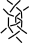

The [GroundForge] main page can show three pairs of thread and pair diagrams.
Each next pair diagram is a color coded version of the previous thread diagram.
When choosing one and the same stitch for each pair of diagrams you get a Droste effect.
In theory more levels are possible but a browser might easily choke even with so few levels,
average complex stitches and not very large numbers of rows and columns.

The table shows the most interesting stitches and demonstrates some traditional patterns.
The left column shows the official color coded diagrams for level 2.
The generated diagrams however don't have pins and the pair diagrams
draw a plait or something-pin-something like a simple stitch.

Mirror, mix, add or drop twists and/or switch diagonal with weaving to get get a myriad of patterns.
Mixing stitches requires larger tile dimensions.

<table>
    <tr>
        <th>level 2</th>
        <th colspan="3">level 1</th>
        <th>tiling</th>
        <th><a href="Whiting-index">Whiting index</a></th>
    </tr>
    <tr>
        <td></td>
        <td></td>
        <td></td>
        <td><a href="index.html?m=5-;bricks;7;5;0;0&s1=ct&s2=ctct&s3=&#diagrams"
        >ct</a></td>
        <td>diagonal 1x2</td>
        <td>A5</td>
    </tr>
    <tr>
        <td></td>
        <td></td>
        <td></td>
        <td>
            <a href="index.html?m=8%0A1;checker;8;6;0;0&s1=A1%3Dctc,A2%3Dctcr&s2=ctc,A24%3Dtctct,A12%3Dctcr,A13%3Dctcr,A20%3Dctc,A21%3Dctcl,A23%3Dctcl&s3=ctct"
            >ctc-ctcr</a></td>
        <td>weaving 2x1</td>
        <td>D16</td>
    </tr>
    <tr>
        <td> </td>
        <td></td>
        <td> </td>
        <td><a href="index.html?m=5-;bricks;7;5;0;0&s1=ctct&s2=cross=ctct,twist=ct&s3=&#diagrams"
        >ctct</a></td>
        <td>diagonal 1x2</td>
        <td>variant of A2 and D2</td>
    </tr>
    <tr>
        <td></td>
        <td></td>
        <td></td>
        <td><a href="index.html?m=5-;bricks;7;5;0;0&s1=crclct&s2=ctct,B12=ct,B15=ct,B16=ct&s3=&#diagrams"
        >crclct</a></td>
        <td>diagonal 1x2</td>
        <td>D6</td>
    </tr>
    <tr>
        <td></td>
        <td></td>
        <td></td>
        <td>
            <a href="index.html?m=5-;bricks;7;5;0;0&s1=clcrclc&s2=ctc,B13=ctcrrctcrr,B15=ctcll,B16=ctctt&s3=&#diagrams"
            >clcrclc</a></td>
        <td>diagonal 1x2</td>
        <td></td>
    </tr>
    <tr>
        <td></td>
        <td></td>
        <td></td>
        <td>
            <a href="index.html?m=5-;bricks;7;5;0;0&s1=ctctc&s2=ctc,B14=ctcll,B15=ctcrr,B16=ctctt&s3=&#diagrams"
            >ctctc</a></td>
        <td>diagonal 1x2</td>
        <td>variant of F2</td>
    </tr>
    <tr>
        <td></td>
        <td></td>
        <td></td>
        <td>ctclctc</td>
        <td></td>
        <td></td>
    </tr>
    <tr>
        <td></td>
        <td></td>
        <td></td>
        <td>ctclcrctc</td>
        <td></td>
        <td></td>
    </tr>
    <tr>
        <td></td>
        <td></td>
        <td></td>
        <td>ctcttctc</td>
        <td></td>
        <td></td>
    </tr>
</table>

Tiling
------

The matrix and its tiling arrangement defines the flow of pairs in a pattern.
They are illustrated below with red rectangles.
The numbers define from which direction the pairs arrive at a stitch.

A weaving pattern requires an even number of rows and
will always work with a checker board tiling.

A diagonal pattern requires an even number of columns
and brick tiling in case of an odd number of rows.
An odd number of rows won't work with a number of columns divisible by four.

For your convenience a few tile dimensions are pre-configured.
You can select one from the following links.

* Diagonal
  * checker:
    [2x2](https://d-bl.github.io/GroundForge/?m=5-%0D-5;checker;8;5;0;0),
    [2x4](https://d-bl.github.io/GroundForge/?m=5-5-%0D-5-5;checker;9;5;0;0),
    [4x2](https://d-bl.github.io/GroundForge/?m=5-%0D-5%0D5-%0D-5;checker;9;5;0;0),
    [4x4](https://d-bl.github.io/GroundForge/?m=5-5-%0D-5-5%0D5-5-%0D-5-5;checker;10;6;0;0).
  * bricks:
    [1x2](https://d-bl.github.io/GroundForge/?m=5-;bricks;7;5;0;0),
    [3x2](https://d-bl.github.io/GroundForge/?m=5-%0D-5%0D5-;bricks;9;6;0;0),
    [2x4](https://d-bl.github.io/GroundForge/?m=5-5-%0D-5-5;bricks;9;5;0;0).
* Weaving
  * checker
    [2x1](https://d-bl.github.io/GroundForge/?m=8%0D1;checker;5;5;0;0),
    [2x2](https://d-bl.github.io/GroundForge/?m=88%0D11;checker;5;5;0;0),
    [2x3](https://d-bl.github.io/GroundForge/?m=888%0D111;checker;5;5;0;0),
    [2x4](https://d-bl.github.io/GroundForge/?m=8888%0D1111;checker;6;6;0;0),
    [4x1](https://d-bl.github.io/GroundForge/?m=8%0D1%0D8%0D1;checker;5;5;0;0),
    [4x2](https://d-bl.github.io/GroundForge/?m=88%0D11%0D88%0D11;checker;6;6;0;0),
    [4x3](https://d-bl.github.io/GroundForge/?m=888%0D111%0D888%0D111;checker;8;4;0;0),
    [4x4](https://d-bl.github.io/GroundForge/?m=8888%0D1111%0D8888%0D1111;checker;6;6;0;0).
  * bricks:
    [2x2](https://d-bl.github.io/GroundForge/?m=88%0D11;bricks;5;5;0;0),
    [2x4](https://d-bl.github.io/GroundForge/?m=8888%0D1111;bricks;6;6;0;0),
    [4x2](https://d-bl.github.io/GroundForge/?m=88%0D11%0D88%0D11;bricks;6;6;0;0),
    [4x4](https://d-bl.github.io/GroundForge/?m=8888%0D1111%0D8888%0D1111;bricks;6;6;0;0).

Offline-execution
-----------------

Off-line execution is faster, doesn't make a fuss if it takes a while,
allows you to abort at your own discretion and allows as many levels as your system can handle.
Downside: it requires a few [hoops] to jump through:
install an environment to execute JavaScript without a browser and get familiar with two or three function calls.
Another option is downloading the code and adjust one of the demo classes to your needs.

Numbers of patterns
-------------------

When limiting the choices to the three most common stitches
we get 3+9+27 thread diagrams for one start pattern.
The main page show about eight stitches resulting in 8+64+4096 patterns,
even more stitches are possible by adding and dropping only a few twist.
And it doesn't even count multiple stitches at each level.
The resulting collection will contain mirrored stitches and perhaps other duplicates.
Nevertheless selecting the real pleasing patterns would take a lot of time.
So you need to develop an intuition to take your picks.

[GroundForge]: https://d-bl.github.io/GroundForge/
[hoops]: https://github.com/d-bl/GroundForge/blob/master/docs/API.md
