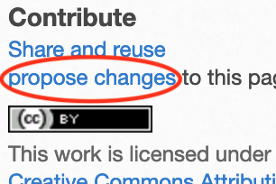

[](https://travis-ci.org/d-bl/GroundForge) 

_A toolbox to design bobbin lace grounds with matching sets of pair/thread diagrams._

The table of contents icon  
in the top left corner of this document gets you to a specific section quickly.

Short intros
=============

### for end users (bobbin lace makers and designers):
See https://d-bl.github.io/GroundForge/

### for developers:
* `src/scala/main/*` is translated to : `docs/js/GroundForge-opt.js`
* This is connected client side to HTML with : `docs/js/tiles.js`
* The source runs also in a JVM environment for server-side or batch processing,
  for example something like : `src/test/Demo4Java.java`

### licenses

The help pages and examples have a [CC-BY](http://creativecommons.org/licenses/by/4.0/) 
license.
The code has a [GPL-v3](https://github.com/d-bl/GroundForge/blob/master/LICENSE)
license.

Diagrams created by you and saved as link and/or images
are owned by you and/or the original authors in cases
you adapted or embedded a definition by someone else.

Note that individual diagram definitions may or may not meet the [threshold of originality](https://en.wikipedia.org/wiki/Threshold_of_originality).
A stitch may be traditional yet take creativity to define with GroundForge,
as shown by the discussion that started with [this message](https://groups.io/g/GroundForge/message/1).
Others may be new but not take much "sweat of the brow".

You are responsible for publishing your work under a license of your choosing
and tracking your use of derivative works. 
Downloaded diagrams don't come with properties expressing origin, author or license,
you will have to add that information yourself with your favourite editor.


Contribute to documentation
===========================

Most common tasks
-----------------
There is a simple [procedure] to propose simple changes to the help pages and catalogues.
A shortcut into this procedure starts in the sidebar:



* Follow the link `propose change`.
* You might be asked to sign in or up.
* Make your changes, perhaps just fixing a typo or grammar.
* Apply three times the green button at the bottom of the page
  to: _a)_ save the changes in your own fork, _b)_ create a pull request, _c)_ save the pull request.
On the fly you are supposed to fill in some comments.
* Step (c) sends generates a notification to the moderator.

The help pages and cataloges are spread among several repositories.

| create forks for all projects: | links to sidebars: | identical sidebars |
|--------------------|:---------------:|:---:|
| | please keep these  up-to-date | | | |
| [GroundForge]      | [X][gf-sb]       | X |
| [GroundForge-help] | [X][gfh-sb]      | X |
| [gw-lace-to-gf]    | [X][w-sb]        | |
| [tesselace-to-gf]  | [X][t-sb]        | |
| [MAE-gf]           | [X][mae-sb]      | |

Pages may have their own internal table of content. Keep them up-to-date too.

Note for moderators:  
When you have write rights for a repository,
the green button to save your changes will show `commit changes`
and the change will be effective immediately.
To first discuss you changes through a pull request, 
check the radio button to ` Create a new branch`,
the big green button then changes to `propose changes`. 

[procedure]: https://help.github.com/articles/editing-files-in-another-user-s-repository/

[GroundForge]: https://d-bl.github.io/GroundForge/fork
[gf-sb]: https://github.com/d-bl/GroundForge/tree/master/docs/_includes/Sidebar.html

[GroundForge-help]: https://d-bl.github.io/GroundForge-help/fork
[gfh-sb]: https://github.com/d-bl/GroundForge-help/tree/master/docs/_includes/Sidebar.html

[gw-lace-to-gf]: https://d-bl.github.io/gw-lace-to-gf/fork
[w-sb]: https://github.com/d-bl/gw-lace-to-gf/tree/master/docs/_includes/Sidebar.html

[tesselace-to-gf]: https://d-bl.github.io/tesselace-to-gf/fork
[t-sb]: https://github.com/d-bl/tesselace-to-gf/tree/master/docs/_includes/Sidebar.html

[MAE-gf]: https://d-bl.github.io/MAE-gf/fork
[mae-sb]: https://github.com/d-bl/MAE-gf/tree/master/docs/_includes/Sidebar.html


Preview complex changes
-----------------------

The preview by the editor might have some broken images or links or illegible content.
To preview a rendered version of the pages:

* The editing procedure above will have created a numbered `patch` branch mentioned by your pull request.
* configure your online project to publish your patch branch  
  at `https://github.com/YOUR_ACCOUNT/REPO_NAME/settings/pages`:  
  
* Publish all the repositories listed above, either your master branches or the patch branches you are working on.
  There should no longer be broken images or links  
  at `https://YOUR_ACCOUNT.github.io/REPO_NAME`


Conventions
-----------

### licenses

The license in the sidebar should apply to all content on all pages that use the sidebar.
In case of exceptions use "[Some rights reserved](https://github.com/d-bl/GroundForge/blob/848938f6f241ec3212323727e24951c0c48263d1/docs/assets/images/CC_some_rights_reserved.png)",
linking to an explanation of the general rule.
Exceptions should be placed as close to the relevant artifacts as possible,
preferably with Creative Commons [icons](https://en.wikipedia.org/wiki/Creative_Commons_license#Types_of_licenses).

### metadata

A mark-down pages start with a metadata section, something like

    ---
    layout: default
    title: XYZ
    ---

Browsers show `XYZ` as tab title. Keep it short and catchy.

### links
Thumbnails in catalogues are the biggest target and should point to the pattern definition.
If available, use a sample of rel lace, otherwise the thread diagram.

Use root relative links for references between the repositories.

### scalable prickings

Both PDF and SVG are scalable and can be altered by vector capable editors
such as Inkscape, Adobe Illustrator and CorelDraw.
Knipling can export PDF. When you just want a section of some file
save a (temporary) copy of the pattern, delete the rest, then export the PDF.
Import into Inkscape (for example) to save as SVG.


### language

Currently, we have a mix of UK and US spelling.

Functional contribution
=======================

Requirements
------------

- The pages in the docs directory don't require any compilation. There is one exception: the `tiles.md` file. See the workflow.
- To execute the tests: maven or an IDE (like IntelliJ community edition)
- To compile `src/main/scala/` into `docs/js/GroundForge-opt.js`:  
  [JDK] 8 and [sbt] 1.2.7 or higher
- To create a jar: [JDK] and maven

[JDK]: https://adoptopenjdk.net/releases.html
[sbt]: https://www.scala-sbt.org/1.x/docs/Setup.html

Work flow
---------

- Fork the project and make a local clone.
- Don't push to your own master branch, but use the following work flow
  - add the parent of your fork as remote to your local repository, by our conventions this remote is called blessed
  - fetch the master branch of the blessed repository
  - create a topic branch from the tip of the master branch
  - push your changes to your own fork and create a pull request
- Compile your changes and copy the result from the root of the local project to `/docs/js`.
  Depending in your OS use the one liner in `toJS.sh` or `toJS.bat` the latter is not battle proven.
- Check the results with the `docs/*.html` pages
- If ok (or need advise from a reviewer): commit, push and create a pull request

Should you want to test changes for the `tiles` page, you can try a local build with
[Jekyll](https://jekyllrb.com/docs/github-pages/), this requires some [hoops](https://docs.github.com/en/pages/setting-up-a-github-pages-site-with-jekyll/testing-your-github-pages-site-locally-with-jekyll) to jump through.
Alternatively, you can configure your online project to publish your topic branch

at `https://github.com/YOUR_ACCOUNT/GroundForge/settings/pages`:


Code conventions
----------------

* Never catch exceptions in a `Try` as exceptions terminate the JavaScript.
  The tests might succeed with maven, but the JavaScript breaks.
  Prevent exceptions like illegal arguments and indexes and return a `Failure`
  for safe execution with JavaScript.
* Exchange of data between Scala code and JavaScript can be complicated.  
  It is no problem for JavaScript store complex scala types,
  as long as it only needs to pass it on to other scala code and not has to process the data.
  Otherwise, primitive types are the primary choice. Diagram definitions are serialized as a URL query.
  More or less like forms submitted to a server, for human readability no escaping is applied.
* It was a terrible mistake to implement the `LinkProps` and `NodeProps` as a map.
  Caused by the initial proof of concept starting with plain JavaScript by modifying D3js examples.
  So far no success in phasing out this heritage. 
  However, these maps are hidden from the world outside these two classes as much as possible. 
* The initially applied Scala coding techniques are explained by this [course] up and including workshop 3.
  The main code doesn't use any io, and the hand full of files written by test/demo classes don't justify using a library.
  So you can skip the last task of the FileIO assignment.

[course]: https://github.com/DANS-KNAW/course-scala


Tests
-----

Use `mvn clean test` to run unit tests. As some tests read pattern links from help files using java-io, the test fail with SBT.
Maven is much faster but uses JVM while the JS used by SBT is the actual target environment.
Some classes under `src/test` are suffixed with `Demos` rather than `Spec` these runnable objects create SVG documents in a `target/test` directory for a visual check.

For manual tests with other browsers and devices than your own, 
you can sign-up (for free, since this project is open source) at  
 [BrowserStack](http://browserstack.com/)

Use as JavaScript Library
=========================

The demo's mentioned above use the scala code as a JavaScript library
as explained under short intro for developers.
Other mash ups and more user-friendly applications could be wrapped around the library.

Use as JVM library
==================

A JVM library allows server-side or batch processing.

The [Demo4Java.java](https://github.com/d-bl/GroundForge/blob/119-layout/src/test/scala/dibl/Demo4Java.java)
between the test classes is a simple plain java main class example that generates diagrams.
This example uses the code in `src/main` as a Java library. 

In a plain [JVM](https://www.w3schools.com/java/java_getstarted.asp)
environment, you'll need at least on your `classpath`: 
* The `.jar` from the [last release](https://github.com/d-bl/GroundForge/releases)
  or a self-built one.
* The jar at the repository URL on [scalajs-library](https://maven-repository.com/artifact/org.scala-js/scalajs-library_2.12/0.6.26)
  in the central maven repository. For the actual version, follow the tag of the release
  and find the dependency in the `pom.xml`

For a maven/scala-sdk-2.12 environment:
* [download](https://github.com/d-bl/GroundForge/) or checkout the tip of the master branch, or any other branch or commit you prefer 
* execute `maven clean install` in the unzipped directory
* add to the `pom.xml` of your own project
```
        <dependency>
            <groupId>io.github.d-bl</groupId>
            <artifactId>GroundForge</artifactId>
            <version>0.x-SNAPSHOT</version>
        </dependency>
```
