Under Construction
==================

*Jo Edkins* created in her online  Lace School an [index] on the grounds in
'_A Lace Guide for Makers and Collectors_' by Gertrude Whiting which dates from 1920.
The book is also available in four PDF's at the late professor Griswold's [Digital Archive],
including a [scan] of the original index.

Below a copy of the same index, each `W` links to a page of Jo Edkins with a scan from the book and her notes.
The lower case links go to a set of pricking prototypes in GroundForge with variations for pin positions.
The same letter links to the same set of prickings.
Each pricking in such a set can be morphed into the others by nudging pins.
Each pricking links to a diagram page where you can choose alternative stitches
and show the corresponding pair and thread diagrams.

Note that GroundForge doesn't support picots and treats tallies and plaits like simple stitches.

[index]: http://gwydir.demon.co.uk/jo/lace/whiting/index.htm#picindex
[scan]: https://www2.cs.arizona.edu/patterns/weaving/books/whiting.jpg
[Digital Archive]: https://www2.cs.arizona.edu/patterns/weaving/lace.html#books

[c]: https://d-bl.github.io/GroundForge/sheet.html?patch=88%2011;bricks&patch=66%2022;bricks&patch=88%2099%2011%2000;bricks&patch=66%2011%2088%2022;bricks&patch=66%2099%2022%2000;bricks
[t]: https://d-bl.github.io/GroundForge/sheet.html?patch=53%2053%2053%205-;bricks&patch=5663%205663;checker&patch=53%205-;bricks&patch=563%20563%20563;checker&patch=53%2053;checker&patch=5632%205632;checker&patch5353%205353;bricks&patch=5-%20-5;checker&patch=5353%205353%205-5-%20-5-5;checker&patch=5632%2056-2%205-5-%20-535;checker&patch=53%205-%20-5%205-;bricks&patch=44%2077%2044%2077;bricks&patch=44%2044%2077%2077;bricks&patch=66%2088%2066%2011;bricks&patch=66%2066%2088%2011;checker&patch=66%2066%2099%2000;checker&patch=6;checker&patch=566-%2066-5%206-56%20-566;checker
[v]: https://d-bl.github.io/GroundForge/sheet.html?patch=5831%20-4-7;bricks&patch=-437%2034-7;bricks&patch=4830%20--77;bricks
[k]: https://d-bl.github.io/GroundForge/sheet.html?patch=B-C-%20---5%20C-B-%20-5--;checker&patch=5831%20-4-7;checker&patch=68%20-4;checker&patch=-4-7%205---%20-C-B%203158;bricks&patch=5-O-E-%20-E-5-O%205-O-E-;bricks

|   | A | B | C | D | E | F | G | H |
|---|---|---|---|---|---|---|---|---|
|  1 | [c], [W](http://gwydir.demon.co.uk/jo/lace/whiting/page70.htm) | [t], [W](http://gwydir.demon.co.uk/jo/lace/whiting/page94.htm) | [t], [W](http://gwydir.demon.co.uk/jo/lace/whiting/page114.htm) | [t], [W](http://gwydir.demon.co.uk/jo/lace/whiting/page134.htm) | [t], [W](http://gwydir.demon.co.uk/jo/lace/whiting/page155.htm) | [t], [W](http://gwydir.demon.co.uk/jo/lace/whiting/page177.htm) | [t], [W](http://gwydir.demon.co.uk/jo/lace/whiting/page198.htm) | [t], [W](http://gwydir.demon.co.uk/jo/lace/whiting/page219.htm) |
|  2 | [v], [W](http://gwydir.demon.co.uk/jo/lace/whiting/page71.htm) | [v], [W](http://gwydir.demon.co.uk/jo/lace/whiting/page95.htm) | [W](http://gwydir.demon.co.uk/jo/lace/whiting/page115.htm) | [W](http://gwydir.demon.co.uk/jo/lace/whiting/page135.htm) | [W](http://gwydir.demon.co.uk/jo/lace/whiting/page156.htm) | [W](http://gwydir.demon.co.uk/jo/lace/whiting/page178.htm) | [W](http://gwydir.demon.co.uk/jo/lace/whiting/page199.htm) | [W](http://gwydir.demon.co.uk/jo/lace/whiting/page220.htm) |
|  3 | [t], [W](http://gwydir.demon.co.uk/jo/lace/whiting/page73.htm)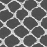 | [t], [W](http://gwydir.demon.co.uk/jo/lace/whiting/page96.htm) | [t], [W](http://gwydir.demon.co.uk/jo/lace/whiting/page117.htm) | [W](http://gwydir.demon.co.uk/jo/lace/whiting/page136.htm) | [W](http://gwydir.demon.co.uk/jo/lace/whiting/page157.htm) | [W](http://gwydir.demon.co.uk/jo/lace/whiting/page179.htm) | [W](http://gwydir.demon.co.uk/jo/lace/whiting/page200.htm) | [W](http://gwydir.demon.co.uk/jo/lace/whiting/page221.htm) |
|  4 | [W](http://gwydir.demon.co.uk/jo/lace/whiting/page74.htm) | [W](http://gwydir.demon.co.uk/jo/lace/whiting/page97.htm) | [k], [W](http://gwydir.demon.co.uk/jo/lace/whiting/page118.htm) | [k], [W](http://gwydir.demon.co.uk/jo/lace/whiting/page137.htm) | [W](http://gwydir.demon.co.uk/jo/lace/whiting/page158.htm) | [W](http://gwydir.demon.co.uk/jo/lace/whiting/page180.htm) | [W](http://gwydir.demon.co.uk/jo/lace/whiting/page201.htm) | [W](http://gwydir.demon.co.uk/jo/lace/whiting/page222.htm) |
|  5 | [k], [W](http://gwydir.demon.co.uk/jo/lace/whiting/page75.htm) | [k], [W](http://gwydir.demon.co.uk/jo/lace/whiting/page98.htm) | [k], [W](http://gwydir.demon.co.uk/jo/lace/whiting/page119.htm) | [W](http://gwydir.demon.co.uk/jo/lace/whiting/page138.htm) | [W](http://gwydir.demon.co.uk/jo/lace/whiting/page159.htm) | [W](http://gwydir.demon.co.uk/jo/lace/whiting/page181.htm) | [W](http://gwydir.demon.co.uk/jo/lace/whiting/page203.htm)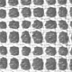 | [W](http://gwydir.demon.co.uk/jo/lace/whiting/page224.htm) |
|  6 | [k], [W](http://gwydir.demon.co.uk/jo/lace/whiting/page76.htm) | [v], [W](http://gwydir.demon.co.uk/jo/lace/whiting/page99.htm) | [v], [W](http://gwydir.demon.co.uk/jo/lace/whiting/page120.htm) | [W](http://gwydir.demon.co.uk/jo/lace/whiting/page139.htm) | [W](http://gwydir.demon.co.uk/jo/lace/whiting/page160.htm) | [W](http://gwydir.demon.co.uk/jo/lace/whiting/page182.htm) | [W](http://gwydir.demon.co.uk/jo/lace/whiting/page204.htm) | [W](http://gwydir.demon.co.uk/jo/lace/whiting/page225.htm) |
|  7 | [W](http://gwydir.demon.co.uk/jo/lace/whiting/page77.htm) | [k], [W](http://gwydir.demon.co.uk/jo/lace/whiting/page100.htm)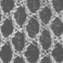 | [W](http://gwydir.demon.co.uk/jo/lace/whiting/page121.htm) | [W](http://gwydir.demon.co.uk/jo/lace/whiting/page140.htm) | [W](http://gwydir.demon.co.uk/jo/lace/whiting/page161.htm) | [W](http://gwydir.demon.co.uk/jo/lace/whiting/page183.htm) | [W](http://gwydir.demon.co.uk/jo/lace/whiting/page205.htm) | [W](http://gwydir.demon.co.uk/jo/lace/whiting/page226.htm) |
|  8 | [W](http://gwydir.demon.co.uk/jo/lace/whiting/page79.htm) | [W](http://gwydir.demon.co.uk/jo/lace/whiting/page101.htm) | [W](http://gwydir.demon.co.uk/jo/lace/whiting/page122.htm) | [W](http://gwydir.demon.co.uk/jo/lace/whiting/page141.htm)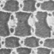 | [W](http://gwydir.demon.co.uk/jo/lace/whiting/page162.htm) | [W](http://gwydir.demon.co.uk/jo/lace/whiting/page184.htm) | [W](http://gwydir.demon.co.uk/jo/lace/whiting/page206.htm) | [W](http://gwydir.demon.co.uk/jo/lace/whiting/page227.htm)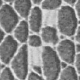 |
|  9 | [W](http://gwydir.demon.co.uk/jo/lace/whiting/page80.htm) | [W](http://gwydir.demon.co.uk/jo/lace/whiting/page102.htm) | [v], [W](http://gwydir.demon.co.uk/jo/lace/whiting/page123.htm)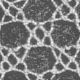 | [W](http://gwydir.demon.co.uk/jo/lace/whiting/page142.htm) | [W](http://gwydir.demon.co.uk/jo/lace/whiting/page163.htm) | [W](http://gwydir.demon.co.uk/jo/lace/whiting/page185.htm) | [W](http://gwydir.demon.co.uk/jo/lace/whiting/page207.htm) | [W](http://gwydir.demon.co.uk/jo/lace/whiting/page229.htm) |
|  10 | [W](http://gwydir.demon.co.uk/jo/lace/whiting/page82.htm) | [W](http://gwydir.demon.co.uk/jo/lace/whiting/page103.htm) | [W](http://gwydir.demon.co.uk/jo/lace/whiting/page124.htm) | [W](http://gwydir.demon.co.uk/jo/lace/whiting/page143.htm) | [W](http://gwydir.demon.co.uk/jo/lace/whiting/page164.htm) | [W](http://gwydir.demon.co.uk/jo/lace/whiting/page187.htm) | [W](http://gwydir.demon.co.uk/jo/lace/whiting/page208.htm) | [W](http://gwydir.demon.co.uk/jo/lace/whiting/page230.htm)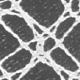 |
|  11 | [W](http://gwydir.demon.co.uk/jo/lace/whiting/page83.htm) | [W](http://gwydir.demon.co.uk/jo/lace/whiting/page104.htm) | [W](http://gwydir.demon.co.uk/jo/lace/whiting/page125.htm) | [W](http://gwydir.demon.co.uk/jo/lace/whiting/page144.htm) | [W](http://gwydir.demon.co.uk/jo/lace/whiting/page166.htm)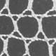 | [W](http://gwydir.demon.co.uk/jo/lace/whiting/page189.htm) | [W](http://gwydir.demon.co.uk/jo/lace/whiting/page209.htm) | [W](http://gwydir.demon.co.uk/jo/lace/whiting/page231.htm) |
|  12 | [W](http://gwydir.demon.co.uk/jo/lace/whiting/page84.htm) | [W](http://gwydir.demon.co.uk/jo/lace/whiting/page105.htm) | [W](http://gwydir.demon.co.uk/jo/lace/whiting/page126.htm) | [W](http://gwydir.demon.co.uk/jo/lace/whiting/page145.htm) | [W](http://gwydir.demon.co.uk/jo/lace/whiting/page167.htm) | [W](http://gwydir.demon.co.uk/jo/lace/whiting/page190.htm) | [W](http://gwydir.demon.co.uk/jo/lace/whiting/page210.htm) | [W](http://gwydir.demon.co.uk/jo/lace/whiting/page232.htm)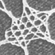 |
|  13 | [W](http://gwydir.demon.co.uk/jo/lace/whiting/page85.htm) | [W](http://gwydir.demon.co.uk/jo/lace/whiting/page106.htm) | [W](http://gwydir.demon.co.uk/jo/lace/whiting/page128.htm) | [W](http://gwydir.demon.co.uk/jo/lace/whiting/page147.htm) | [W](http://gwydir.demon.co.uk/jo/lace/whiting/page169.htm) | [W](http://gwydir.demon.co.uk/jo/lace/whiting/page192.htm) | [W](http://gwydir.demon.co.uk/jo/lace/whiting/page211.htm) | [W](http://gwydir.demon.co.uk/jo/lace/whiting/page234.htm) |
|  14 | [W](http://gwydir.demon.co.uk/jo/lace/whiting/page87.htm) | [W](http://gwydir.demon.co.uk/jo/lace/whiting/page107.htm) | [W](http://gwydir.demon.co.uk/jo/lace/whiting/page129.htm) | [W](http://gwydir.demon.co.uk/jo/lace/whiting/page148.htm) | [W](http://gwydir.demon.co.uk/jo/lace/whiting/page171.htm) | [W](http://gwydir.demon.co.uk/jo/lace/whiting/page193.htm)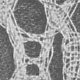 | [W](http://gwydir.demon.co.uk/jo/lace/whiting/page212.htm) | [W](http://gwydir.demon.co.uk/jo/lace/whiting/page235.htm) |
|  15 | [W](http://gwydir.demon.co.uk/jo/lace/whiting/page89.htm)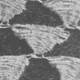 | [W](http://gwydir.demon.co.uk/jo/lace/whiting/page109.htm) | [W](http://gwydir.demon.co.uk/jo/lace/whiting/page130.htm) | [W](http://gwydir.demon.co.uk/jo/lace/whiting/page149.htm) | [W](http://gwydir.demon.co.uk/jo/lace/whiting/page173.htm) | [W](http://gwydir.demon.co.uk/jo/lace/whiting/page194.htm) | [W](http://gwydir.demon.co.uk/jo/lace/whiting/page213.htm) | [W](http://gwydir.demon.co.uk/jo/lace/whiting/page237.htm) |
|  16 | [W](http://gwydir.demon.co.uk/jo/lace/whiting/page90.htm) | [W](http://gwydir.demon.co.uk/jo/lace/whiting/page110.htm) | [W](http://gwydir.demon.co.uk/jo/lace/whiting/page131.htm) | [W](http://gwydir.demon.co.uk/jo/lace/whiting/page150.htm) | [W](http://gwydir.demon.co.uk/jo/lace/whiting/page174.htm) | [W](http://gwydir.demon.co.uk/jo/lace/whiting/page195.htm)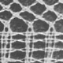 | [W](http://gwydir.demon.co.uk/jo/lace/whiting/page214.htm) | [W](http://gwydir.demon.co.uk/jo/lace/whiting/page238.htm) |
|  17 | [W](http://gwydir.demon.co.uk/jo/lace/whiting/page91.htm) | [W](http://gwydir.demon.co.uk/jo/lace/whiting/page111.htm) | [W](http://gwydir.demon.co.uk/jo/lace/whiting/page132.htm) | [W](http://gwydir.demon.co.uk/jo/lace/whiting/page151.htm) | [W](http://gwydir.demon.co.uk/jo/lace/whiting/page175.htm) | [W](http://gwydir.demon.co.uk/jo/lace/whiting/page196.htm) | [W](http://gwydir.demon.co.uk/jo/lace/whiting/page215.htm) | [W](http://gwydir.demon.co.uk/jo/lace/whiting/page239.htm) |
|  18 | [W](http://gwydir.demon.co.uk/jo/lace/whiting/page93.htm) | [W](http://gwydir.demon.co.uk/jo/lace/whiting/page112.htm) | [W](http://gwydir.demon.co.uk/jo/lace/whiting/page133.htm) | [W](http://gwydir.demon.co.uk/jo/lace/whiting/page153.htm) | [W](http://gwydir.demon.co.uk/jo/lace/whiting/page176.htm) | [W](http://gwydir.demon.co.uk/jo/lace/whiting/page197.htm)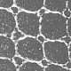 | [W](http://gwydir.demon.co.uk/jo/lace/whiting/page217.htm) | [W](http://gwydir.demon.co.uk/jo/lace/whiting/page241.htm) |