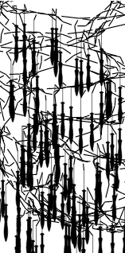

404 - Not the page you were looking for
===



Over time, some pages moved to new locations or content merged into other pages.
Below some old names of pages and links to their new locations
or to pages with similar content.
You can also drop a note at the [user group] for guidance to recover.

[user group]: https://groups.io/g/groundforge

* gallery, thumbs, Tesselace Index -> [tesselace-to-gf](/tesseLace-to-gf)
* Whiting index -> [gw-lace-to-gf](/gw-lace-to-gf)
* [Powerpoint](https://github.com/d-bl/GroundForge/blob/e6464920/docs/help/NL.pdf), Dutch presented in 2017
* [recursive](/GroundForge/tiles) (apply wand in _Thread diagram as pair diagram_ section) 
* [rose](/GroundForge/sheet.html?patch=5831%20-4-7;bricks&patch=-437%2034-7;bricks&patch=4830%20--77;bricks)
* [stitches](/GroundForge-help/Replace)
* [help](/GroundForge-help/) `GroundForge/help` -> `GroundForge-help`: the slash became a dash

