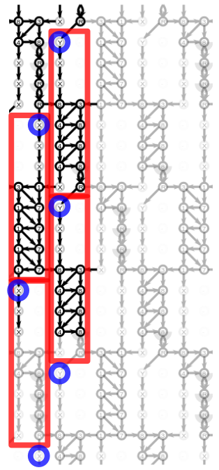
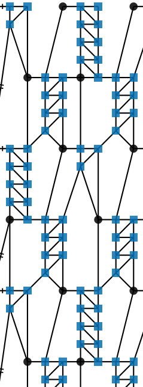

Comment on the code
===================

 &nbsp; 

function setHref.replaceTile
----------------------------

The red tiles can accommodate three pair connections of a varying number of stitches.
B3.122 of _Viele Gute Gründe_ needs 7, so 10 should be enough.
With fewer stitches we will have more rows with x-r or r-x at the end of a red tile.
After filling in a left or right version of a red tile,
we have to  properly connect the blue items in and beneath the tile.
The black part of the diagram becomes the final Tile, the grey part are repetitions.

function setHref.replaceStites
------------------------------

The pair diagram collapses the x/r element into single lines.
Therefor the last stitch sits always at the bottom of the tile:
the black dots in the right diagram, not next to the last blue stitch.

Odd number of stitches
-----------------------

An odd number of stitches is not yet supported.
We expect to need a dash as stitch.