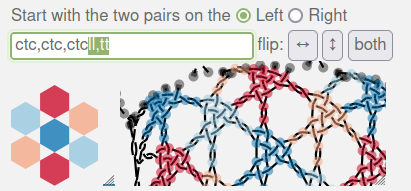

Comments on the code
====================

 &nbsp; 

function setHref.replaceTile
----------------------------

The red tiles can accommodate three pair connections of a varying number of stitches.
B3.122 of _Viele Gute Gründe_ needs 7, so 10 should be enough.
With fewer stitches, we have more rows with x-r or r-x at the end of a red tile.
After replacing a red tile with a left or right version,
the blue items in and beneath the tile are fixed to properly connect the tiles.
The black part of the diagram becomes the final pattern definition, 
the grey parts are repetitions.

function setHref.replaceStitches
------------------------------

The pair diagram collapses the x/r elements into single lines.
Therefor the last stitch sits always at the bottom of the tile:
the black dots in the right diagram, not next to the last blue stitch.

Odd number of stitches
-----------------------

Workaround: add twists for the legs.  
Add either left or right twists to the last stitch 
and make the number of stitches even with a "stitch" that just twists.
This approach is highlighted in the text field of the screenshot below.

The additional twists may cause unwanted crossed legs when using the thread diagram as pair diagram for the snowflakes.
Another option might be to split the last stitch in two.

