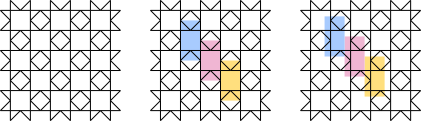
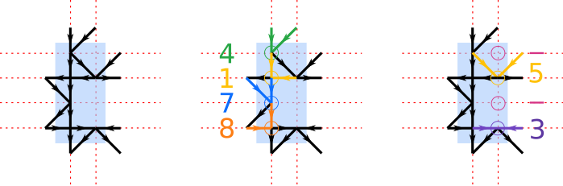
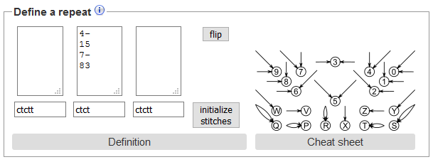
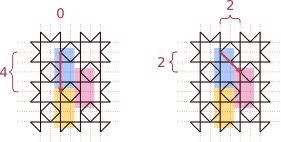
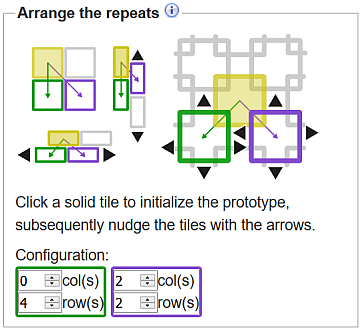
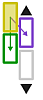
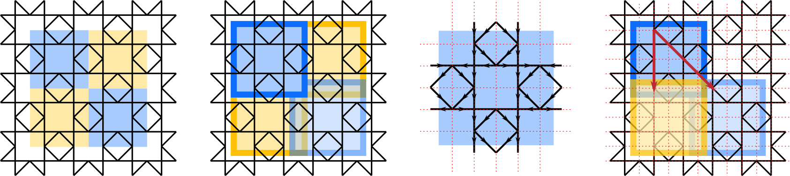
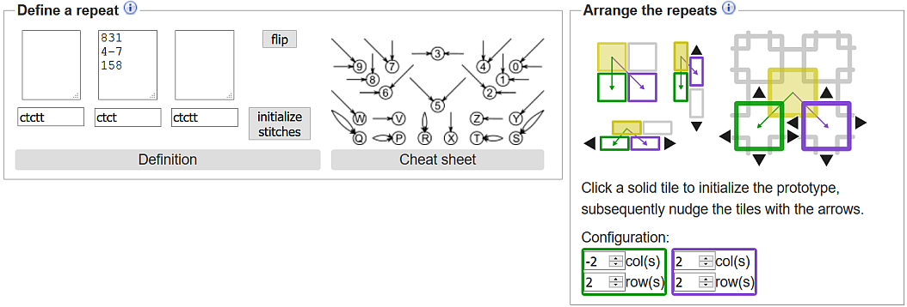
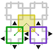

Advanced forms
==============

[lace ground page]: /GroundForge/tiles?tile=5831,-4-7&patchWidth=9&patchHeight=9&shiftColsSE=4&shiftRowsSE=2&shiftColsSW=0&shiftRowsSW=2&

+ [Prototype Tutorial](#prototype-tutorial)
   + [Define the base pattern](#define-the-base-pattern)
   + [Glue copies together](#glue-copies-together)
   + [Initialize stitches](#initialize-stitches)
+ [Footside Tutorial](#footside-tutorial)
+ [Thread diagram as pair diagram](#thread-diagram-as-pair-diagram)

On each [lace ground page], below the prototype, pair and thread diagrams, you will find an area labelled _Forms for advanced users_.  These forms are the controls for creating and editing the prototype.
You can use these controls to modify an existing pattern (add a headside or a footside, for example) or to create a new pattern.

Prototype Tutorial
------------------
We will use Rose ground as an example and define a prototype for it from scratch.
There are many ways to draw the pair diagram for Rose ground.
One way to think of it is as a checkerboard with a diamond inside each of the black squares.

### Define the base pattern
A lace ground consists of a small pattern that is repeated, like a wallpaper or printed fabric pattern, to cover the area you need to fill.
This small base pattern is called a __repeat__.  The form labelled _Define a repeat_ contains three text boxes.  
The left and right boxes control the headside and footside.  We will discuss them later.  The middle box controls the repeated pattern.

From the large pattern, we need to identify the base pattern.  There are many ways to do this and over the course of this tutorial, we will show a few of them.
In the image below, each rectangle highlights one repeat of the Rose pattern.  The repeating rectangles are arranged like vertical bricks.
For convenience, on the far right of the image we have moved the rectangles slightly so that it is easy to see all the intersections of pairs within a rectangle (no intersection lies on the edge of a rectangle).

Next we will map the pairs in the lace ground to a grid.  Within one repeat rectangle, the intersections lie on two columns and four rows as shown by the red dashed lines in the figure below.  The red dashed lines form a grid

For each position in the grid, we assign a symbol.  The symbol specifies the angle and direction of the two pairs that are pointing at that row/column position.
The meaning of each symbol is shown in the "Cheat sheet" on the right of the "Define a repeat" area.  For example, in row 1/column 1 the green arrows correspond to the symbol '4'.  Similarly, in row 3/column 2, there is no intersection of pairs which we represent by the symbol '-'.

We can now fill in the middle section of the "Define a repeat" area.

Notice that the prototype diagram is updated to match the symbols as soon as you click outside of the box.

### Glue copies together

Now that the base pattern is defined, we need to specify how to connect copies of this pattern together.  This is done in the area labelled _Arrange the repeats_.

Consider several meters of a lace edging.  The pattern for the edging is not several meters long.  It is a smaller pattern that you repeat over and over again by sliding the pattern along in one direction.  This gives a long strip.  To make a large rectangular patch from a small pattern, we need to slide the pattern in two directions.

Consider the image below. Red dashed lines show the grid overlaid on the pattern.

To position the blue rectangle on top of the yellow rectangle, we must slide the blue rectangle down 4 rows.
To position the blue rectangle on top of the red rectangle, we must slide it over 2 columns and down 2 rows.  These translations are entered in the configuration information below.

 

If you are more comfortable with visual tools, we have also provided images that you can click on.
For a vertical brick pattern like our Rose ground example, first click on the picture of vertical bricks:

If the prototype pattern does not immediately align correctly, click on the black arrows above and below the solid purple brick to adjust how the two columns of bricks align.  
Each click will move the second column up or down by one row relative to the first column.  Look at the prototype diagram to see how the copies move around.

[Final result](/GroundForge/tiles?patchWidth=13&patchHeight=10&a1=ctct&b2=ctct&a2=ct&a3=ctct&b4=ctct&a4=ct&tile=4-,15,7-,83,,&footsideStitch=ctctt&tileStitch=ctct&headsideStitch=ctctt&shiftColsSW=0&shiftRowsSW=4&shiftColsSE=2&shiftRowsSE=2)

### Another Rose ground example
There is more than one way to choose the base pattern.  
Starting from scratch again, we will think about Rose ground as a checkerboard pattern of repeated squares.
In the figure below, the coloured squares each contain one copy of the pattern.  

Again we want to make sure that none of the line intersections are on the edge of the base pattern.  This time we make the base pattern a little bit larger, as shown in the second drawing from the left, to encompass any intersections along its border.  Notice that the squares overlap a little bit.

As before, we apply a grid to the base pattern and assign symbols to each line intersection.  This time we have three rows and three columns in the base pattern.
Finally, we arrange the copies.  To slide the blue square over the yellow square, we must move it down 2 rows and left 2 columns.  To slide the blue square over the green square, we must move it right 2 columns and down 2 rows.  Note: The pattern has three rows and three columns but the squares overlap in the corner, hence the slides are only a distance of two.

 

You can enter these slide moves directly into the Configuration area.
If you are more comfortable with visual tools, click on the image of a checkerboard with black arrows:

Initially, the copies will be placed corner to corner.  Click on the black arrows to nudge the copies so that they overlap.

[Final result](/GroundForge/tiles?patchWidth=12&patchHeight=12&c1=ctct&b1=ctct&a1=ctct&c2=ctct&a2=ctct&c3=ctct&b3=ctct&a3=ctct&tile=831,4-7,158&footsideStitch=ctctt&tileStitch=ctct&headsideStitch=ctctt&shiftColsSW=-2&shiftRowsSW=2&shiftColsSE=2&shiftRowsSE=2)

### Initialize stitches

For convenience, you can set all stitches in the pattern to the same value.  In the "Define a repeat" area, just below the middle box where you typed symbols for the prototype, there is a small text box.  Enter a stitch as a sequence of 'c', 't', 'r' or 'l' (for example, 'cttct').  Click on the "initialize stitches button" and then on the  image above the prototype diagram to regenerate the thread and pair diagrams.  This is a quick way to see how a ground looks in cloth-stitch, half-stitch or whole-stitch.  Once initialized, you can change the stitches used for individual intersections by editing the prototype diagram.  Each time you click on "initialize stitches button", the values in the prototype are reset.

Footside Tutorial
-----------------
You may want to study how threads disappearing in foot sides return back into the ground.
Foot sides are defined in the side panels of the "define a repeat" form in the advanced section.
Note that the right foot sides depends on the chosen patch width alias number of columns.

Foot sides may require one or two columns of additional stitches.
It is a matter of piecing a puzzle together with symbols from the cheat sheet.
The symbols with a single arrow can extend an arrow of any symbol to make it fit.

Annotated screen shot snippets of an example:

[Live version](/GroundForge/tiles?patchWidth=7&patchHeight=18&a3=-&footside=B,-,C,-,B,-,B,-,&tile=-5-,5-5,-5-,B-C,-5-&headside=5,-,&footsideStitch=tctctr&tileStitch=ct&headsideStitch=-&shiftColsSW=-2&shiftRowsSW=4&shiftColsSE=2&shiftRowsSE=4)

The blue and purple rectangles in this example illustrate corresponding
sections in the form, prototype diagram and pair diagram.
The yellow curves in the prototype show how extended arrows are reduced
to a single connection between stitches in the pair diagram.
Note that the twist marks only indicate multiple twists, not how many.

On the right side we only added extensions.
In practice you would need at least one column with real stitches
to choose other stitches for the foot side than for the pattern.
This example shows that extensions don't need to be a straight line. 
The bold yellow curve causes two stitches connected with two pairs.
In those cases the stitches are merged into a single stitch in the pair diagram.
Thus both pairs for the bottom stitch are stretched.
You can still choose to apply a plait for the thread diagram in those cases,
well, if it happens in an added column and is not part of the ground.

Thread diagram as pair diagram
------------------------------

Sorry, nothing like the prototype diagram to choose stitches for these sets of diagrams.
The team of GroundForge could use the help of a seasoned front end engineer for a more convenient user interface.

You can choose to use one stitch everywhere. Or two different stitches:
one for each cross in the preceding thread diagram, the other for each twist.
To make exceptions to these rules you need to hover over a stitch
in the pair diagram to discover its id for stitch assignments.

An example mixing all the options mentioned above:

The overall default in this example is a `ctct`.
A more selective default is `ctc` for stitches that were twists in the preceding thread diagram.
Two specific stitches are set to `ct`.

The page on the [Droste effect](Droste-effect) has some example patterns.

 Note that spaces may have unexpected results, 
recommended delimiters between assignments: new lines or `,`.

Foot sides can get complicated to define when a pattern has a worker.
At the second and third level two respective four pairs
work from left to right before returning from right to left.
In practice it might be very well possible to alternate the direction every other row.
