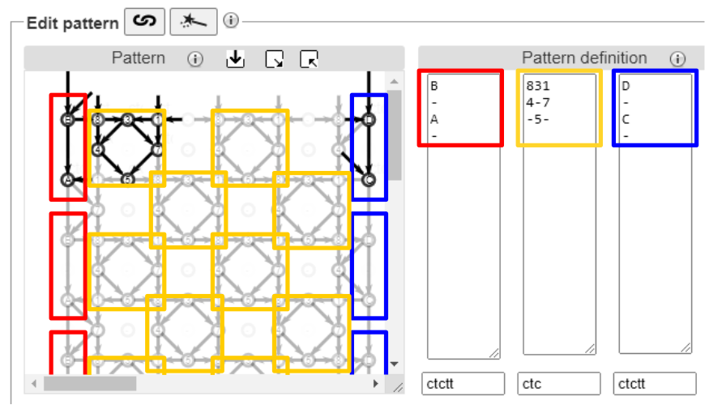
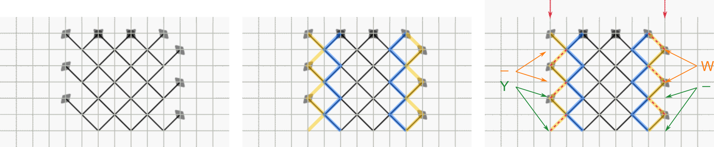
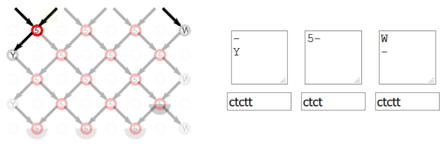
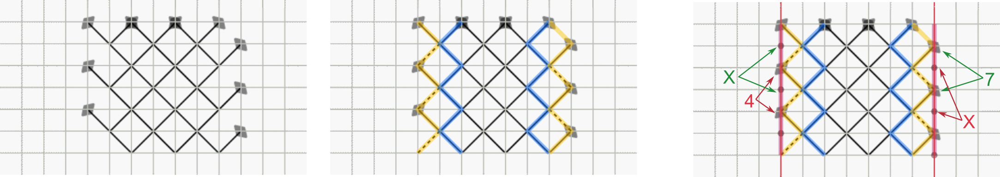
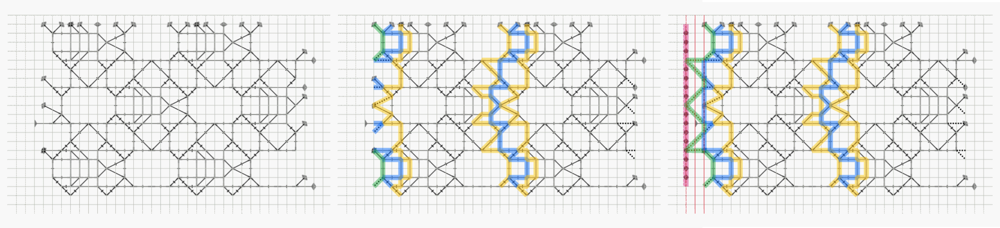
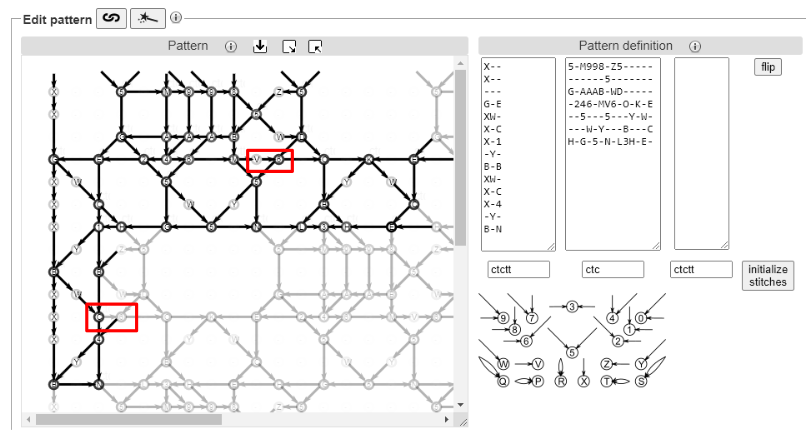
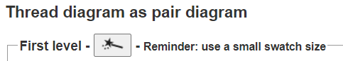
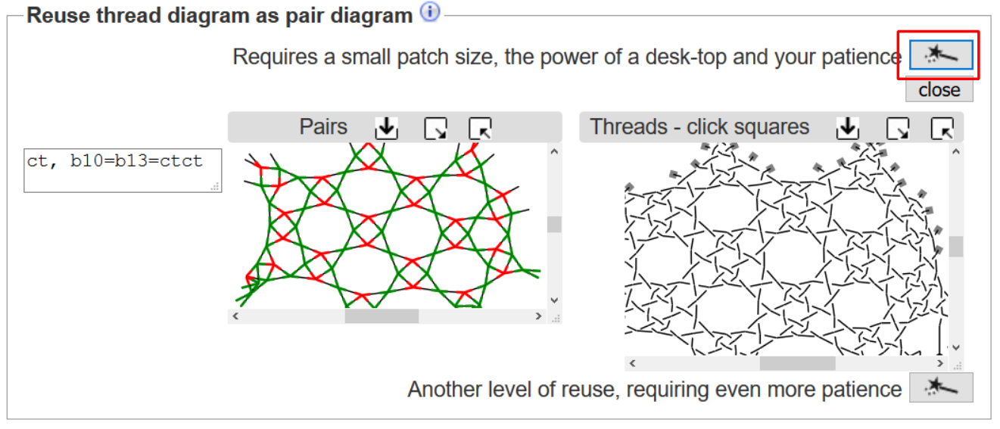
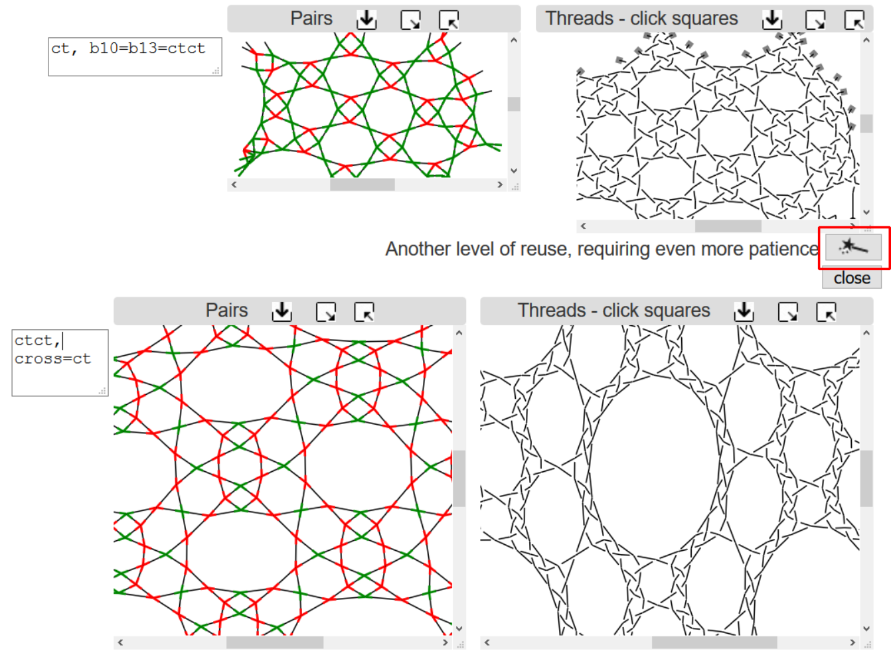

Designing prototypes
==============

[lace ground page]: /GroundForge/tiles?tile=5831,-4-7&patchWidth=9&patchHeight=9&shiftColsSE=4&shiftRowsSE=2&shiftColsSW=0&shiftRowsSW=2&

+ [Prototype Tutorial](#prototype-tutorial)
   + [Define the base pattern](#define-the-base-pattern)
   + [Glue copies together](#glue-copies-together)
   + [Initialize stitches](#initialize-stitches)
+ [Footside Tutorial](#footside-tutorial)
+ [Thread diagram as pair diagram](#thread-diagram-as-pair-diagram)

On each [lace ground page], below the prototype, pair and thread diagrams, you will find an area labelled _Forms for advanced users_.  These forms are the controls for creating and editing the prototype.
You can use these controls to modify an existing pattern (add a headside or a footside, for example) or to create a new pattern.

Prototype Tutorial
------------------
We will use Rose ground as an example and define a prototype for it from scratch.
There are many ways to draw the pair diagram for Rose ground.
One way to think of it is as a checkerboard with a diamond inside each of the black squares.

### Define the base pattern
A lace ground consists of a small pattern that is repeated, like a wallpaper or printed fabric pattern, to cover the area you need to fill.
This small base pattern is called a __repeat__.  The form labelled _Define a repeat_ contains three text boxes.  
The left and right boxes control the headside and footside.  We will discuss them later.  The middle box controls the repeated pattern.

From the large pattern, we need to identify the base pattern.  There are many ways to do this and over the course of this tutorial, we will show a few of them.
In the image below, each rectangle highlights one repeat of the Rose pattern.  The repeating rectangles are arranged like vertical bricks.
For convenience, on the far right of the image we have moved the rectangles slightly so that it is easy to see all the intersections of pairs within a rectangle (no intersection lies on the edge of a rectangle).

Next we will map the pairs in the lace ground to a grid.  Within one repeat rectangle, the intersections lie on two columns and four rows as shown by the red dashed lines in the figure below.  The red dashed lines form a grid.

For each position in the grid, we assign a symbol.  The symbol specifies the angle and direction of the two pairs that are pointing at that row/column position.
The meaning of each symbol is shown in the "Cheat sheet" on the right of the "Define a repeat" area.  For example, in row 1/column 1 the green arrows correspond to the symbol '4'.  Similarly, in row 3/column 2, there is no intersection of pairs which we represent by the symbol '-'.

We can now fill in the middle section of the "Define a repeat" area.

Notice that the prototype diagram is updated to match the symbols as soon as you click outside of the box.

### Glue copies together

Now that the base pattern is defined, we need to specify how to connect copies of this pattern together.  This is done in the area labelled _Arrange the repeats_.

Consider several meters of a lace edging.  The pattern for the edging is not several meters long.  It is a smaller pattern that you repeat over and over again by sliding the pattern along in one direction.  This gives a long strip.  To make a large rectangular patch from a small pattern, we need to slide the pattern in two directions.

Consider the image below. Red dashed lines show the grid overlaid on the pattern.

To position the blue rectangle on top of the yellow rectangle, we must slide the blue rectangle down 4 rows.
To position the blue rectangle on top of the red rectangle, we must slide it over 2 columns and down 2 rows.  These translations are entered in the configuration information below.

 

If you are more comfortable with visual tools, we have also provided images that you can click on.
For a vertical brick pattern like our Rose ground example, first click on the picture of vertical bricks:

If the prototype pattern does not immediately align correctly, click on the black arrows above and below the solid purple brick to adjust how the two columns of bricks align.  
Each click will move the second column up or down by one row relative to the first column.  Look at the prototype diagram to see how the copies move around.

[Final result](/GroundForge/tiles?patchWidth=13&patchHeight=10&a1=ctct&b2=ctct&a2=ct&a3=ctct&b4=ctct&a4=ct&tile=4-,15,7-,83,,&footsideStitch=ctctt&tileStitch=ctct&headsideStitch=ctctt&shiftColsSW=0&shiftRowsSW=4&shiftColsSE=2&shiftRowsSE=2)

### Another Rose ground example
There is more than one way to choose the base pattern.  
Starting from scratch again, we will think about Rose ground as a checkerboard pattern of repeated squares.
In the figure below, the coloured squares each contain one copy of the pattern.  

Again we want to make sure that none of the line intersections are on the edge of the base pattern.  This time we make the base pattern a little bit larger, as shown in the second drawing from the left, to encompass any intersections along its border.  Notice that the squares overlap a little bit.

As before, we apply a grid to the base pattern and assign symbols to each line intersection.  This time we have three rows and three columns in the base pattern.
Finally, we arrange the copies.  To slide the blue square over the yellow square, we must move it down 2 rows and left 2 columns.  To slide the blue square over the green square, we must move it right 2 columns and down 2 rows.  Note: The pattern has three rows and three columns but the squares overlap in the corner, hence the slides are only a distance of two.

 

You can enter these slide moves directly into the Configuration area.
If you are more comfortable with visual tools, click on the image of a checkerboard with black arrows:

Initially, the copies will be placed corner to corner.  Click on the black arrows to nudge the copies so that they overlap.

[Final result](/GroundForge/tiles?patchWidth=12&patchHeight=12&c1=ctct&b1=ctct&a1=ctct&c2=ctct&a2=ctct&c3=ctct&b3=ctct&a3=ctct&tile=831,4-7,158&footsideStitch=ctctt&tileStitch=ctct&headsideStitch=ctctt&shiftColsSW=-2&shiftRowsSW=2&shiftColsSE=2&shiftRowsSE=2)

### Initialize stitches

For convenience, you can set all stitches in the pattern to the same value.  In the "Define a repeat" area, just below the middle box where you typed symbols for the prototype, there is a small text box.  Enter a stitch as a sequence of 'c', 't', 'r' or 'l' (for example, 'cttct').  Click on the "initialize stitches button" and then on the  image above the prototype diagram to regenerate the thread and pair diagrams.  This is a quick way to see how a ground looks in cloth-stitch, half-stitch or whole-stitch.  Once initialized, you can change the stitches used for individual intersections by editing the prototype diagram.  Each time you click on "initialize stitches button", the values in the prototype are reset.

Footside Tutorial
-----------------
In the "Define a repeat" section, the central panel defines the ground, and the left and right side panels define the left and right footsides.

The leftmost edge of the central patch is determined by the leftmost column in the ground definition.  If you want to change where the patch starts on the left, you must choose a different starting point for the base pattern and modify the ground definition accordingly.

The rightmost edge of the patch depends on the number of columns specified in the "Patch size".  If you change the number of columns in the patch size, the right footside may no longer match correctly.  Note that the number of columns required for the footsides are not included in the "Patch size".  They are added on top of the width that you specify.

First, we will consider the simple example of Torchon Ground.  Lay a square grid over the pair diagram. We must identify the loose ends of pairs along the edge and match them up where possible. To do this, we can use a "kissing path". A kissing path follows one set of pairs through the pair diagram.  When two pairs intersect, the kissing path does not cross over to the other side, it just touches the other pair ("kisses") and continues.  You can think of it as the path that a pair of threads follows if a turning stitch (cttct) is used at each intersection.  The yellow and blue thick lines in the figure below highlight the kissing paths for the pairs at the edge of the pair diagram. Note that several incoming edges are missing on the yellow kissing path (dashed red lines).  We can add them by labelling the incoming pair intersections using the symbols 'W', 'Y' and '-' in the Cheat Sheet:

Below is the [completed footside definition](/GroundForge/tiles?patchWidth=6&patchHeight=5&b1=ctct&footside=-,Y&tile=5-&headside=W,-&footsideStitch=ctctt&tileStitch=ctct&headsideStitch=ctctt&shiftColsSW=-1&shiftRowsSW=1&shiftColsSE=1&shiftRowsSE=1). Footside definitions are repeated in one direction, like a frieze pattern.  In this example, the definition for the left footside of the Torchon ground is "-,Y" so the left footside will be "-,Y,-,Y,-,Y,..." for as many rows as are in the patch. Note that in this example, the footside definition has two rows while the ground definition only has one row.  The ground and footside definitions may not always have the same number of rows.

  
Alternatively, we can make the edge straight by adding another pair of threads, shown in red below. 

Now consider the more complicated example of [G-4] in the Whiting sampler.  We follow the same steps: lay a grid over the pair diagram and trace out the kissing paths on the left edge of the pattern.  Note that this time the blue and green kissing paths are not complete; large sections are missing.  We need to add intersections to complete the blue and green kissing paths.  We can also add another kissing path, shown in red, to make a clean straight edge. In total, this footside requires three columns.

Below is [G-4 with left footside].  Notice the red box around "V,6" in the ground area of the prototype.  In the original definition, this was "-,L" which draws a long horizontal edge.  The long horizontal edge sticks out on the left side of the patch.  We can get a better looking footside by shortening this edge.  In order to get a short edge on the left side of the patch, we changed the ground definition to use two short horizontal edges in a row ("V,6") instead of one long edge ("-,L").  The symbols "V,6" and "-,L" give the same result in the thread diagram.  On the footside, we can cut the ground pattern off at "6" which gives a nicer looking result (see red box around "C,6", the "C" intersection is part of the footside.  The "6" intersection is part of the ground).  As an exercise, create the right footside.

You can also create a traditional footside that has several [passives].

[G-4]: /GroundForge/tiles?whiting=G4_P201&patchWidth=40&patchHeight=19&i1=ctctt&f1=ctc&e1=ctc&d1=ctc&c1=ctc&a1=ctctt&g2=ctc&i3=ctc&f3=ctc&e3=ctc&d3=ctc&c3=ctcll&a3=ctctt&n4=ctctt&l4=ctctt&j4=ctctt&h4=ctctt&f4=ctt&d4=ctcll&c4=ctcll&b4=ctctt&g5=ctctt&c5=ctctt&n6=ctctt&j6=ctctt&m7=c&k7=ctc&j7=ctc&i7=ctctt&g7=ctctt&e7=ctctt&c7=ctctt&a7=ctctt&tile=5-m998-z5-----,------5-------,g-aaab-wd-----,-246-m-l-o-k-e,--5---5---y-w-,---w-y---b---c,h-g-5-n-l3h-e-,&footsideStitch=ctctt&tileStitch=ctc&headsideStitch=ctctt&shiftColsSW=-7&shiftRowsSW=7&shiftColsSE=7&shiftRowsSE=7

[passives]: /GroundForge/tiles?patchWidth=19&patchHeight=21&y1=ctcttr&g1=ctct&a1=ctcttl&x2=ctc&w2=ctc&h2=ct&f2=ct&d2=ct&c2=ctc&b2=ctc&x3=ctcrr&w3=ctc&i3=ctct&g3=ctc&e3=ctct&d3=ct&c3=ctc&b3=ctcll&y4=ctcttr&x4=ctc&w4=ctc&h4=ctc&f4=ctc&c4=ctc&b4=ctc&a4=ctcttl&i5=ctc&h5=ctc&g5=ctc&f5=ctc&e5=ctc&d5=ct&g6=ctc&y7=ctcttr&x7=ctcrr&w7=ctc&i7=ctcr&h7=ctc&g7=ctc&f7=ctc&e7=ctcl&d7=ct&c7=ctc&b7=ctcll&a7=ctcttl&x8=ctc&w8=ctc&h8=ctcr&f8=ctcl&d8=ct&c8=ctc&b8=ctc&i9=ctct&g9=ctct&e9=ctct&x10=ctcrr&w10=ctc&h10=ct&f10=ct&d10=ct&c10=ctc&b10=ctcll&footside=B--,XCD,-11,B88,XXX,---,AAA,X78,X--,-AA&tile=---5--,D-B-C-,15-5-5,--5-5-,C63532,---5--,AAB3CD,8-5-5-,-5-5-5,B-5-5-&headside=--C,ABX,88-,11C,XXX,---,DDD,14X,--X,DD-&footsideStitch=ctct&tileStitch=ctc&headsideStitch=ctct&shiftColsSW=0&shiftRowsSW=10&shiftColsSE=6&shiftRowsSE=5

[G-4 with left footside]: /GroundForge/tiles?patchWidth=28&patchHeight=40&l1=ctctt&i1=ctc&h1=ctc&g1=ctc&f1=ctc&d1=ctctt&j2=ctcrr&l3=ctctt&i3=ctc&h3=ctc&g3=ctc&f3=ctcll&d3=ctctt&q4=ctctt&o4=ctctt&m4=ctctt&k4=ctctt&i4=ctt&g4=ctcll&f4=ctcll&e4=ctctt&c4=ctctt&a4=ctctt&j5=ctctt&f5=ctctt&q6=ctctt&m6=ctctt&c6=ctctt&p7=c&n7=ctc&m7=ctc&l7=ctctt&j7=ctctt&h7=ctctt&f7=ctctt&d7=ctctt&c7=ctctt&c9=ctctt&a9=ctctt&c11=ctctt&c12=ctctt&c14=ctctt&a14=ctctt&footside=X--,X--,---,G-E,XW-,X-C,X-1,-Y-,B-B,XW-,X-C,X-4,-Y-,B-N&tile=5-m998-z5-----,------5-------,g-aaab-wd-----,-246-mv6-o-k-e,--5---5---y-w-,---w-y---b---c,h-g-5-n-l3h-e-,&footsideStitch=ctctt&tileStitch=ctc&headsideStitch=ctctt&shiftColsSW=-7&shiftRowsSW=7&shiftColsSE=7&shiftRowsSE=7

Thread diagram as pair diagram
------------------------------
**This feature is still under construction.  We welcome any suggestions on how to improve it.**

In a typical pair diagram, two pairs intersect at each crossing and then continue.  In a thread diagram, two threads meet at each crossing and then continue.  So why not take a thread diagram, flatten all the over/under information, and use it as a pair diagram?  Using this technique, you can quickly create a new, usually more complex, pattern.  This process can be repeated over and over again, as long as your computer has enough power to handle the increased complexity.    In mathematics, this is called ["recursion"](https://en.wikipedia.org/wiki/Recursion).  In art, it is sometimes called the ["Droste effect"](https://en.wikipedia.org/wiki/Droste_effect).

To apply this technique in GroundForge, click on the  image under the "Reuse thread diagram as pair diagram" heading. 
 

There are several options for specifying which stitches appear in the new thread diagram.

By default, every stitch is `ctc`.  You can assign a new default stitch by typing the actions (such as `ct`) in the input box that appears to the left of the new pair diagram. You can also assign a stitch to every "cross" in the original thread diagram by typing `cross=...` (for example, `cross=ctcll`) in the input box.  Similarly, you assign a stitch to every "twist" in the original thread diagram using `twist=...`.  For finer control, you can specify a stitch for a specific intersection.  First find the identity of the intersection in the new pair diagram (hover over the intersection until the id appears), then give it a new value in the input box such as `b10=clcl`.  You can combine any of these options in the input box.  Use a new line or a comma to separate each instruction. After editing the stitches in the input box, click on the  image **above** the pair diagram.

To repeat this process a second time, click on the  image **below** the new pair diagram.  This will create a second new thread diagram by using the thread diagram above the wand as a pair diagram.

See the [Droste effect](Droste-effect) page for more examples.

