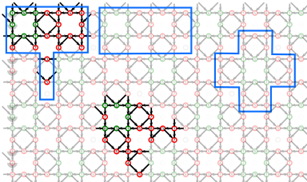

Change the tiling of a pattern definition
=========================================

Patterns can have different types and sizes of tiles, each having their pros and cons.
This page shows the proces of changing the tile definitions.

The image below shows the definition of ground 
[F4](https://d-bl.github.io/GroundForge/tiles?whiting=F4_P180&patchWidth=9&patchHeight=9&d1=ctc&c1=ctc&b1=ctc&a1=ctc&d2=ctc&c2=ctcllctc&a2=ctcrrctc&tile=1483,8-48&footsideStitch=ctctt&tileStitch=ctc&headsideStitch=ctctt&shiftColsSW=-2&shiftRowsSW=2&shiftColsSE=2&shiftRowsSE=2)
by Gertrude Whiting. 

The faint stitches repeat the bright ones. The green rectangles show that the repetition has a brick style.
The small purple tile looks more like a unit presented in traditional text books.
This tile makes it easier to pick the stitches you might want to change.
The large purple tile allows you to vary stitches in two units of work. 
This tile is easy to repeat in the text field to cover more units.
However, the second unit in this larger tile is sliced up in three parts.
Again making it harder to find the stitches you want to change.

An animation shows the procedure below to change the brick into the small green tile.
The <a href="images/brick-to-overlap-animation.gif" target="_blank">animation</a>
appears in a new tab or window, reload that page to restart.

* Type the characters in the rectangle of your choice in the second text field.
* Select the alternating tiles.
* Move the purple tile until you have proper diagonals.
* Then move the green tile to get the diagonals together.
* Any textbook will explain the bottom corners of a unit are the top corners for the next row.
  We saw this happen when moving the tiles in place.
  Make these stitches faint with a dash.
  Having these stitches up to now helps to check the tiles are moving to their target. 

Subsequently, you will have to adjust stitches to get the original thread diagram.
Use two browser windows, one with the old pattern, one with the new pattern.
Then you can copy-paste the corresponding stitches.

For larger patterns the cons of the T-shape tile below (or the variant that didn't even get a border)
might outweigh the pros of the brick. Though in a text book you might want the cross.

For new patterns you can prepare a sketch with pencil on squared paper.
Draw the desired pattern following the lines and/or diagonals
in a way that warps the least what you want.
Sketch the brick or simple tile for the repeats and
use the cheat sheet to find the characters to type.

See also the [tutorial](Advanced#glue-copies-together) pages for related subjects.
