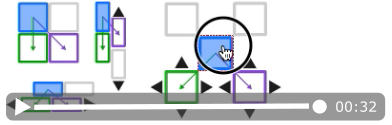
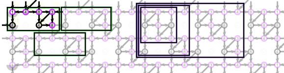

Change the tile layout
======================

The "Tile layout" panel has visual controls to 
change the way a custom base pattern repeats.
Select one of the blue tile buttons to activate that configuration.
Subsequently, use the black arrow buttons to nudge the repeating tiles in one grid-point steps 
until the pattern repeats in a valid way.

A short animation shows the process. It appears in a new tab or window, 
this allows restart with the reload button of your browser.
A step by step description follows after a short explanation of the pattern.

  

See also the [tutorial](Advanced) for a step-by-step introduction to create patterns.

An example pattern
------------------

Patterns can have different types and sizes of tiles, each having their pros and cons.
The image below shows ground [F4](https://d-bl.github.io/GroundForge/tiles?whiting=F4_P180&patchWidth=9&patchHeight=9&d1=ctc&c1=ctc&b1=ctc&a1=ctc&d2=ctc&c2=ctcllctc&a2=ctcrrctc&tile=1483,8-48&footsideStitch=ctctt&tileStitch=ctc&headsideStitch=ctctt&shiftColsSW=-2&shiftRowsSW=2&shiftColsSE=2&shiftRowsSE=2)
by Gertrude Whiting, marked with some possible base tiles. 

The faint stitches repeat the bright ones. The green 2x4 rectangles around the stitches show that the repetition has a brick layout.
The 3x3 purple tile looks more like a unit presented in traditional text books.
The larger purple tiles allows you to vary stitches in more units. 

The animation in words
----------------------

* Type the characters in the base tile of your choice in the second text field.
* Select a tile layout with a blue square/rectangle and adjust with the black arrows.
  * For the 4x4 tile you can select the "simple" layout at the left top and you are done.
  * For the 4x8 tile you can choose between "simple" and "brick" layout.
  * For the 3x3 tile you need the "offset" layout on the right, continue with the following steps.
* Move the purple tile with the black arrows until you have proper diagonals.
* Then move the green tile to get the diagonals together.
* Moving the tiles together caused overlap, it confirmed the tiles arrived at their target
  This overlap can cause unexpected behaviour. 
  Fix this by changing the bottom corners to "-" in the input field.

Subsequently, you will have to adjust what stitches to make at each grid position to get the original thread diagram.
Use two browser windows, one with the old tile layout, one with the new tile layout.
Then you can copy-paste the corresponding stitches.

