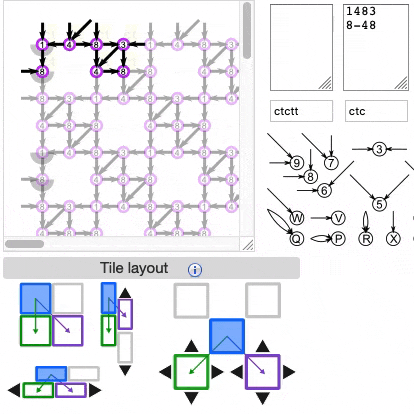

Change the tiling of a pattern
==============================

The illustrations in this panel are buttons with which you can change the way a custom base pattern repeats in the larger pattern and visualisations

Click on a button to activate that configuration: either "simple layout", "vertical bricks", "horizontal bricks" or "checkerboard".
Use the black arrow buttons to nudge the repeating tiles in one grid-point steps until the pattern repeats in a valid way.

The following animation illustrates the process:

  

(If the animation above isn't playing, try <a href="images/brick-to-overlap-animation.gif" target="_blank"> this link </a> instead.  
The animation should appear in a new tab or window, reload that page to restart.)

The steps illustrated here are:

* Create a basic pattern by typing the characters of the pair intersections that you need in the second text field.
* Select a tile layout (In this case the "checkeroard" configuration is used). If, like the example, your base pattern requires a "checkerboard" configuration:
  * Use the arrow buttons on the purple icon until your base tiles connect in a diagonal line.
  * Then use the arrow buttons on the green icon to get the diagonals together.
* Look for any overlapping intersections in the base tile and "delete" them from the basic pattern definition with a "-" instead of the original character/number.
  * (This step avoids defining different stitches to the same intersection of the pattern that may cause the visualisations to not render the way you wanted them.
  * Luckily, this problem will reveal itself soon enough: When you try to define stitches and the colours of the repeat intersections show that you are not creating the pattern you had in mind, this is probably because there is an intersection defined with two different stitch definitions because of an overlap in the base pattern.
  * If you need to be able to change that stitch at an overlap, it is better to define a larger base pattern instead of having the base pattern tile with an overlap. (For example if you want a pattern of two rosegrounds worked in different ways in the same ground.)
 

An example pattern
------------------

The image below shows different base patterns with which the ground [F4] in Gertrude Whiting's catalogue can be defined 
[F4](https://d-bl.github.io/GroundForge/tiles?whiting=F4_P180&patchWidth=9&patchHeight=9&d1=ctc&c1=ctc&b1=ctc&a1=ctc&d2=ctc&c2=ctcllctc&a2=ctcrrctc&tile=1483,8-48&footsideStitch=ctctt&tileStitch=ctc&headsideStitch=ctctt&shiftColsSW=-2&shiftRowsSW=2&shiftColsSE=2&shiftRowsSE=2)

 

* The "simple layout" button will suffice for the 4x4 or 4x8 purple base patterns.
* The 4x8 base pattern can also be tiled with the "horizontal brick" layout.
* The "checkerboard" button can be used for the 3x3 purple in the same way as per the above animation.  
* The "horizontal brick" button can be used for the green 2x4 rectangles.
* The 3x3 purple tile looks more like a unit presented in traditional pattern books.
* The larger purple tiles allow you to vary more stitches in one repeat. 

See also <a href="https://d-bl.github.io/GroundForge/help/Advanced" target="_blank"> this tutorial </a> for a step-by-step introduction to creating and tiling base patterns.

