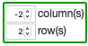
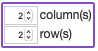
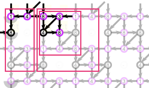
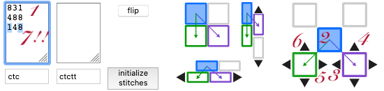

Tile layout
===========

The "Tile layout" panel controls the way a base pattern repeats.

| Buttons | | Steps (either 1+2 or 3) |
|:---:|:---:|:---|
|  | &nbsp;**1**&nbsp;   | Choose the initial layout of the tiles. |
|  | **2**    | Fine tune the choice made above.   Each arrow nudges the green or purple tile (see the bottom of the video) one grid position. |
|     | **3**     | Values resulting from the actions above.   You can also enter the values manually, see this [tutorial section](Advanced#glue-copies-together).   Some browsers might show a red border when the values are problematic. These problems might only show up with larger swatches as empty corners. |
| | | _A myriad of choices can render the same pattern, each has pros and cons._
|  | **?**    | Tutorial sections explain how to find a [simple](Advanced#simple-arrangement) tile (for example the 4x4) a [brick](Advanced#creating-a-smaller-base-tile) (the 2x4) or [overlap](Advanced#overlap-arrangement) (the 3x3, recorded in the video). Bigger tiles are also possible.

An example: corner-to-corner => overlap
----------
<video width="414" height="414" controls style="border: 1px solid; padding-top: 2px;">
    <source src="images/brick-to-overlap-animation.mp4#t=0.001" type="video/mp4">
    Your browser does not support an inline <a href="images/brick-to-overlap-animation.mp4">video</a>.
</video>  

The video above shows what happens with the diagram (and status bar of the browser)
when executing the steps numbered in the image below. 
The video starts with ground [F4](https://d-bl.github.io/GroundForge/tiles?whiting=F4_P180&patchWidth=9&patchHeight=9&d1=ctc&c1=ctc&b1=ctc&a1=ctc&d2=ctc&c2=ctcllctc&a2=ctcrrctc&tile=1483,8-48&footsideStitch=ctctt&tileStitch=ctc&headsideStitch=ctctt&shiftColsSW=-2&shiftRowsSW=2&shiftColsSE=2&shiftRowsSE=2)
by Gertrude Whiting as defined in the [catalogue](/gw-lace-to-gf).
The very last action (not numbered) would bring you back to this page.

| | |
|:---:|:---|
|  | Step 1 of the video starts with typing the characters in the 3x3 rectangle.  |
