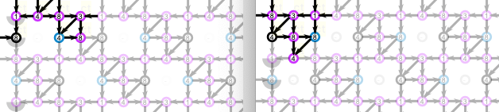

Change the tile layout
======================

The "Tile layout" panel has visual controls to 
define the way a custom base pattern repeats.
Select one of the blue tile buttons to activate the desired configuration.
Subsequently, use the black arrow buttons to nudge the repeating tiles in one grid-point steps 
until the pattern repeats in a valid way.

<video width="414" height="414" controls style="border: 1px solid; padding-top: 2px;">
    <source src="images/brick-to-overlap-animation.mp4" type="video/mp4">
    Your browser does not support an inline <a href="images/brick-to-overlap-animation.mp4">video</a>.
</video>  

The video above shows what happens with the diagram 
when following the steps numbered in the image below.
Descriptions of the steps follow after introducing properties of the pattern.

An example pattern
------------------

The image below shows ground [F4](https://d-bl.github.io/GroundForge/tiles?whiting=F4_P180&patchWidth=9&patchHeight=9&d1=ctc&c1=ctc&b1=ctc&a1=ctc&d2=ctc&c2=ctcllctc&a2=ctcrrctc&tile=1483,8-48&footsideStitch=ctctt&tileStitch=ctc&headsideStitch=ctctt&shiftColsSW=-2&shiftRowsSW=2&shiftColsSE=2&shiftRowsSE=2)
by Gertrude Whiting as defined in the [catalogue](/gw-lace-to-gf).
The black rectangles and squares mark some possible base tiles, each has their pros and cons. 
Some options were not possible when publishing. We had to make a choice anyway, but you can change when desired. 

The faint stitches repeat the bright ones. 
The 4x2 rectangles (one with all the bright stitches) show that the repetition has a brick layout.
The 3x3 tile looks more like a unit presented in traditional text books.
The larger tiles allows you to vary stitches in more units. 

Tutorial sections explain how to find a [simple](Advanced#simple-arrangement) 
tile (in this case the 4x4) a [brick](Advanced#creating-a-smaller-base-tile) 
(a rotated variant of the 4x2 above) or [overlap](Advanced#overlap-arrangement) (the 3x3).

The video in words
------------------

* Type the characters of the custom base tile of your choice (in this case the 3x3) in the second text field (step 1).
* Start with the blue tile in the "corner-to-corner" layout on the right (step 2), 
    then nudge the tiles until the corners _overlap_ with the following steps (step 3-6).
  * Move the purple tile with the black arrows in north-west direction until you have proper diagonals.
  * Then move the green tile to the north-east to get the diagonals together.
* The overlap can cause unexpected behaviour. 
  Fix this by changing the bottom corners in the input field to "-" (step 7).
  Please note thate these stitches become faint in the diagram.
* Not recorded: without nudging you can create valid patterns with the following combinations
  * The 4x4 tile with the "simple" layout at the left top.
  * The 4x2 tile with "brick" layout. 
  * The 8x4 tile with the "simple" as well as the "brick" layout.
  

Changed stitches
----------------
The black and blue stitches in the images below show 
that the tile change has consequences for the thread diagram.
  

You will have to adjust to get the original thread diagram.
Use two browser windows, one with the old tile layout, one with the new tile layout.
Then you can copy-paste the corresponding [stitches](Replace).
