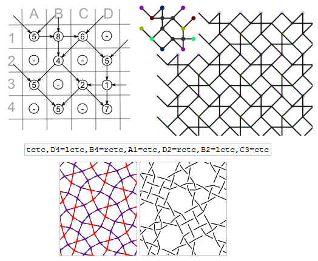

Choose Stitches
===============

- [Stitch definitions](#stitch-definitions)
- [Assign stitches](#assign-stitches)
- [An Example](#an-example)

This form sets stitches for the first pair of diagrams on the main page.
The pattern choice reveals the required fields in the stitches form,
The pattern is also filled out in the parameters form.
Subsequent paragraphs explain how to set the stitches field manually
for not covered patterns and dimensions.



Below some less trivial stitches to copy-paste into the form.
A second string is the mirrored version of the stitch.

 crclct 

 clcrclc, crclcrc

 ctctc

 ctclctc, ctcrctc

 ctclcrctc, ctcrclctc

 ctcttctc

Stitch definitions
------------------

The definition of a stitch consists of a sequence  of the characters
`c`, `t`, `l`, `r` for cross, twist, left-twist and right-twist. 
A stitch requires at least a cross, violating this requirement would implicitly change the pair diagram.
Invalid characters are ignored.

You can try a `p` for a pin, but that rarely works as desired,
see issue [#51] for the technical details.

Assign stitches
---------------

The form fields for stitches on the main page expect defaults and/or assignments. For example `A1=ctc` assigns a plain cloth stitch to id A1 which represents the upper left stitch of the pattern.
No spaces are allowed around the equal sign between the id and stitch definition.

If a form field starts with a stitch definition, it is used as default.
When a thread diagrams is used as pair diagram, you can use the keywords `cross` and `twist` as id's for defaults.

An Example
----------

The image below shows screen shot snippets of a pattern and its stitches.

* _Top left:_ the definition of a pattern created by one of the example page.
  The digits inside the circles determine the configuration of arrows arriving at that position. 
  The rows and columns determine the id's assigned to stitches.
  For example the top-left (5) gets id A1. Well, that's the theory.
  Under circumstance the id's in a row of stitches may start somewhere halfway the matrix
  and the stitches wander a little away from their matrix position,
  see issue [#96].
* _Top right:_ how the pattern definition looks like when repeated. The colored dots are explained on the "reshape" pages.
* _Bottom:_ the diagrams generated with the chosen stitches.
  When hovering with your mouse over a stitch (in a generated pattern, not the screenshot above), your browser is supposed to show the id and instructions of a stitch.

[stitches]: /GroundForge/stitches.html
[main]: /GroundForge/
[assemble]: /GroundForge/help/Reversed-engineering-of-patterns
[#51]: https://github.com/d-bl/GroundForge/issues/51
[#96]: https://github.com/d-bl/GroundForge/issues/96
