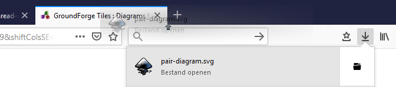

[tiles]: /GroundForge/tiles?tile=5831,-4-7&patchWidth=9&patchHeight=9&shiftColsSE=4&shiftRowsSE=2&shiftColsSW=0&shiftRowsSW=2&
[intro]: /GroundForge/help/intro

Download
========
The  button downloads a diagram to save it as an SVG file.
Several applications can [edit][SVG editor] these files, manipulating vectors not pixels.
Modern browsers can show these files, just drag the download between other pages.

 

[SVG editor]: https://en.wikipedia.org/wiki/Comparison_of_vector_graphics_editors#File_format_support
