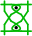
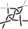
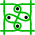
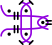
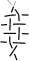
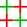
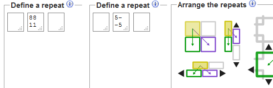

Droste effect
=============

Pair diagrams of several traditional grounds are very similar to thread diagrams of more basic grounds.
The differences in the basic grounds are the stitches.

The principle of using a thread diagram as pair diagram can be used over and over again, in theory.
In practice the holes will grow very large. The diagram generator supports up to lever 3.
At level 4 browser would choke even with a very small number of repeats.

At each level you can mix stitches resulting in a myriad of patterns.
The following table shows just a few options in the level-2 column.
The last column mentions patterns of the Whiting index,
some times they are mirrored or have other small variations.

level 1                                                                  | interactive diagrams    | level 2     | [Whiting index](/gw-lace-to-gf)
-------------------------------------------------------------------------------------|----------------|-------------|---------
single stitch | click 2nd  too!
                                      | [ct-ctct]      |  | A5, A6, B5, C6, [A7-H7,G11]
   | [ctct-ct/ctct] |    | A2, B2, B6, C6
 | [crclct-ct/ctct] |   | C6
 | [clcrclc-ctc] | 
 | [ctctc-ctc] |  | F2
stitch mix |
   | 2 x [ctc+t]* |  | D16
 | 2 x [ct/ctct] | surprise!

*: the second level pair diagram looks a bit weird because "stitches" don't cross.

[ct-ctct]: /GroundForge/tiles?tile=-5&tileStitch=ct&droste2=ctct&patchWidth=5&patchHeight=6&shiftColsSW=-2&shiftRowsSW=0&shiftColsSE=1&shiftRowsSE=1
[ctct-ct/ctct]: /GroundForge/tiles?tile=-5&tileStitch=ctct&droste2=ct,b10=b13=ctct&patchWidth=5&patchHeight=6&shiftColsSW=-2&shiftRowsSW=0&shiftColsSE=1&shiftRowsSE=1
[crclct-ct/ctct]: /GroundForge/tiles?tile=-5&tileStitch=crclct&droste2=ctct,b16=b15=b12=ct&patchWidth=5&patchHeight=6&shiftColsSW=-2&shiftRowsSW=0&shiftColsSE=1&shiftRowsSE=1
[clcrclc-ctc]: /GroundForge/tiles?tile=-5&tileStitch=clcrclc&droste2=ctc,b16=ctct,b13=ctcr,b15=ctcl&patchWidth=5&patchHeight=6&shiftColsSW=-2&shiftRowsSW=0&shiftColsSE=1&shiftRowsSE=1
[clcrclc-ctc]: /GroundForge/tiles?tile=-5&tileStitch=ctctc&droste2=ctc,b16=ctct,b13=ctcr,b15=ctcl&patchWidth=5&patchHeight=6&shiftColsSW=-2&shiftRowsSW=0&shiftColsSE=1&shiftRowsSE=1
[ctctc-ctc]: /GroundForge/tiles?tile=-5&tileStitch=ctctc&droste2=ctc,B16=ctcttt,B15=ctcrrr,B14=ctclll,b13=ctcctc&patchWidth=5&patchHeight=6&shiftColsSW=-2&shiftRowsSW=0&shiftColsSE=1&shiftRowsSE=1
[ctc+t]: /GroundForge/tiles?tile=8,1&a1=ctct&a2=ctcl&droste2=ctc,a24=a15=tt,a14=tctct&patchWidth=4&patchHeight=4&shiftColsSW=0&shiftRowsSW=2&shiftColsSE=1&shiftRowsSE=2
[ct/ctct]: /GroundForge/tiles?tile=88,11&tileStitch=ctct&b1=ct&a2=ct&droste2=cross=ctct,twist=ct&patchWidth=6&patchHeight=6&shiftColsSW=0&shiftRowsSW=2&shiftColsSE=2&shiftRowsSE=2
[A7-H7,G11]: /gw-lace-to-gf#val

Seed your own experiments
-------------------------

To mix stitches at the first level, you can use patterns of the [Tesselace index](/tesselace-to-gf)
or get your feet wet with designing patterns from scratch.
Enter alternating `-`'s and `5`'s or an even number of alternating rows of `8`'s and `1`'s,
as shown below. Just try which ones of the purple tiles produce a valid pattern.

Choose Stitches
---------------

At the first level you can choose your stitches in the pattern diagram, click the  to show the result.

Some stitches to copy paste:



Stitches at the 2nd/3rd level
-----------------------------

The second and third level have a less convenient method to select stitches.
The team of GroundForge can use a seasoned front end engineer for a more convenient user interface.

You can choose to use one stitch everywhere. Or two different stitches:
one for each cross in the preceding thread diagram, the other for each twist.
To make exceptions to these rules you need to hover over a stitch
in the pair diagram to discover its id for stitch assignments.

An example mixing all the options mentioned above:

The overall default in this example is a `ctct`.
A more selective default is `ctc` for stitches that were twists in the preceding thread diagram.
Two specific stitches are set to `ct`.

_Note_ 
Spaces may have unexpected results, 
recommended delimiters between assignments: new lines or `,`.
