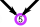

The purpose/meaning of buttons/icons in short
=============================================

 **Link**  
To a help page. Hover over the icon for the subject.

**[Reload](Undo)**  
the wand reloads only the diagrams (faster) / 
the link reloads the entire page and makes your browser remembering your pattern

 **Stitch**  
The character inside the circle determines the origins 
of the pairs used to make the stitch.
The default [cheat sheet](images/matrix-example.png) shows all you need to assemble a pattern.
An [extended version](images/matrix-template-extended.png) 
shows additional symbols used in legacy patterns.

**Resize**  
Depending on the browser/device, the diagrams may have a hot corner
in the south-east, where the sliders meet.
Drag this corner to adjust the available space. 
The buttons shown here are an alternative when the hot corner is not available, for example on touch devices. 

 **Animate**  
It may bridge the difference in shapes of the holes between pattern definition and thread diagram. 
For example for [dropped stitches](Replace#drop-stitches) or irregular holes. 
An example of the latter is the TesseLace pattern [3x4_447](/GroundForge/tiles.html?TesseLace=3x4_447&patchWidth=12&patchHeight=12&tile=4-L8,-50F,56-O&shiftColsSW=0&shiftRowsSW=3&shiftColsSE=4&shiftRowsSE=0&)
which becomes surprisingly regular.
See also [reshape patterns](Reshape-Patterns).

 **Download**  
scalable images for 3rd party [editors](Reshape-Patterns#evaluated-editors).
Or preview in your browser by [dragging](images/download.png) the file between other pages.
* thread diagram: for other thread [colors/widths](Thread-Properties#more-thread-colors-andor-widths)
* pair diagram: larger swatches distort less
