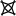

The purpose/meaning of buttons/icons in short
=============================================

 **Link** to a help page. Hover over the icon for the subject.

**[Reload](Undo)**: diagrams (faster) / page (the browser remembers your pattern)

**Resize**  
Depending on the browser/device, the diagrams may have a hot corner
in the south-east, where the sliders meet.
Drag this corner to adjust the available space. 
The buttons shown here are an alternative when the hot corner is not available, for example on touch devices. 

 **Animate**  
It may bridge the difference in shapes of the holes between pattern definition and thread diagram. 
For example for [dropped stitches](Replace#drop-stitches) or irregular holes. 
An example of the latter is the TesseLace pattern [3x4_447](/GroundForge/tiles.html?TesseLace=3x4_447&patchWidth=12&patchHeight=12&tile=4-L8,-50F,56-O&shiftColsSW=0&shiftRowsSW=3&shiftColsSE=4&shiftRowsSE=0&)
which becomes surprisingly regular.
See also [reshape patterns](Reshape-Patterns).

 **Download**:
scalable images for 3rd party [editors](Reshape-Patterns#evaluated-editors).
* pair diagram
* [thread diagram](Thread-Properties#more-thread-colors-andor-widths)
