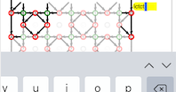

Modify stitches
=======================
One of the diagrams shows faint and bright stitches.
The faint stitches repeat the bright ones.
Click slightly north-east of a bright stitch to open a yellow input field and start typing. 
Don't use your mouse to position the cursor inside the input field because
clicking will select another input field.
User the arrows on your keyboard to move around. 

You can also use the TAB key of your keyboard to travel from one field to the next,
even from/to form fields outside the diagram. 
Touch devices may also have keys to traverse through the fields.
Below a screenshot of an iPad with the up/down arrows on the right.
 

Stitch definitions
------------------

Type as many `c`'s and `t`'s for cross and twist as you need for the stitch of your choice,
or use `l`'s and `r`'s for a left twist or right twist.
For example, here are some interesting stitch combinations that you can copy and paste:



The right footside in the following example applies the last stitch in the second row of the figure above (with a few more twists).
You can [try](/GroundForge/tiles?patchWidth=3&patchHeight=8&g1=tctcttrrctct&f1=tctct&c1=ctc&b1=tctct&f2=tctct&c2=ctc&b2=tctct&a2=tctct&footside=-7,A1&tile=8,1&headside=8D,4-&footsideStitch=tctct&tileStitch=ctc&headsideStitch=tctct&shiftColsSW=-1&shiftRowsSW=2&shiftColsSE=0&shiftRowsSE=2)
variations.

Drop stitches
-------------
To remove a stitch from the pattern, you can use `-` (a single dash and no other symbols) for the stitch.
If you delete all the text from a stitch field, the default value is used.  
The default stitch is the text that appears in the bottom row of boxes in _Pattern definition_, as shown in the figure above. If there is no text in this box, the default is `ctc`.

_Warning_: too many adjacent dropped stitches may cause weird thread diagrams
in which the pairs swap before a stitch is made.

Reconnected stitches
--------------------
The green annotations in the screen shot below show how the remaining stitches reconnect in the pair diagram after a dropped stitch.
One case is straight forward. In the other case, because the GroundForge pair diagram treats stitch-pin-stitch as a single stitch, the stitches are merged two by two.

The  button simulates what the pattern looks like when the connections between stitches act like springs.
The same spring behaviour is used to create the thread diagrams.  Aplying the animate button creates a pair diagram that can be used as a pricking for the thread diagram. 

You can [try](/GroundForge/tiles?patchWidth=12&patchHeight=13&g1=ctct&e1=ctct&c1=ctct&a1=ctct&f2=ctct&b2=-&g3=ctct&e3=ctct&c3=ctct&a3=ctct&h4=ctct&f4=-&d4=ctct&b4=ctct&g5=ctct&e5=ctct&c5=ctct&a5=ctct&f6=ctct&b6=ctct&g7=ctct&e7=ctct&c7=ctct&a7=ctct&h8=ctct&f8=ctct&d8=ctct&b8=ctct&tile=5-5-5-5-,-5---5--,B-C-B-C-,-5-5-5-5,5-5-5-5-,-5---5--,B-C-B-C-,-5-5-5-5,&footsideStitch=tctct&tileStitch=ctct&headsideStitch=tctct&shiftColsSW=0&shiftRowsSW=8&shiftColsSE=8&shiftRowsSE=8)
variations.

