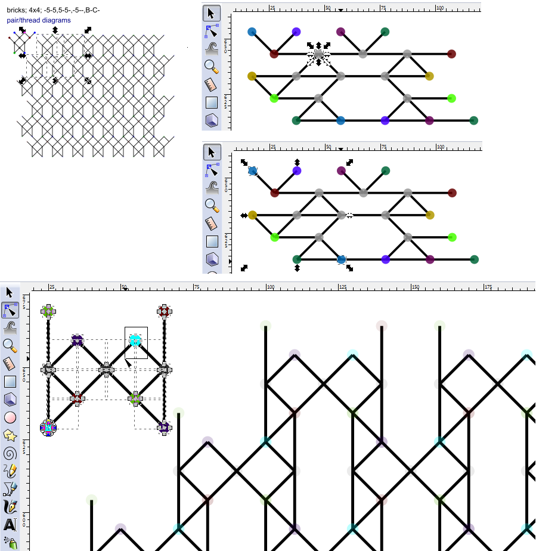
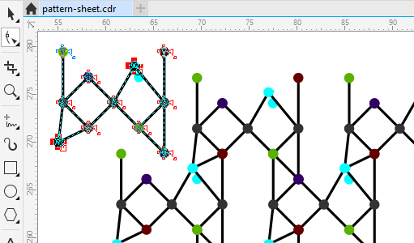

Reshape Using clones
====================

_Customize a generated pattern to your own taste._

Table of contents
-----------------

* [Editor Requirements](#editor-requirements)
* [The procedure](#the-procedure)
  * [Step by step for InkScape v0.91](#step-by-step-for-inkscape-v091)
  * [CorelDRAW X8 preparations](#coreldraw-x8-preparations)
* [Screenshots for InkScape v0.91](#screenshots-for-inkscape-v091)
* [Screenshots for CorelDraw X8](Reshape-Using-Clones#screenshots-for-coreldraw-x8)

Editor Requirements
-------------------

The SVG editor should have "full" support for clones or `<use>` elements in SVG terminology. "Full" means that the clones are not plain copies but reflect changes made to the original. For example InkPad imports clones properly but doesn't have the "full" support. On the other hand does CorelDRAW have the full suport of clones, but doesn't import them correctly. So in case of CorelDRAW you need some preparations.

The editor should have a mode to manipulate objects, and a mode to deal with nodes on objects.

The procedure
-------------

The procedure is written for two specific SVG editors but might work with small differences for other editors too.

In short:

Download a pattern-sheet from [GroundForge] and open it with the SVG editor. 
All tiles (or repeats) in a patch change along with changes made to the slightly separated tile/repeat in the top left corner. Select a dot by its nodes to drag the connected lines along, move nodes with the same color together to move all four connected lines.

[InkScape]: http://inkscape.org
[CorelDRAW]: http://www.coreldraw.com/en/product/graphic-design-software/
[GroundForge]: /GroundForge/

### Step by step for [InkScape] v0.91.

* Start with object mode.
* Right-click the tile that sits next to the cloned patch to enter the group of objects.
* Select all the objects in the group of the tile.
* Switch to node mode.
* Select a dot by dragging a square around it. This way the end of the adjacent lines are also selected and will move along with the dot.
* Less than four adjacent lines on the selected dot? Hold down the shift key when selecting the second or even third dot of the same colour.
* Drag the dots with the mouse or nudge them with arrow keys. Five time an arrow key in InkScape is a full grid position. One time shift+arrow is two grid positions.

### [CorelDRAW] X8 preparations.

The patch witch very faint dots should be reconstructed manually from the single repeat with the bright dots.

* remove the patch with the very pale dots
* the remaining repeat with bright dots may have a few duplicate dots on top of one another, remove these duplicates in advance.
* rebuild the removed patch:
  * make a clone of the bright repeat
  * duplicate the clone
  * attach it to the first clone as described for "reshaping using copies"
  * duplicate both clones
  * attach ... and so on
* select all the objects in the original repeat one by one with ctrl-shift-click
* switch to node mode, check you did not miss anything and continue as for InkScape at "switch to node mode"

Screenshots for InkScape v0.91
------------------------------

_On the left_: shows how the patch repeats the slightly off-set "tile" in the top left, not unlike the [logo] tiles.

_On the right_: dots selected as objects, note the dashed rectangles around the two selected dots. The toolbar indicates object mode with the first icon.

_At the bottom_: light blue dots and their line ends selected by their nodes. The toolbar indicates node mode with the second icon.

[logo]: ../images/logo-medium.png

Screenshots for CorelDraw X8
----------------------------

Moving the blue dots reveals there was a duplicate dot that wasn't removed.

