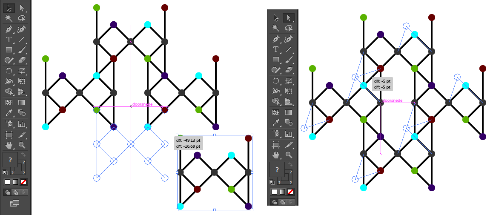

Reshape using copies
====================

_Customize a generated pattern to your own taste._

Table of contents
-----------------

* [Introduction](#introduction)
* [The Procedure](#the-procedure)
* [Screenshots with InkScape v0.91](#screenshots-with-inkscape-v091)
* [Screenshots with Adobe Illustrator v2015-3.1](#screenshots-with-adobe-illustrator-v2015-31)

Introduction
------------

Colored dots help performing the tasks: they should match up and move together. Too many colors would be hard to distinguish, therefore the colors are limited to dots with less than four lines connecting with other dots. The procedure is written for any state of the art [SVG editor] but might be slightly different with the editor of your choice.

The Procedure
-------------

* Download a pattern-sheet from [GroundForge] and open it with an [SVG editor].
* Assemble a new patch with about four copies of the tile/repeat that is slightly separated from the downloaded patch. Four repeats is usually just enough to get an impression of the pattern, yet not too much dots to select and move together. You may have to ungroup (InkScape) or break-apart (Ope Office Draw) to access just the group of objects you need.
* The colored dots guide you how to seam the copied repeats together. The process is illustrated by the screenshots below.
* With InkScape you will have to ungroup the four repeats, select all their objects and switch to node mode (F2). With Adobe Illustrator it is enough to switch to "select direct".
* Now you can select dots to move by dragging a rectangle around them as illustrated with the close up dot in the first set of screenshots. You may need to hold down shift key to add another dot to the selection, just try or check the tutorials or user guide of your editor.
* You need to select the same dot in each repeat to keep the pattern repetitive. For dark grey dots you need to select just one per repeat. In case of a colored dot, you need to select all dots with that color.
* With the proper dots selected you can nudge them into another position by the methods provided by your editor.

When satisfied you can create a bigger patch the same way you moved the first four repeats together, perhaps you want to remove the dots first.

[GroundForge]: /GroundForge/
[SVG editor]: https://en.wikipedia.org/wiki/Comparison_of_vector_graphics_editors#File_format_support

Screenshots with InkScape v0.91
-------------------------------

_On top_: Generated patches with the initial tile/repeat selected.

_Second row_: Assembling a new patch with four copies of the initial tile/repeat. Dots with the same color should still "merge" by snapping the groups of objects together. Between the two examples a close up of "merged" dots, the dashed lines mark the bounding boxes of the lines and dot. The end nodes of the lines sit at the centre behind the dots.

_At the bottom_: One dot per tile/repeat selected and nudged to another position.

Screenshots with Adobe Illustrator v2015-3.1
--------------------------------------------

_Left_ Moving the fouth repeat into position

_Right_ Moving corresponding dots after selecting them "select direct"

