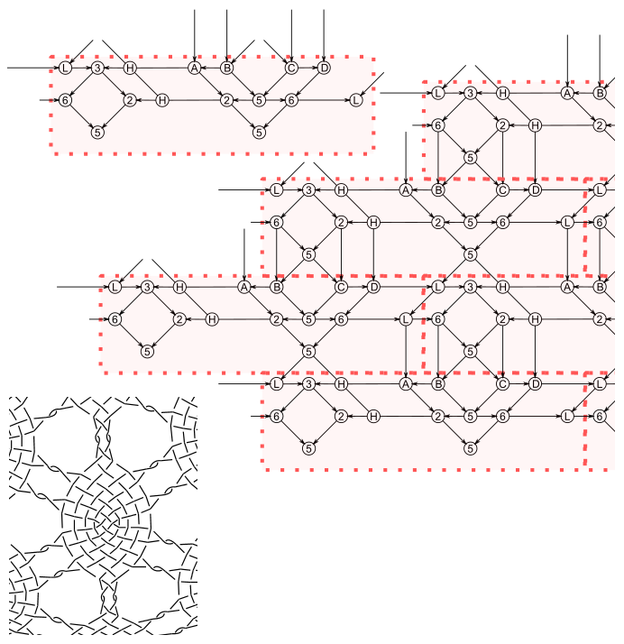
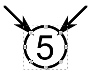
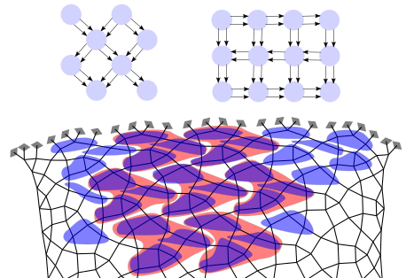

Reversed engineering of patterns
================================

Different methods allow to reproduce a pattern with GroundForge.

- [Recognize patterns](#recognize-patterns)
- [Matrix from pair diagram](#matrix-from-pair-diagram)
  * [Tiling](#tiling)
  * [With an SVG editor](#with-an-svg-editor)
- [Droste method](#Droste-method)

Recognize patterns
------------------

The [example pages](examples) are the easiest way to start experimenting with grounds.
The generated pair diagrams don't care about plaits and something-pin-something
and draw them as plain cloth stitches.
Furthermore are the distances between stitches optimized to some average.
So when trying to start with some familiar pattern to make variations,
you may have to simplify, mirror and distort it
to recognize it in the [TesseLace Index](TesseLace-Index). 

Let us the process with an example:

* left: the desired pattern (pattern 3086 of "Gründe mit System" by Uta Ulrich, stretched by Kitty Zuidgeest, 4F in mrs [Whiting index](Whiting-Index))
* 2nd: simplified something-pin-something to plain stitches
* 3rd: snapping stitches to grid positions
* 4th: a partially squeezed version also snapping to grid positions
* top right: the matching pattern from the [TesseLace Index](TesseLace-Index)
* bottom right: a flipped version of the stitches on the [droste](Droste-effect) page also matches

Snapping to a rectangular grid might not help to recognize the corresponding pattern in the index.
See also the trick with colors on the [Reshape Patterns](Reshape-Patterns) page,
we'll get back to snapping further down the page.

Simplifying stitches might need some out of the box thinking as shown with the Binche snow-flakes under [tiling](#tiling)

Matrix from pair diagram
------------------------

The template below contains objects to assemble a matrix required for the parameters.
Each object represents a stitch and the pairs used to make the stitch.
A less compact [variant] of the template has the objects in alpha-numerical order:
counter clock-wise, shortest first.

Start with the simplifications and distortions as described under [Recognize patterns](#recognize-patterns).
The snapped versions of the example happen to abide the rules for a valid matrix:
diagonal connections span just one square, horizontal and vertical span one or two squares.
Lookup the digits or letters from the template and fill them in on the adjusted diagram.
You might need more repeats than expected to figure out a tiling.

Note that 18 out of 449 patterns known on the [TesseLace Index](TesseLace-Index) page (including the pricking variations) may suffer from bug [#93](https://github.com/d-bl/GroundForge/issues/93).

### Tiling

The next step is figuring out the tiling.
GroundForge uses only rectangular tiles, that might not match the natural repeat of a pattern.
The tiles in the example are surrounded with a red-dotted line and stacked as bricks in a wall. 
An alternative stacking method looks like a checker board though the tiles can be rectangles.
Finally read the matrix from the symbols within one tile.
Note that empty spots require a dash as shown on [choose stitches](Choose-Stitches),
it would get confusing with this example.

To see if it is possible to reduce a rectangular tile to bricks,
divide the rectangle in four quadrants.
If the upper left equals the lower right and the upper right equals bottom left,
you can use the top half or bottom half as brick tile.
It saves id's of stitches to assign.

### With an SVG editor

You can also use a general purpose editor like Adobe-Illustrator, CorelDraw or the free InkScape
and the [SVG version] (right click to download) of the template.

The symbol in each template object has six free snapping points,
two of them should be connected with other objects.
Copy-paste these objects to assemble a pattern without changing the length or directions of lines connecting the symbols. It might need some out-of-the-box thinking: the Binche snow flake example above has horizontal connections and the vertical connection is reduced to a single stitch. Stretching the stitch into a kind of plait with a hole (`ctcttctc`) reveals traditional connections in the thread diagram.

Droste method
-------------

The Droste method uses thread diagrams as pair diagram.

The image below tries to show how to dissect a pair diagram as if it is a thread diagram.
The blue shapes enclose stitches with two pairs alias threads.
The red shapes collect stitches into a repeat with three rows of the diagonal base pattern, its matrix:

    5-
    -5
    5-

The weaving base pattern has always a checkerboard tiling. The diagonal base pattern needs a brick tiling with an odd number of rows and a checkeboard tiling with an even number of rows.

The ID calculator of GroundForge can sometimes shift a column.
The effect for this particular matrix is shown in the table below.
Fixing this bug would break existing links beyond control of the project.
As usually the patterns are distorted beyond recognizing the underlying matrix,
fixing the bug would introduce a worse problem.

Hover over stitches in the pair diagram to find out the actual ID of a stitch.
At the first set of diagrams we need the following stitch definitions to reproduce the pattern at level two.

    A1=ct B2=cr B3=crcl

The result of the mistaken ID calculator:

|  .  |     |  A  |  B  |     |  A  |  B  |
| --- | --- | --- | --- | --- | --- | --- |
|  1  |     | A1  | B1  |     | A1  | B1  |
|  2  |     | A2  | B2  |     | A2  | B2  |
|  3  |     | B3  | A3  |     | B3  | A3  |
|     |     |     |     |     |     |     |
|  1  |     | B1  | A1  |     | B1  | A1  |
|  2  |     | B2  | A2  |     | B2  | A2  |
|  3  |     | A3  | B3  |     | A3  | B3  |

[SVG version]: images/template.svg
[variant]: images/matrix-template2.png
[snow flake]: /GroundForge/?tiles=bricks&matrix=L3H-AB-CD-%0D%0A6-2H-256-L%0D%0A-5----5---&stitches=ctc+H3%3Dctcttctc+A1%3Dctcll+B2%3Dctcll+E1%3Dctcrr+D2%3Dctcrr&rows=12&cols=14&left=1&up=1&transparency=0&#diagrams