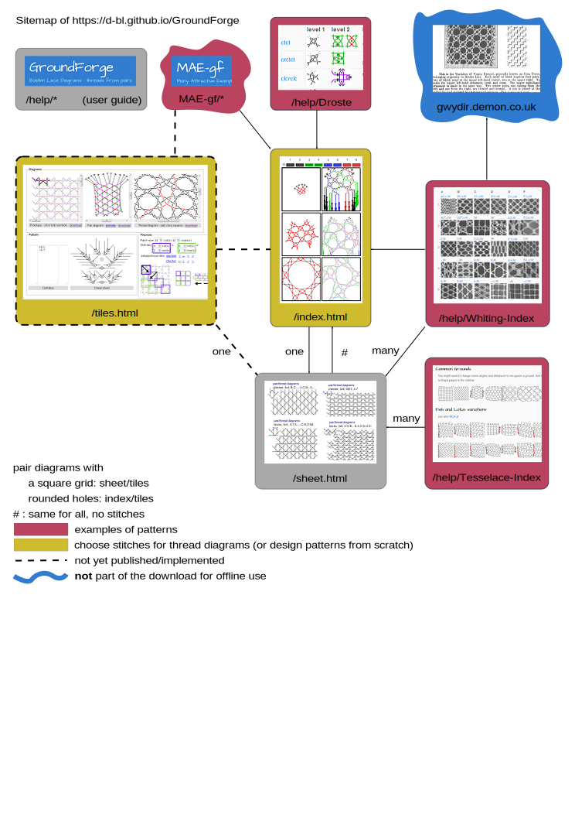

Site Map
========

The following clickable doagram givs an overview of the pages and how to navigate between them.

The main page (index.html) has a workaround for a bug in IE-11 which tiles.html hasn't.
The latter supports only black and red threads but choosing them is more intuitive
what also applies to choosing stitches.

Pair diagrams come in roughly two styles:
* a square grid on `tiles.html` and `sheet.html`
* round holes on `tiles.html` and `index.html`

