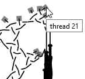

Toggle thread colors
====================
You may have to scroll/drag the thread diagram (or increase the panel size)
to make the squares at the start of the threads visible.  

Click these squares to toggle between a black or red color.
A tooltip shows a thread number when your mouse hovers over a square.  
  
Too tiny squares or too close together? Use the zoom function of your browser.
Usually control-shift-plus to zoom in, control-zero to reset,
on a mac use command for control.

More thread colors and/or widths
================================

Grouping thread segments in downloaded diagrams simplifies the procedure to apply more thread colors and widths.
The feature did not mary well with the Droste patterns and is only available for laptops and desktops:
* [download](https://github.com/d-bl/GroundForge/archive/thread-props.zip) and unzip
* select/tweak your pattern on the [web site](/GroundForge/tiles)
* click 
* in the address bar of your browser
  * replace `https://github.com/d-bl/tiles.html` (as far as there is a `.html`)
  * with `file:///PATH/TO/UNZIPPED/GroundForge-thread-props/docs/tiles.html`
* click 
* open the download with a [tool of your choice](Reshape-Patterns#evaluated-editors)

The next procedure may vary between the tools.
* Select the diagram.
* Ungroup it (this main group serves a proper scale on the web page but is annoying when editing)
* Select a thread.
* Change the properties of the paths in the group.

Simplify editing
================

Each thread is a group of paths. This might cause elaborate editing.

* Select all paths in a group composing a thread.
* Combine the paths into a single one.
* The group now contains a single object: ungroup.

Smooth bends
============

InkScape has a plugin to combine the nodes of adjacent path segments.
This prepares to make the sharp bends smooth.

To install:
* on a Mac: InkScape -> preferences -> system -> user extensions -> open  
  other systems: File -> preferences -> system -> user extensions -> open
* Download two files into this folder:
  [chain_paths.py](https://raw.githubusercontent.com/fablabnbg/inkscape-chain-paths/master/chain_paths.py)
  and
  [chain_paths.inx](https://raw.githubusercontent.com/fablabnbg/inkscape-chain-paths/master/chain_paths.inx)
* Restart InkScape

To apply
* Select all threads (after _simplify editing_)
* menu on all systems: extensions -> modify path -> chain paths
* set the max. distance to something like 0.01
* apply button

Finally, use the built in tools bar:
* Join selected nodes.
* Make selected nodes smooth.
