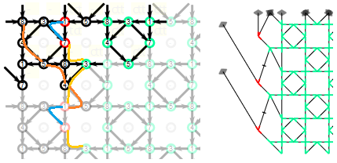

The [tiles] page is a variant of the older home page.
The [site map] provides the context for both and lists their differences.

[tiles]: /GroundForge/tiles.html?tile=5831,-4-7&patchWidth=9&patchHeight=9&shiftColsSE=4&shiftRowsSE=2&shiftColsSW=0&shiftRowsSW=2&
[site map]: /GroundForge/help/Site-map

* [Catalogues](#catalogues)
* [Link or wand / Reload diagrams](#reload-diagrams)
* [Patch size](#patch-size)
* [Choose stitches](#choose-stitches)
* [Toggle thread colors](#toggle-thread-colors)
* [Download](#download)
* [Advanced usage](#advanced-usage)
  + [Define a repeat](#define-a-repeat)
  + [Arrange the repeats](#arrange-the-repeats)
  + [Foot sides](#foot-sides)
  + [Demo section](#demo-section)

Catalogues
==========
The links from a catalogue page fill out the forms in the advanced section of the page.
These forms define a base pattern.
You can vary stitches for the base patterns and check how
contrasting threads would travel through the ground.

There are more catalogue pages than linked on the tiles page,
but most links still refer to the older home page.
_For as long as the page is still under construction,
you may also choose a link from the image captions of the demo section
on the tiles page itself._

Reload diagrams
===============
Generating the pair diagram and thread diagrams can take a while
and may block the browser while busy.
Therefore only the prototype is updated when you change some value on the page.
To avoid confusion about outdated diagrams the pair diagram and thread diagrams
are hidden on these occasions. Use the link or wand button to [reload] the diagrams.

[reload]: undo

Patch size
==========
Note that a large patch size makes a diagram slower to render.
On slow devices like tablets and phones that might give
the impression that links to pages with a large patch size
don't work at all or block the device.
So create links with patch sizes just large enough to recognize the pattern,
visitors can easily increment the size.

When a diagram has a foot side on the right,
it will usually match only for every so many columns.
If you want another number, go the "define a repeat" section
and rotate the rows in the right field.

Some diagrams may not work with all values for the patch size.
Try other values if the thread diagram stays frozen at its initial state. 

Choose stitches
===============
The faint nodes in the prototype diagram repeat the bright ones.
Click on a bright nodes and a yellow form field should emerge with a code
for a stitch.
Type as many `c`'s and `t`'s as you need for the stitch of your choice,
or use `l`'s and `r`'s for a left twist or right twist.



Some predefined patterns may have foot sides.
Some stitches in these foot sides may show up black and have a `-` in the input field.
Unless you know what you are doing, don't change these input fields,
see foot sides under the advance subjects.

Note that in the example below, two foot side stitches on the right of the 
thread diagram are drawn as a single stitch in the pair diagram.
The two stitches are defined with `tctcttrrctct`
at the top-right stitch in the prototype diagram.

[Live version](/GroundForge/tiles.html?patchWidth=3&patchHeight=8&g1=tctcttrrctct&f1=tctct&c1=ctc&b1=tctct&f2=tctct&c2=ctc&b2=tctct&a2=tctct&footside=-7,A1&tile=8,1&headside=8D,4-&footsideStitch=tctct&tileStitch=ctc&headsideStitch=tctct&shiftColsSW=-1&shiftRowsSW=2&shiftColsSE=0&shiftRowsSE=2)

More or less twists along the foot sides can influence distortion of the thread diagram.
For the path taken by contrasting pairs in the final design it is only important
whether the number of twists are odd or even.
The passive pairs along the foot sides won't influence the paths of contrasting pairs.

Toggle thread colors
====================
You may have to scroll/drag the pair diagram to make
the squares at the start of the threads visible.
Click these squares to toggle between a black or red color.

A tooltip shows a thread number when your mouse hovers over a square. 
Too tiny squares or too close together? Use the zoom function of your browser.
Usually control-shift-plus to zoom in, control-zero to reset,
on a mac use command for control.

Download
========
You can download the diagrams to edit them with an [SVG editor].
Details for just one type of diagrams on the [reshape patterns](Reshape-Patterns) page.

[SVG editor]: https://en.wikipedia.org/wiki/Comparison_of_vector_graphics_editors#File_format_support

Advanced usage
==============
The sections below the diagram are the engine under the hood of the car.
The form fields define the prototype diagram. 
Advanced users can play with the values to define new patterns from scratch.

Define a repeat
---------------
You have one row with three fields to fill with  digits and letters of the cheat sheet.
The other row defines the default stitches for the sections above.

The outer panels are optional for a custom foot side. 
Note that a column more or less for the patch size may invalidate the right foot side. 

The position of a digit correlates with a position in the prototype diagram.
Half circles in the prototype indicate you added a new pair for a next stitch,
or are not using a pair for a next stitch.

The right foot side may be a mirrored version of the left foot side for some patterns.
For your convenience the flip button can set the right field from the left.
You may still have to rotate the rows or adjust the patch width.  

More details on the [advanced design](Reversed-engineering-of-patterns) page.

Arrange the repeats
-------------------
The foot sides are simply repeated vertically, but the centre section has more options. 

The configuration at the bottom of the section is more or less like 
the crank for the first car models with ignition keys:
the hard way to start your car but usually not needed.
The image with linked components at the top of the section is
like the ignition key: the simple way to arrange the tiles.

The prototype highlights a single tile alias repeat in the top left corner,
this repeat may span just a single column or row of stitches. 

Those who nevertheless want to understand the numbers
should not interpret them as mathematical (x,y) coordinates.
Point (0,0) lies in the north west of a computer canvas, 
where western scripts start to write on a sheet of paper
or how you count rows and columns in a spread sheet
as the labels for the numbers tell.

The purple numbers define the absolute position of the solid tile.
The green numbers define the position of the arrowed green tile
relative to the solid tile.

Foot sides
----------

Foot sides are defined in the side panels of the "define a repeat" panel in the advanced section.
Note that the right foot sides depends on chosen patch width alias number of columns.

Foot sides may require longer lines than possible to configure in the prototype diagram.
The example below shows a workaround.

The blue and purple rectangles in this example illustrate corresponding sections
in the form, prototype diagram and thread diagram.
The yellow curves in the prototype show how an outer pair of a foot side stitch
can be extended with the inner pair of an ignored stitch.
An ignored stitch has a dash (`-`) in stead of something like `ctct`.

[Live version](/GroundForge/tiles.html?patchWidth=7&patchHeight=18&a3=-&footside=B,-,C,-,B,-,B,-,&tile=-5-,5-5,-5-,B-C,-5-&headside=5,-,&footsideStitch=tctctr&tileStitch=ct&headsideStitch=-&shiftColsSW=-2&shiftRowsSW=4&shiftColsSE=2&shiftRowsSE=4)

Just one of the `tctctr` stitches on the left, is ignored. 
This stretches the outer pair of the next stitch.

On the right side a complete column of stitches is ignored. 
In practice you would need at least one column with real stitches.
Otherwise you can't define other stitches for the foot side
than for the pattern for a proper thread diagram.
The reconnection illustrated with the bold yellow curve
causes two stitches directly connected with two pairs.
In those cases the stitches are merged into a single stitch in the pair diagram.
Thus both pairs for the bottom stitch are stretched.

**Warning**

It will usually be better to make sure all real stitches have at least one direct connection.
Below an example that ignores this advise and fails to create a foot side.

[Live version](patchWidth=8&patchHeight=12&p1=-&o1=-&n1=-&m1=-&g1=cttct&f1=cttct&e1=cttct&d1=-&c1=tctct&b1=-&a1=-&o2=-&m2=-&g2=cttct&e2=cttct&c2=tctct&a2=-&p3=-&o3=-&n3=-&m3=-&f3=cttct&d3=cttct&c3=-&b3=-&a3=-&o4=-&m4=tctct&c4=-&a4=-&footside=8315,4-7-,1583,7-4-&tile=831,4-7,-5-&headside=8315,4-7-,1583,7-4-&footsideStitch=-&tileStitch=cttct&headsideStitch=-&shiftColsSW=-2&shiftRowsSW=2&shiftColsSE=2&shiftRowsSE=2)

The three individual yellow curves shows how the outer pair of a foot side stitch
finds a connection with a real stitch by following an inner pair along an ignored stitch.
Same for the blue curves, but these reconnects cause parallel pairs and these stitches are merged.
The sequence of orange curves show how the inner pair of the foot side stitch doesn't find any connection 
by following outer pairs along ignored stitches.

With the live version you can try to define a stitch at the third row and second column.
It seems to fix the example for the pair diagram. However, the inner and outer pair are mixed up.
Even with many twists for this additional stitch, the thread diagram won't look good. 

Demo section
------------
The demo section is introduced for quick testing during development and bug fixing.
The introduction at the very top of the page links to catalogues with many more patterns.
