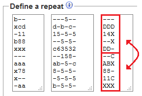
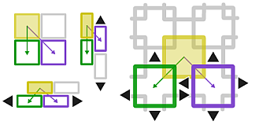

The [tiles] page is a variant of the older home page.
The [site map] provides the context for both and lists their differences.

[tiles]: /GroundForge/tiles?tile=5831,-4-7&patchWidth=9&patchHeight=9&shiftColsSE=4&shiftRowsSE=2&shiftColsSW=0&shiftRowsSW=2&
[site map]: /GroundForge/help/Site-map

* [Catalogues](#catalogues)
* [Link or wand / Reload diagrams](#reload-diagrams)
* [Patch size](#patch-size)
* [Choose stitches](#choose-stitches)
* [Toggle thread colors](#toggle-thread-colors)
* [Download](#download)
* [Advanced usage](#advanced-usage)
  + [Thread diagram as pair diagram](#thread-diagram-as-pair-diagram)
  + [Define a repeat](#define-a-repeat)
  + [Arrange the repeats](#arrange-the-repeats)
  + [Foot sides](#foot-sides)

Catalogues
==========
The links from a catalogue page fill out the forms in the advanced section of the page.
These forms define a base pattern.
You can vary stitches for the base patterns and check how
contrasting threads would travel through the ground.

There are more catalogue pages than linked on the tiles page,
but most links still refer to the older home page.
_For as long as the page is still under construction,
you may also choose a link from the image captions of the demo section
on the tiles page itself._

Reload diagrams
===============
Generating the pair diagram and thread diagrams can take a while
and may block the browser while busy.
Therefore only the prototype is updated when you change some value on the page.
To avoid confusion about outdated diagrams the pair diagram and thread diagrams
are hidden on these occasions. Use the link or wand button to [reload] the diagrams.

[reload]: Undo

Patch size
==========

### Large sizes
Note that a large patch size makes a diagram slower to render.
On slow devices like tablets and phones that might give
the impression that links to pages with a large patch size
don't work at all or block the device.
So create links with patch sizes just large enough to recognize the pattern,
visitors can easily increment the size.

When you specify a too small patch, its size will be automatically increased to contain at least one tile.
When a link specifies no patch size at all, it will get a size that can contain 2x2 tiles.

### Right foot sides
When a diagram has a foot side on the right,
it will usually match only for every so many columns.
Anyway you will have to reassign the stitches.

If you want another number, go to the "define a repeat" section:
rotating the rows in the right field might help but you might need more changes.
For example for this [pattern](/GroundForge/tiles?patchWidth=13&patchHeight=20&g1=ctct&a1=ctcttl&s2=ctcttr&r2=ctcrr&q2=ctc&h2=ct&f2=ct&d2=ct&c2=ctc&b2=ctc&r3=ctc&q3=ctcl&i3=ctct&g3=ctc&e3=ctct&d3=ct&c3=ctc&b3=ctcll&h4=ctc&f4=ctc&c4=ctc&b4=ctc&a4=ctcttl&r5=ctcrr&q5=ctc&i5=ctc&h5=ctc&g5=ctc&f5=ctc&e5=ctc&d5=ct&s6=ctcttr&h6=ctc&g6=ctc&f6=ctc&r7=ctc&q7=ctcl&i7=ctcr&g7=ctc&e7=ctcl&d7=ct&c7=ctc&b7=ctcll&a7=ctcttl&r8=ctcrr&q8=ctc&h8=ctcr&f8=ctcl&d8=ct&c8=ctc&b8=ctc&s9=ctcttr&r9=ctc&q9=ctcl&i9=ctct&g9=ctct&e9=ctct&h10=ct&f10=ct&d10=ct&c10=ctc&b10=ctcll&footside=b--,xcd,-11,b88,xxx,---,aaa,x78,x--,-aa&tile=---5--,d-b-c-,15-5-5,--5-5-,c63532,--158-,ab-5-c,8-5-5-,-5-5-5,b-5-5-&headside=---,DDD,14X,--X,DD-,--C,ABX,88-,11C,XXX&footsideStitch=ctct&tileStitch=ctc&headsideStitch=ctct&shiftColsSW=0&shiftRowsSW=10&shiftColsSE=6&shiftRowsSE=5)
you would have to change as shown below when switching
between an odd and even number of spider columns. 
Other widths will match with neither of the variations.

### Possible bug
Some diagrams may not work with all values for the patch size.
Try other values if the thread diagram stays frozen at its initial state. 

Choose stitches
===============
The faint nodes in the prototype diagram repeat the bright ones.
Click on a bright node and a yellow form field should emerge with a stitch definition.

Type as many `c`'s and `t`'s for cross and twist as you need for the stitch of your choice,
or use `l`'s and `r`'s for a left twist or right twist.

Some stitches to copy paste:



The example below applies the last stitch above with a few more twists.

[Live version](/GroundForge/tiles?patchWidth=3&patchHeight=8&g1=tctcttrrctct&f1=tctct&c1=ctc&b1=tctct&f2=tctct&c2=ctc&b2=tctct&a2=tctct&footside=-7,A1&tile=8,1&headside=8D,4-&footsideStitch=tctct&tileStitch=ctc&headsideStitch=tctct&shiftColsSW=-1&shiftRowsSW=2&shiftColsSE=0&shiftRowsSE=2)

When erasing the content of a stitch field, the value from "define a repeat"
in the advanced section will be filled in, if that is empty `ctc` will be filled in.
To deliberately ignore a stitch from the prototype, you'll have to fill in a dash: `-`.
The green arcs in the diagrams below show how stitches will be reconnected in the pair diagram.
One case is straight forward. In the other case two stitches are merged
because they were were connected with parallel pairs.
Too many adjacent ignored stitches may cause weird thread diagrams
with pairs swapped before a stitch is made.

[Live version](/GroundForge/tiles?patchWidth=12&patchHeight=13&g1=ctct&e1=ctct&c1=ctct&a1=ctct&f2=ctct&b2=-&g3=ctct&e3=ctct&c3=ctct&a3=ctct&h4=ctct&f4=-&d4=ctct&b4=ctct&g5=ctct&e5=ctct&c5=ctct&a5=ctct&f6=ctct&b6=ctct&g7=ctct&e7=ctct&c7=ctct&a7=ctct&h8=ctct&f8=ctct&d8=ctct&b8=ctct&tile=5-5-5-5-,-5---5--,B-C-B-C-,-5-5-5-5,5-5-5-5-,-5---5--,B-C-B-C-,-5-5-5-5,&footsideStitch=tctct&tileStitch=ctct&headsideStitch=tctct&shiftColsSW=0&shiftRowsSW=8&shiftColsSE=8&shiftRowsSE=8)

Toggle thread colors
====================
You may have to scroll/drag the thread diagram to make
the squares at the start of the threads visible.
Click these squares to toggle between a black or red color.

A tooltip shows a thread number when your mouse hovers over a square. 
Too tiny squares or too close together? Use the zoom function of your browser.
Usually control-shift-plus to zoom in, control-zero to reset,
on a mac use command for control.

Download
========
You can download the diagrams to edit them with an [SVG editor], manipulating vectors not pixels.

[SVG editor]: https://en.wikipedia.org/wiki/Comparison_of_vector_graphics_editors#File_format_support

Advanced usage
==============

The sections  below the diagrams are the engine under the hood of the car.
The form fields define the prototype diagram. 
Advanced users can play with the values to define new patterns from scratch.

Thread diagram as pair diagram
------------------------------

Sorry, nothing like the prototype diagram to choose stitches for these sets of diagrams.
The team of GroundForge could use the help of a seasoned front end engineer for a more convenient user interface.

You can choose to use one stitch everywhere. Or two different stitches:
one for each cross in the preceding thread diagram, the other for each twist.
To make exceptions to these rules you need to hover over a stitch
in the pair diagram to discover its id for stitch assignments.

An example mixing all the options mentioned above:

The overall default in this example is a `ctct`.
A more selective default is `ctc` for stitches that were twists in the preceding thread diagram.
Two specific stitches are set to `ct`.

The page on the [Droste effect](Droste-effect) has some example patterns.

 Note that spaces may have unexpected results, 
recommended delimiters between assignments: new lines or `,`.

Foot sides can get complicated to define when a pattern has a worker.
At the second and third level two respective four pairs
work from left to right before returning from right to left.
In practice it might be very well possible to alternate the direction every other row.

Define a repeat
---------------
The form has three fields to fill with  digits and letters of the cheat sheet.
These fields are paired with other fields to define the default stitches.

The outer panels are optional for a custom foot side. 
Note that a column more or less for the patch size may invalidate the right foot side. 

The position of a digit correlates with a position in the prototype diagram.
Half circles in the prototype indicate you added a new pair for a next stitch,
or are not using a pair for a next stitch. The symbols with a single arrow
are intended to extend an arrow of another symbol.

More details on the [advanced design](Reversed-engineering-of-patterns) page.

The right foot side may be a mirrored version of the left foot side for some patterns.
For your convenience the flip button can set the right field from the left.
You may still have to rotate the rows or adjust the patch width.  

Arrange the repeats
-------------------
The matrices for head sides and foot sides are simply repeated vertically,
more details in another section.
This section ignores the presence of a head side or foot side to keep descriptions simple.

The parameters to arrange the tiles can be hard to understand.
An image with four diagrams should simplify the task.
The filled tiles and arrows act as buttons that change the configuration values
and move the faint stitches in the prototype diagram.

The top left tile in each diagram of the image represents the bold set of stitches in the prototype diagram.
Each solid tile in the linked image represents a copy made of the top left tile
alias the bold stitches in the prototype.
The tiles with a slightly fainter purple edge represent copies of the chosen solid tile.
The tiles with a green stroke are copies of the tiles with a purple fill or stroke.

The purple numbers in the form define the absolute position of the filled purple tile,
and the relative position of subsequent purple tiles.
The green numbers define the position of one row of green tiles relative to the purple tiles.

The recommended procedure:
- Select a filled purple tile that closely matches the pattern.
- Use the arrows around the purple to nudge the purple row in place.
- Use the arrows around the green tile to nudge the rest in place.

Try the procedure with [rose ground](https://d-bl.github.io/GroundForge/tiles?patchWidth=9&patchHeight=10&c1=ctct&b1=ct&a1=rctctt&c2=ctct&a2=ctct&b3=ctct&tile=831,4-7,-5-&tileStitch=ctct&shiftColsSW=-3&shiftRowsSW=3&shiftColsSE=3&shiftRowsSE=3)
and stitch the tiles together with the links in the overlapping diagram.
Note that another pattern than traditional rose ground is possible.

Those who really want to understand the numbers
should not interpret them as mathematical (x,y) coordinates.
Point (0,0) lies in the north west of a computer canvas, 
where western scripts start to write on a sheet of paper.
You can also memorise by counting rows and columns as in a spread sheet, 
like used for the labels for the stitches in the pair diagram.

When a link specifies no shift values at all, you'll get a checkerboard arrangement.

Foot sides
----------
You may want to study how threads disappearing in foot sides return back into the ground.
Foot sides are defined in the side panels of the "define a repeat" form in the advanced section.
Note that the right foot sides depends on the chosen patch width alias number of columns.

Foot sides may require one or two columns of additional stitches.
It is a matter of piecing a puzzle together with symbols from the cheat sheet.
The symbols with a single arrow can extend an arrow of any symbol to make it fit.

Annotated screen shot snippets of an example:

[Live version](/GroundForge/tiles?patchWidth=7&patchHeight=18&a3=-&footside=B,-,C,-,B,-,B,-,&tile=-5-,5-5,-5-,B-C,-5-&headside=5,-,&footsideStitch=tctctr&tileStitch=ct&headsideStitch=-&shiftColsSW=-2&shiftRowsSW=4&shiftColsSE=2&shiftRowsSE=4)

The blue and purple rectangles in this example illustrate corresponding
sections in the form, prototype diagram and pair diagram.
The yellow curves in the prototype show how extended arrows are reduced
to a single connection between stitches in the pair diagram.
Note that the twist marks only indicate multiple twists, not how many.

On the right side we only added extensions.
In practice you would need at least one column with real stitches
to choose other stitches for the foot side than for the pattern.
This example shows that extensions don't need to be a straight line. 
The bold yellow curve causes two stitches connected with two pairs.
In those cases the stitches are merged into a single stitch in the pair diagram.
Thus both pairs for the bottom stitch are stretched.
You can still choose to apply a plait for the thread diagram in those cases,
well, if it happens in an added column and is not part of the ground.
