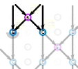

Whiting index
=============

Samples of lace by [Gertrude Whiting](#source) to illustrate diagrams generated by GroundForge.
Though the other way around (diagrams for the samples) is not avoidable, it is not the primary intention. [Read why not](#why).

* Each image links to the corresponding page of the book.
* The `diagr` links lead to customizable diagrams, **to do: C2, A14**.
* [Notes](#notes) on the other components of the image captions.

[c]: /GroundForge/sheet.html?patch=88%0A11;bricks&patch=66%0A22;bricks&patch=88%0A99%0A11%0A00;bricks&patch=66%0A11%0A88%0A22;bricks&patch=66%0A99%0A22%0A00;bricks
[t]: /GroundForge/sheet.html?patch=53%0A53%0A53%0A5-;bricks&patch=5663%0A5663;checker&patch=53%0A5-;bricks&patch=563%0A563%0A563;checker&patch=53%0A53;checker&patch=5632%0A5632;checker&patch5353%0A5353;bricks&patch=5-%0A-5;checker&patch=5353%0A5353%0A5-5-%0A-5-5;checker&patch=5632%0A56-2%0A5-5-%0A-535;checker&patch=53%0A5-%0A-5%0A5-;bricks&patch=44%0A77%0A44%0A77;bricks&patch=44%0A44%0A77%0A77;bricks&patch=66%0A88%0A66%0A11;bricks&patch=66%0A66%0A88%0A11;checker&patch=66%0A66%0A99%0A00;checker&patch=6;checker&patch=566-%0A66-5%0A6-56%0A-566;checker
[v]: /GroundForge/sheet.html?patch=5831%0A-4-7;bricks&patch=-437%0A34-7;bricks&patch=4830%0A--77;bricks
[k]: /GroundForge/sheet.html?patch=B-C-%0A---5%0AC-B-%0A-5--;checker&patch=5831%0A-4-7;checker&patch=68%0A-4;checker&patch=-4-7%0A5---%0A-C-B%0A3158;bricks&patch=5-O-E-%0A-E-5-O%0A5-O-E-;bricks
[wk]: /GroundForge/sheet.html?patch=6868%0A-4-4%0A2121%0A-7-7;checker&patch=L-O-L-O-%0A---5---5%0AH-E-H-E-%0A-5---5--;bricks
[ts]: /GroundForge/sheet.html?patch=5-5-%0A-5--%0AB-C-%0A-5-5;bricks&patch=5632%0A34-7;bricks&patch=256-%0A---5%0AC3B-;bricks&patch=4373%0A5-53;bricks
[z]: /GroundForge/sheet.html?patch=1483%0A8-48;bricks&patch=C-B-%0A-5--%0AB8D-%0A-4--;bricks&patch=-48-%0AB--2%0A8-B8;bricks&patch=-4--%0AB-C3%0A8-48;bricks

[A1]: https://d-bl.github.io/GroundForge/tiles.html?whiting=A1_P70&tile=88,11&patchWidth=5&patchHeight=5&a1=ct&b1=ct&a2=ct&b2=ct&shiftColsSE=2&shiftRowsSE=2&shiftColsSW=0&shiftRowsSW=2
[B1]: https://d-bl.github.io/GroundForge/tiles.html?whiting=B1_P94&tile=5-&a1=ctctpctct&patchWidth=5&patchHeight=5&shiftColsSE=1&shiftRowsSE=1&shiftColsSW=-1&shiftRowsSW=1
[C1]: https://d-bl.github.io/GroundForge/tiles.html?whiting=C1_P114&tile=5-&a1=ctpct&patchWidth=6&patchHeight=6&shiftColsSE=1&shiftRowsSE=1&shiftColsSW=-1&shiftRowsSW=1&footside=
[D1]: https://d-bl.github.io/GroundForge/tiles.html?whiting=D1_P134&tile=5-&a1=cttpctt&patchWidth=5&patchHeight=5&shiftColsSE=1&shiftRowsSE=1&shiftColsSW=-1&shiftRowsSW=1
[E1]: https://d-bl.github.io/GroundForge/tiles.html?whiting=E1_P155&tile=5-&a1=ctpcttt&patchWidth=5&patchHeight=5&shiftColsSE=1&shiftRowsSE=1&shiftColsSW=-1&shiftRowsSW=1
[F1]: https://d-bl.github.io/GroundForge/tiles.html?whiting=F1_P177&tile=5-&a1=cttpcttt&patchWidth=5&patchHeight=5&shiftColsSE=1&shiftRowsSE=1&shiftColsSW=-1&shiftRowsSW=1
[G1]: https://d-bl.github.io/GroundForge/tiles.html?whiting=G1_P198&patchWidth=5&patchHeight=5&a1=ctctptt&tile=5-&tileStitch=ctctptt&shiftColsSW=-1&shiftRowsSW=1&shiftColsSE=1&shiftRowsSE=1

[A2]: https://d-bl.github.io/GroundForge/tiles.html?whiting=A2_P71&tile=831,4-7,-5-&headside=d,-,c,-&footside=b,-,a,-&footsideStitch=ctctt&patchWidth=9&patchHeight=10&k1=lctctt&d1=ct&c1=ctct&b1=ct&a1=rctctt&d2=ctct&b2=ctct&k3=lctctt&c3=ctct&a3=rctctt&tileStitch=ctct&headsideStitch=ctctt&shiftColsSW=-2&shiftRowsSW=2&shiftColsSE=2&shiftRowsSE=2
[B2]: https://d-bl.github.io/GroundForge/tiles.html?whiting=B2_P95&patchWidth=9&patchHeight=10&k1=lctctt&d1=ctct&c1=ctct&b1=ctct&a1=rctctt&d2=ctct&b2=ctct&k3=lctctt&c3=ctct&a3=rctctt&footside=b,-,a,-&tile=831,4-7,-5-&headside=d,-,c,-&footsideStitch=ctctt&tileStitch=ctct&headsideStitch=ctctt&shiftColsSW=-2&shiftRowsSW=2&shiftColsSE=2&shiftRowsSE=2
[D2]: https://d-bl.github.io/GroundForge/tiles.html?whiting=D2_P135&patchWidth=16&patchHeight=15&c1=ctct&tile=--5--,-L-H-,L-5-H,-5-5-,b-5-c,-5-5-,,,&tileStitch=ct&shiftColsSW=0&shiftRowsSW=6&shiftColsSE=5&shiftRowsSE=3
[E2]: https://d-bl.github.io/GroundForge/tiles.html?whiting=E2_P156&patchWidth=13&patchHeight=12&e1=ctctttctc&a1=ctcctc&h2=ctc&g2=ctclll&f2=ctc&e2=ctc&d2=ctc&c2=ctcrrr&b2=ctc&h3=ctclll&g3=ctc&f3=ctc&d3=ctc&c3=ctc&b3=ctcrrr&a3=ctc&tile=5---5---,-CD632AB,5666-222&tileStitch=ctc&shiftColsSW=-4&shiftRowsSW=3&shiftColsSE=4&shiftRowsSE=3
[F2]: https://d-bl.github.io/GroundForge/tiles.html?whiting=F2_P178&patchWidth=11&patchHeight=13&b1=ctcctc&c2=ctcrrr&a2=ctclll&d3=ctc&b3=ctcttt&c4=ctc&a4=ctc&tile=-5--,B-C-,-5-5,5-5-&tileStitch=ctc&shiftColsSW=-2&shiftRowsSW=4&shiftColsSE=2&shiftRowsSE=4
[G2]: https://d-bl.github.io/GroundForge/tiles.html?whiting=G2_P199&patchWidth=14&patchHeight=13&f1=ctctt&a1=ctcctc&j2=ctc&i2=ctcll&h2=ctctt&g2=ctctt&f2=ctctt&e2=ctctt&d2=ctctt&c2=ctcrrr&b2=ctc&j3=ctcll&i3=ctctt&h3=ctctt&g3=ctcttl&f3=ctc&e3=ctcttr&d3=ctctt&c3=ctctt&b3=ctcrrr&a3=ctc&j4=ctctt&i4=ctctt&h4=ctcttl&g4=ctc&f4=ctc&e4=ctc&d4=ctcttr&c4=ctctt&b4=ctctt&a4=ctcttt&j5=ctctt&i5=ctcttl&h5=ctc&g5=ctc&e5=ctc&d5=ctc&c5=ctcttr&b5=ctctt&a5=ctctt&tile=5----5----,-CDD632AAB,5666632222,5666632222,56666-2222&tileStitch=ctct&shiftColsSW=-5&shiftRowsSW=5&shiftColsSE=5&shiftRowsSE=5
[H2]: https://d-bl.github.io/GroundForge/tiles.html?whiting=H2_P220&patchWidth=15&patchHeight=15&e1=cttctt&a1=ctcctc&h2=ctc&g2=ctc&f2=rrrcttcttl&e2=ctc&d2=lllcttcttr&c2=ctc&b2=ctc&h3=ctc&g3=rrrcttcttl&f3=ctc&e3=ctc&d3=ctc&c3=lllcttcttr&b3=ctc&a3=ctc&h4=rrrcttcttl&g4=ctc&f4=ctc&d4=ctc&c4=ctc&b4=lllcttcttr&a4=ctc&tile=5---5---,-CD632AB,56663222,5666-222&tileStitch=ctc&shiftColsSW=-4&shiftRowsSW=4&shiftColsSE=4&shiftRowsSE=4

[A3]: https://d-bl.github.io/GroundForge/tiles.html?whiting=A3_P73&patchWidth=7&patchHeight=6&a1=ctctctt&tile=5-&footsideStitch=ctctt&tileStitch=ctctpctctt&headsideStitch=ctctt&shiftColsSW=-1&shiftRowsSW=1&shiftColsSE=1&shiftRowsSE=1
[B3]: https://d-bl.github.io/GroundForge/tiles.html?whiting=B3_P96&patchWidth=6&patchHeight=6&a1=ctctctctt&tile=5-&footsideStitch=ctctt&tileStitch=ctctctctt&headsideStitch=ctctt&shiftColsSW=-1&shiftRowsSW=1&shiftColsSE=1&shiftRowsSE=1
[C3]: https://d-bl.github.io/GroundForge/tiles.html?whiting=C3_P117&patchWidth=7&patchHeight=6&a1=ctctpctctt&tile=5-&tileStitch=ctctpctctt&shiftColsSW=-1&shiftRowsSW=1&shiftColsSE=1&shiftRowsSE=1
[D3]: https://d-bl.github.io/GroundForge/tiles.html?whiting=D3_P136&patchWidth=7&patchHeight=6&a1=ctctctctctct&tile=5-&footsideStitch=ctctt&tileStitch=ctctpctctt&headsideStitch=ctctt&shiftColsSW=-1&shiftRowsSW=1&shiftColsSE=1&shiftRowsSE=1
[E3]: https://d-bl.github.io/GroundForge/tiles.html?whiting=E3_P157&patchWidth=5&patchHeight=6&b1=ctt&tile=-5&tileStitch=ctt&shiftColsSW=-1&shiftRowsSW=1&shiftColsSE=1&shiftRowsSE=1
[F3]: https://d-bl.github.io/GroundForge/tiles.html?whiting=F3_P179&patchWidth=6&patchHeight=6&a1=cttt&tile=5-&tileStitch=cttt&shiftColsSW=-1&shiftRowsSW=1&shiftColsSE=1&shiftRowsSE=1
[G3]: https://d-bl.github.io/GroundForge/tiles.html?whiting=G3_P200&patchWidth=6&patchHeight=6&a1=cttttt&tile=5-&tileStitch=cttttt&shiftColsSW=-1&shiftRowsSW=1&shiftColsSE=1&shiftRowsSE=1

[C4]: https://d-bl.github.io/GroundForge/tiles.html?whiting=C4_P118&patchWidth=11&patchHeight=10&b1=cttctt&c2=cttctt&a2=cttctt&tile=-5-,B-C&tileStitch=cttctt&shiftColsSW=-2&shiftRowsSW=2&shiftColsSE=2&shiftRowsSE=2
[D4]: https://d-bl.github.io/GroundForge/tiles.html?whiting=D4_P137&patchWidth=11&patchHeight=10&b1=cttcttt&c2=cttcttt&a2=cttcttt&tile=-5-,B-C&tileStitch=cttcttt&shiftColsSW=-2&shiftRowsSW=2&shiftColsSE=2&shiftRowsSE=2
[E4]: https://d-bl.github.io/GroundForge/tiles.html?whiting=E4_P158&patchWidth=12&patchHeight=15&b1=ctcctc&a2=ctc&c2=ctc&d2=ctcrr&f2=ctcll&a3=ctcll&b3=ctc&c3=ctcrr&e3=ctc&b4=ctctt&d4=ctc&e4=ctc&f4=ctc&a5=ctc&c5=ctc&d5=ctc&f5=ctc&tile=-5----,B-CD-A,256-5-,-5-535,5-56-2&footsideStitch=ctctt&tileStitch=ctc&headsideStitch=ctctt&shiftColsSW=-3&shiftRowsSW=5&shiftColsSE=3&shiftRowsSE=5
[F4]: https://d-bl.github.io/GroundForge/tiles.html?whiting=F4_P180&patchWidth=9&patchHeight=9&d1=ctc&c1=ctc&b1=ctc&a1=ctc&d2=ctc&c2=ctcllctc&a2=ctcrrctc&tile=1483,8-48&footsideStitch=ctctt&tileStitch=ctc&headsideStitch=ctctt&shiftColsSW=-2&shiftRowsSW=2&shiftColsSE=2&shiftRowsSE=2
[G4]: https://d-bl.github.io/GroundForge/tiles.html?whiting=G4_P201&patchWidth=40&patchHeight=19&i1=ctctt&f1=ctc&e1=ctc&d1=ctc&c1=ctc&a1=ctctt&g2=ctc&i3=ctc&f3=ctc&e3=ctc&d3=ctc&c3=ctcll&a3=ctctt&n4=ctctt&l4=ctctt&j4=ctctt&h4=ctctt&f4=ctt&d4=ctcll&c4=ctcll&b4=ctctt&g5=ctctt&c5=ctctt&n6=ctctt&j6=ctctt&m7=c&k7=ctc&j7=ctc&i7=ctctt&g7=ctctt&e7=ctctt&c7=ctctt&a7=ctctt&tile=5-m998-z5-----,------5-------,g-aaab-wd-----,-246-m-l-o-k-e,--5---5---y-w-,---w-y---b---c,h-g-5-n-l3h-e-,&footsideStitch=ctctt&tileStitch=ctc&headsideStitch=ctctt&shiftColsSW=-7&shiftRowsSW=7&shiftColsSE=7&shiftRowsSE=7
[H4]: https://d-bl.github.io/GroundForge/tiles.html?whiting=H4_P222&patchWidth=16&patchHeight=16&g1=ctc&f1=ctcrr&d1=ctcll&c1=ctc&a1=ctc&h2=ctc&e2=ctcttctc&b2=ctc&g3=ctcll&f3=ctc&d3=ctc&c3=ctcrr&a3=ctc&tile=5-25-56-,-5--5--5,5-C6-2B-&footsideStitch=ctctt&tileStitch=ctc&headsideStitch=ctctt&shiftColsSW=-4&shiftRowsSW=3&shiftColsSE=4&shiftRowsSE=3

[A5]: https://d-bl.github.io/GroundForge/tiles.html?whiting=A5_P75&patchWidth=11&patchHeight=10&b1=ctct&c2=ctct&a2=ctct&tile=-5-,B-C&tileStitch=ctct&shiftColsSW=-2&shiftRowsSW=2&shiftColsSE=2&shiftRowsSE=2
[B5]: https://d-bl.github.io/GroundForge/tiles.html?whiting=B5_P98&patchWidth=11&patchHeight=12&b1=ctct&c2=ctctll&a2=ctctrr&tile=-5-,B-C&tileStitch=ctct&shiftColsSW=-2&shiftRowsSW=2&shiftColsSE=2&shiftRowsSE=2
[C5]: https://d-bl.github.io/GroundForge/tiles.html?whiting=C5_P119&patchWidth=11&patchHeight=12&b1=ctc&c2=ctc&a2=ctc&tile=-5-,B-C&tileStitch=ctc&shiftColsSW=-2&shiftRowsSW=2&shiftColsSE=2&shiftRowsSE=2
[D5]: https://d-bl.github.io/GroundForge/tiles.html?whiting=H6_P137&patchWidth=4&patchHeight=5&a1=ctcttt&a2=ctcttt&tile=8,1&tileStitch=ctcttt&shiftColsSW=0&shiftRowsSW=2&shiftColsSE=1&shiftRowsSE=2
[F5]: https://d-bl.github.io/GroundForge/tiles.html?whiting=F5_P181&patchWidth=4&patchHeight=5&a1=ctctt&a2=ctctt&tile=8,1&tileStitch=ctctt&shiftColsSW=0&shiftRowsSW=2&shiftColsSE=1&shiftRowsSE=2
[G5]: https://d-bl.github.io/GroundForge/tiles.html?whiting=G5_P203&patchWidth=4&patchHeight=5&a1=ctct&a2=ctct&tile=8,1&tileStitch=ctct&shiftColsSW=0&shiftRowsSW=2&shiftColsSE=1&shiftRowsSE=2
[H5]: https://d-bl.github.io/GroundForge/tiles.html?whiting=H5_P224&patchWidth=4&patchHeight=5&a1=ctcr&a2=ctcl&tile=8,1&tileStitch=ctc&shiftColsSW=0&shiftRowsSW=2&shiftColsSE=1&shiftRowsSE=2

[A6]: https://d-bl.github.io/GroundForge/tiles.html?whiting=A6_P76&patchWidth=11&patchHeight=12&b1=ctct&c2=ctct&a2=ctct&tile=-5-,B-C&tileStitch=ctct&shiftColsSW=-2&shiftRowsSW=2&shiftColsSE=2&shiftRowsSE=2
[B6]: https://d-bl.github.io/GroundForge/tiles.html?whiting=B6_P99&patchWidth=9&patchHeight=10&k1=ctctt&d1=cttctt&c1=cttctt&b1=cttctt&a1=ctctt&d2=cttctt&b2=cttctt&k3=ctctt&c3=cttctt&a3=ctctt&footside=b,-,a,-&tile=831,4-7,-5-&headside=d,-,c,-&footsideStitch=ctctt&tileStitch=cttctt&headsideStitch=ctctt&shiftColsSW=-2&shiftRowsSW=2&shiftColsSE=2&shiftRowsSE=2
[C6]: https://d-bl.github.io/GroundForge/tiles.html?whiting=C6_P120&patchWidth=9&patchHeight=10&k1=ctctr&d1=ct&c1=ctct&b1=ct&a1=ctctl&d2=ct&b2=ct&k3=ctctr&c3=ctct&a3=ctctl&footside=b,-,a,-&tile=831,4-7,-5-&headside=d,-,c,-&footsideStitch=ctctl&tileStitch=ct&headsideStitch=ctctr&shiftColsSW=-2&shiftRowsSW=2&shiftColsSE=2&shiftRowsSE=2
[D6]: https://d-bl.github.io/GroundForge/tiles.html?whiting=D6_P139&patchWidth=9&patchHeight=9&c1=ct&b1=ctct&a1=ct&c2=ctct&b2=ct&a2=ctct&b3=ctct&tile=831,117,178&tileStitch=ctct&shiftColsSW=-2&shiftRowsSW=2&shiftColsSE=2&shiftRowsSE=2
[E6]: https://d-bl.github.io/GroundForge/tiles.html?whiting=E6_P160&patchWidth=10&patchHeight=10&d1=ctct&c1=ct&b1=ctct&a1=ct&c2=ctct&b2=ct&a2=ctct&tile=8317,1178&tileStitch=ctct&shiftColsSW=-5&shiftRowsSW=1&shiftColsSE=3&shiftRowsSE=1
[F6]: https://d-bl.github.io/GroundForge/tiles.html?whiting=F6_P182&patchWidth=6&patchHeight=7&h1=tctct&b1=cttct&a2=tctct&footside=-,B&tile=5-&headside=C,-&footsideStitch=tctct&tileStitch=cttct&headsideStitch=tctct&shiftColsSW=-1&shiftRowsSW=1&shiftColsSE=1&shiftRowsSE=1
[H6]: https://d-bl.github.io/GroundForge/tiles.html?whiting=H6_P225&patchWidth=11&patchHeight=12&c1=ctct&a1=ctct&d2=ctctctct&tile=B-C-,---5&footsideStitch=tctct&tileStitch=ctct&headsideStitch=tctct&shiftColsSW=-2&shiftRowsSW=2&shiftColsSE=2&shiftRowsSE=2

[C9]: https://d-bl.github.io/GroundForge/tiles.html?whiting=C9_P123&patchWidth=9&patchHeight=10&k1=ctctt&d1=ctcttt&c1=ctcttt&b1=ctcttt&a1=ctctt&d2=ctcttt&b2=ctcttt&k3=ctctt&c3=ctcttt&a3=ctctt&footside=b,-,a,-&tile=831,4-7,-5-&headside=d,-,c,-&footsideStitch=ctctt&tileStitch=ctcttt&headsideStitch=ctctt&shiftColsSW=-2&shiftRowsSW=2&shiftColsSE=2&shiftRowsSE=2
[D9]: https://d-bl.github.io/GroundForge/tiles.html?whiting=D9_P142&patchWidth=7&patchHeight=7&a1=ctctt&b2=ctt&tile=5-,-5&footsideStitch=ctctt&tileStitch=ctct&headsideStitch=ctctt&shiftColsSW=0&shiftRowsSW=2&shiftColsSE=2&shiftRowsSE=2
[E9]: https://d-bl.github.io/GroundForge/tiles.html?whiting=E9_P163&patchWidth=12&patchHeight=20&a1=cttt&b1=cttt&a2=cttt&tile=12,7-&footsideStitch=ctctt&tileStitch=cttt&headsideStitch=ctctt&shiftColsSW=0&shiftRowsSW=2&shiftColsSE=2&shiftRowsSE=2
[F9]: https://d-bl.github.io/GroundForge/tiles.html?whiting=F9_P185&patchWidth=26&patchHeight=26&m1=ctc&e1=ctc&o3=llcttctt&k3=cttctt&g3=ctcrrrctc&e3=ctc&c3=ctcllctc&g4=ctc&e4=ctc&i5=llctctt&g5=ctc&e5=ctc&c5=ctc&a5=rrctctt&e6=ctc&c6=ctc&o7=cttctt&k7=cttctt&g7=ctcrrctcrr&e7=ctc&c7=ctcllctcll&tile=--x-5-x---x-c-x-,-----w-----y-w--,--g-g-c---b---c-,---w8-mv-yx---xw,h-g-f-f-5-x---x-,-w8-mv---w-----y,--f-f-c---c---b-,--xw--x---xw-yx-&footsideStitch=ctctt&tileStitch=ctc&headsideStitch=ctctt&shiftColsSW=-8&shiftRowsSW=8&shiftColsSE=8&shiftRowsSE=8
[G9]: https://d-bl.github.io/GroundForge/tiles.html?whiting=G9_P229&patchWidth=5&patchHeight=5&a1=ctctttt&tile=5-&tileStitch=ctctttt&shiftColsSW=-1&shiftRowsSW=1&shiftColsSE=1&shiftRowsSE=1
[H9]: https://d-bl.github.io/GroundForge/tiles.html?whiting=H9_P229&patchWidth=7&patchHeight=7&a1=ctcttptctcttt&tile=5-&tileStitch=ctcttptctcttt&shiftColsSW=-1&shiftRowsSW=1&shiftColsSE=1&shiftRowsSE=1

[E10]: https://d-bl.github.io/GroundForge/tiles.html?whiting=E10_P164&patchWidth=12&patchHeight=12&e1=ctctct&c1=ctc&b1=ctc&a1=ctc&f2=rrctctr&c2=ctcrrrctc&b2=ctc&a2=ctc&e3=ctctcrl&b3=ctc&a3=ctclllctc&d4=llctctl&c4=ctc&b4=ctc&tile=A14-C-,788--2,14--B-,-7D6--&footsideStitch=ctctt&tileStitch=ctc&headsideStitch=ctctt&shiftColsSW=0&shiftRowsSW=4&shiftColsSE=6&shiftRowsSE=1
[G10]: https://d-bl.github.io/GroundForge/tiles.html?whiting=G10_P208&patchWidth=10&patchHeight=16&b1=ctc&c2=ctcrrrctc&b2=ctc&a2=ctclllctc&b3=ctc&c4=ctcrrrctc&b4=ctc&a4=ctclllctc&b5=ctc&c6=ctc&a6=ctc&d7=ctc&d8=ctc&c8=ctclllctc&a8=ctcrrrctc&tile=-4--,B8D-,-4--,B8D-,-4--,B-C-,---5,D-B8&footsideStitch=ctctt&tileStitch=ctc&headsideStitch=ctctt&shiftColsSW=-2&shiftRowsSW=8&shiftColsSE=2&shiftRowsSE=8
[H10]: https://d-bl.github.io/GroundForge/tiles.html?whiting=H10_P230&patchWidth=14&patchHeight=11&f1=ctctll&b1=ctctrr&a1=ctctctct&f2=ctctl&e2=ctct&c2=ctct&b2=ctctr&e3=ctct&d3=ctct&c3=ctct&a3=ctctt&f4=ctctt&d4=ctctctct&b4=ctctt&e5=ctct&d5=ctct&c5=ctct&a5=ctctt&f6=ctct&e6=ctcttl&c6=ctcttr&b6=ctct&tile=54---7,-79-04,5-158-,-5-5-5,5-535-,-24-76&footsideStitch=ctctt&tileStitch=ctct&headsideStitch=ctctt&shiftColsSW=0&shiftRowsSW=6&shiftColsSE=6&shiftRowsSE=6

[A11]: https://d-bl.github.io/GroundForge/tiles.html?whiting=A11_P83&patchWidth=5&patchHeight=5&a1=ctpctpctt&tile=5-&footsideStitch=ctctt&tileStitch=ctct&headsideStitch=ctctt&shiftColsSW=-1&shiftRowsSW=1&shiftColsSE=1&shiftRowsSE=1
[B11]: https://d-bl.github.io/GroundForge/tiles.html?whiting=B11_P104&patchWidth=5&patchHeight=5&a1=ctpctpctt&tile=5-&footsideStitch=ctctt&tileStitch=ctct&headsideStitch=ctctt&shiftColsSW=-1&shiftRowsSW=1&shiftColsSE=1&shiftRowsSE=1
[D11]: https://d-bl.github.io/GroundForge/tiles.html?whiting=D11_P144&patchWidth=12&patchHeight=12&c1=ctctt&a1=ctctt&d2=ctctt&c3=ctctt&a3=ctctt&b4=ctctt&tile=L-O-,---5,H-E-,-5--&tileStitch=ctctt&shiftColsSW=0&shiftRowsSW=4&shiftColsSE=4&shiftRowsSE=4
[E11]: https://d-bl.github.io/GroundForge/tiles.html?whiting=E11_P166&patchWidth=12&patchHeight=12&c1=ctctt&a1=ctctt&d2=ctctctctt&c3=ctctt&a3=ctctt&b4=ctctctctt&tile=L-O-,---5,H-E-,-5--&tileStitch=ctctt&shiftColsSW=0&shiftRowsSW=4&shiftColsSE=4&shiftRowsSE=4
[F11]: https://d-bl.github.io/GroundForge/tiles.html?whiting=F11_P189&patchWidth=8&patchHeight=9&j1=tctct&b1=ctctctctctt&c2=ctctt&a2=tctct&footside=-,B&tile=5-,-5&headside=C,-&footsideStitch=tctct&tileStitch=ctctt&headsideStitch=tctct&shiftColsSW=0&shiftRowsSW=2&shiftColsSE=2&shiftRowsSE=2

[A12]: https://d-bl.github.io/GroundForge/tiles.html?whiting=A12_P84&patchWidth=10&patchHeight=9&e1=ctclll&c1=ctc&a1=ctcrrr&f2=ctcttt&d2=ctc&b2=ctc&e3=ctcrrr&c3=ctc&a3=ctclll&tile=5-5-5-,-5-5-5,5-5-5-&tileStitch=ctc&shiftColsSW=-3&shiftRowsSW=3&shiftColsSE=3&shiftRowsSE=3
[C12]: https://d-bl.github.io/GroundForge/tiles.html?whiting=C12_P126&patchWidth=28&patchHeight=20&m1=cttct&k1=ct&i1=ctlct&c1=ctrct&a1=ct&j2=ctrct&h2=ct&f2=cttct&d2=ct&b2=ctlct&g3=ct&e3=ct&h4=cttct&d4=cttct&g5=ct&e5=ct&tile=o-o-----e-e-5-,-5-o-k-e-5----,--w-5-5-y-----,---5---5------,--y-c-b-w-----&footsideStitch=ctctt&tileStitch=ct&headsideStitch=ctctt&shiftColsSW=-7&shiftRowsSW=5&shiftColsSE=7&shiftRowsSE=5
[D12]: https://d-bl.github.io/GroundForge/tiles.html?whiting=D12_P145&patchWidth=20&patchHeight=20&e1=ctrct&c1=ct&j2=ct&d2=ct&b2=ct&i3=ctlct&a3=ct&j4=ct&i4=ctlct&e4=ctrct&d4=ct&b4=cttct&j5=ctrct&i5=ct&g5=cttct&e5=ct&d5=ctlct&tile=--5-m---x-,-g-5x----g,o-------b-,-c-nd---1e,---48-k-17,&footsideStitch=ctctt&tileStitch=ct&headsideStitch=ctctt&shiftColsSW=-5&shiftRowsSW=5&shiftColsSE=5&shiftRowsSE=5
[E12]: https://d-bl.github.io/GroundForge/tiles.html?whiting=E12_?P167&patchWidth=20&patchHeight=20&h1=ct&c1=ctctt&a1=ctctt&i2=ctrct&h2=ct&g2=ct&f2=ct&e2=ctlct&h3=ct&g3=ct&f3=ct&b3=ctctt&i4=ctrct&h4=ct&g4=ct&f4=ct&e4=ctlct&f5=ct&c5=ctct&a5=ctct&j6=ctrct&i6=ct&h6=ct&g6=ctct&f6=ct&e6=ct&d6=ctlct&i7=ct&e7=ct&j8=ct&i8=ct&h8=ctlct&f8=ctrct&e8=ct&d8=ct&c8=ctlct&a8=ctrct&j9=ct&d9=ct&j10=ct&i10=ctlct&e10=ctrct&d10=ct&c10=ct&b10=ctct&a10=ct&tile=7-4----7--,x-xwaaa1cy,-5-x-788-x,y-wxa111cx,7-4--7----,x-x2a1cdd6,x-x-7---4-,8-1a1c-b8d,---7-x-x-4,d3a1cx-xb8&footsideStitch=ctctt&tileStitch=ct&headsideStitch=ctctt&shiftColsSW=-5&shiftRowsSW=10&shiftColsSE=5&shiftRowsSE=10
[F12]: https://d-bl.github.io/GroundForge/tiles.html?whiting=F12_P190&patchWidth=16&patchHeight=16&f1=ctc&d1=tctct&b1=ctc&g2=ctctctc&e2=tctct&c2=tctct&a2=ctctctc&f3=ctc&d3=tctct&b3=ctc&g4=ctcrrctc&f4=ctc&e4=ctcllctc&c4=ctcrrctc&b4=ctc&a4=ctcllctc&tile=-4-5-7--,b-5-5-c-,-5-5-5--,a15-58d-&footsideStitch=ctctt&tileStitch=ctc&headsideStitch=ctctt&shiftColsSW=-4&shiftRowsSW=4&shiftColsSE=4&shiftRowsSE=4
[G12]: https://d-bl.github.io/GroundForge/tiles.html?whiting=G12_P210&patchWidth=10&patchHeight=9&e1=ctcll&c1=ctcctc&a1=ctcrr&f2=ctcctctt&d2=ctc&b2=ctc&e3=ctcrr&c3=ctc&a3=ctcll&tile=5-5-5-,-5-5-5,5-5-5-&footsideStitch=ctctt&tileStitch=ctc&headsideStitch=ctctt&shiftColsSW=-3&shiftRowsSW=3&shiftColsSE=3&shiftRowsSE=3
[H12]: https://d-bl.github.io/GroundForge/tiles.html?whiting=H12_P232&patchWidth=18&patchHeight=18&k1=ctct&j1=ct&i1=ct&g1=ctctctctct&e1=ctct&d1=ct&c1=ctct&a1=ctctctctct&l2=ctct&k2=ct&j2=ct&i2=ct&h2=ctct&k3=ct&j3=ct&i3=ct&d3=ctctctctct&l4=ct&k4=ct&j4=ct&i4=ct&h4=ctct&tile=e-114-o-jaf-,--x----58886,---c----114-,----w--b888d&footsideStitch=ctctt&tileStitch=ct&headsideStitch=ctctt&shiftColsSW=-6&shiftRowsSW=4&shiftColsSE=6&shiftRowsSE=4

[B14]: https://d-bl.github.io/GroundForge/tiles.html?whiting=B14_P107&patchWidth=16&patchHeight=16&d1=ctct&b1=ctct&e2=ctc&d2=ctc&b2=ctc&a2=ctc&e3=ctc&d3=ctc&b3=ctc&a3=ctc&e4=ctc&d4=ctc&b4=ctc&a4=ctc&e5=ctc&d5=ctc&b5=ctc&a5=ctc&e6=ctc&d6=ctc&b6=ctc&a6=ctc&d7=tctct&b7=tctct&c8=ctctctct&tile=-b-c--,l8-m9-,1f-1f-,m8-m8-,1f-1f-,m8-m8-,-7-4--,--5---&footsideStitch=ctctt&tileStitch=ctc&headsideStitch=ctctt&shiftColsSW=0&shiftRowsSW=8&shiftColsSE=6&shiftRowsSE=8
[C14]: https://d-bl.github.io/GroundForge/tiles.html?whiting=C14_P129&patchWidth=12&patchHeight=21&d1=ctctt&b1=ctctt&c2=ctctt&a2=ctctt&d3=ctctt&b3=ctc&c4=ctc&a4=ctc&b5=ctc&c6=ctcrr&a6=ctcll&d7=ctctt&c8=ctc&a8=ctc&b9=ctc&c10=ctcrr&a10=ctcll&tile=-5-5,5-5-,-5-5,5-5-,-5--,B-C-,---5,C-B-,-5--,B-C-&footsideStitch=ctctt&tileStitch=ctctt&headsideStitch=ctctt&shiftColsSW=-2&shiftRowsSW=10&shiftColsSE=2&shiftRowsSE=10
[E14]: https://d-bl.github.io/GroundForge/tiles.html?whiting=E14_P171&patchWidth=17&patchHeight=19&d1=ctcr&c1=ctc&b1=ctcl&c2=ctct&f3=ctct&e4=ctct&a4=ctcT&f5=ctct&c6=ctc&d7=ctc&c7=ctc&b7=ctc&e8=ctcr&d8=ctc&b8=ctcr&a8=ctc&e9=ctc&d9=ctcl&b9=ctc&a9=ctcl&e10=ctcr&d10=ctc&b10=ctcr&a10=ctc&e11=ctc&d11=ctcl&b11=ctc&a11=ctcl&tile=-256--,Y-5-W-,-Y-W-5,5---5-,-W-Y-5,W-5-Y-,-535--,L6-O9-,1F-1F-,M8-M8-,1F-1F-,&footsideStitch=ctctt&tileStitch=ctc&headsideStitch=ctctt&shiftColsSW=0&shiftRowsSW=11&shiftColsSE=6&shiftRowsSE=11
[F14]: https://d-bl.github.io/GroundForge/tiles.html?whiting=F14_P193&patchWidth=16&patchHeight=24&d10=tctct&d12=tctct&d14=tctct&tile=-XX-XX-5,C-X-X-B-,-C---B-5,5-C-B-5-,-5X-X5-5,5XX-XX5-,-XX-XX-5,C-----B-,-CD-AB--,A11588D-,-78-14--,A11588D-,-78-14--,A11588D-&tileStitch=ctc&shiftColsSW=0&shiftRowsSW=14&shiftColsSE=8&shiftRowsSE=14
[G14]: https://d-bl.github.io/GroundForge/tiles.html?whiting=G14_P212&patchWidth=7&patchHeight=12&a1=ctc&b2=ctc&a2=ctcll&b3=ctcrr&a3=ctc&a4=ctctt&tile=5-,12,88,4-&tileStitch=ctc&shiftColsSW=-1&shiftRowsSW=4&shiftColsSE=1&shiftRowsSE=4
[H14a]: https://d-bl.github.io/GroundForge/tiles.html?whiting=H14_P235&patchWidth=25&patchHeight=22&m1=rctctpctct&l1=lctctpctct&i1=ctc&h1=ctcl&f1=ctc&e1=ctcl&c1=ctc&b1=ctc&a1=ctclllctc&j2=ctcrrrctc&i2=ctc&h2=ctc&f2=ctcr&e2=ctc&c2=ctcr&b2=ctc&l3=ctctpctc&i3=ctc&h3=ctcl&f3=ctc&e3=ctcl&c3=ctc&b3=ctc&a3=ctclllctc&j4=ctcrrrctc&i4=ctc&h4=ctc&f4=ctcr&e4=ctc&c4=ctcr&b4=ctc&i5=ctc&h5=ctcl&f5=ctc&e5=ctcl&c5=ctc&b5=ctc&a5=ctc&j6=ctc&i6=ctc&h6=ctc&e6=ctctpctct&d6=ctc&c6=ctc&b6=ctc&a6=ctc&m7=ctc&l7=ctcl&j7=ctc&i7=ctc&h7=ctclllctc&c7=ctc&b7=ctc&a7=ctcl&m8=ctcr&l8=ctc&j8=ctcr&i8=ctc&f8=rctctpctct&e8=lctctpctct&c8=ctcrrrctc&b8=ctc&a8=ctc&m9=ctc&l9=ctcl&j9=ctc&i9=ctc&h9=ctclllctc&b9=ctc&a9=ctcl&m10=ctcr&l10=ctc&j10=ctcr&i10=ctc&e10=ctctpctc&c10=ctcrrrctc&b10=ctc&a10=ctc&m11=ctc&l11=ctcl&j11=ctc&i11=ctc&h11=ctclllctc&b11=ctc&a11=ctcl&m12=ctcr&l12=ctc&j12=ctcr&i12=ctc&c12=ctc&b12=ctc&a12=ctc&n13=ctc&l13=ctctpctct&j13=ctc&i13=ctc&h13=ctc&c13=ctc&b13=ctc&a13=ctc&j14=ctcrrrctc&i14=ctc&h14=ctc&f14=ctcr&e14=ctc&c14=ctcr&b14=ctc&a14=ctc&tile=11f-1F-14--c4-,-78-M8-M8dyxxw,a1F-1F-14-x4-x,-78-M8-M8dxxwx,a1F-1F-14-xxxx,79994--11b-xx-,114x-wy11f-1F-,m88-c4--78-M8-,14-yxxwa1f-1f-,m8dx4-x-78-m8-,14-xxwxa1f-1f-,m8dxxxx-78-m8-,004-xx-c88-4-0,788-m8-m88w-wx&footsideStitch=ctctt&tileStitch=ctc&headsideStitch=ctctt&shiftColsSW=0&shiftRowsSW=14&shiftColsSE=14&shiftRowsSE=14
[H14b]: https://d-bl.github.io/GroundForge/tiles.html?whiting=H14_P235&patchWidth=26&patchHeight=25&f1=ctc&e1=ctcl&c1=ctc&b1=ctc&a1=ctclllctc&f2=ctcr&e2=ctc&c2=ctcr&b2=ctc&f3=ctc&e3=ctcl&c3=ctc&b3=ctc&a3=ctclllctc&f4=ctcr&e4=ctc&c4=ctcr&b4=ctc&e5=tctctpctct&c5=ctc&b5=ctc&a5=ctc&f6=rctctpctct&c6=ctcrrrctc&b6=ctc&a6=ctc&e7=rctctpctct&b7=ctc&a7=ctcl&c8=ctcrrrctc&b8=ctc&a8=ctc&f9=ctctpctct&b9=ctc&a9=ctcl&d10=ctc&c10=ctc&b10=ctc&a10=ctc&c11=ctc&b11=ctc&a11=ctc&g12=ctcr&f12=ctc&d12=ctcr&c12=ctc&b12=ctc&tile=11f-1F--,-78-M8--,a1F-1F--,-78-M8--,d88-4---,m88w-2y-,14--cxw-,M8Dyxxx-,14-x-7x-,M8d8-xww,114--xxx,-78d-m8-&tileStitch=ctc&shiftColsSW=1&shiftRowsSW=12&shiftColsSE=8&shiftRowsSE=6

[A16]: https://d-bl.github.io/GroundForge/tiles.html?whiting=A16_P90&patchWidth=11&patchHeight=13&b1=ctcctc&c2=ctcr&a2=ctcl&d3=ctc&b3=ctct&c4=ctc&a4=ctc&tile=-5--,B-C-,-5-5,5-5-&tileStitch=ctc&shiftColsSW=-2&shiftRowsSW=4&shiftColsSE=2&shiftRowsSE=4
[B16]: https://d-bl.github.io/GroundForge/tiles.html?whiting=B16_P110&patchWidth=11&patchHeight=17&b1=ctcctc&c2=ctcr&a2=ctcl&d3=ctct&b3=ctct&c4=ctct&a4=ctct&d5=ctct&b5=ctc&c6=ctc&a6=ctc&tile=-5--,B-C-,-5-5,5-5-,-5-5,5-5-,&tileStitch=ctct&shiftColsSW=0&shiftRowsSW=6&shiftColsSE=4&shiftRowsSE=6
[C16]: https://d-bl.github.io/GroundForge/tiles.html?whiting=C16_P131&patchWidth=13&patchHeight=16&e1=ctct&c1=ctc&a1=ctct&f2=ctct&d2=ctc&c2=ctc&b2=ctc&e3=ctc&d3=ctc&b3=ctc&a3=ctc&c4=ctcctc&e5=ctcr&d5=ctc&b5=ctc&a5=ctcl&f6=ctct&d6=ctcr&c6=ctc&b6=ctcl&e7=ctct&c7=ctct&a7=ctct&f8=ctct&d8=ctct&b8=ctct&tile=5-5-5-,-535-5,56-25-,--5---,AB-CD-,-256-5,5-5-5-,-5-5-5&tileStitch=ctc&shiftColsSW=0&shiftRowsSW=8&shiftColsSE=6&shiftRowsSE=8
[D16]: https://d-bl.github.io/GroundForge/tiles.html?whiting=D16_P150&patchWidth=9&patchHeight=12&b1=ctc&c2=ctc&a2=ctcll&c3=ctcrr&a3=ctc&c4=ctc&a4=ctcll&c5=ctcrr&a5=ctc&tile=-5-,E-2,8-M,F-1,8-M&tileStitch=ctc&shiftColsSW=0&shiftRowsSW=5&shiftColsSE=3&shiftRowsSE=5
[E16]: https://d-bl.github.io/GroundForge/tiles.html?whiting=E16_P174&patchWidth=11&patchHeight=12&f1=ctc&d1=ctc&b1=ctct&f2=ctcll&e2=ctc&c2=ctcll&a2=ctc&f3=ctc&e3=ctcrr&c3=ctc&b3=ctcrr&f4=ctcll&e4=ctc&c4=ctcll&b4=ctc&f5=ctc&d5=ctcrr&c5=ctc&b5=ctcrr&e6=ctct&c6=ctct&a6=ctct&tile=-5-L-H,H-E-21,-O8-M8,-1F-1F,-M86-M,5-4-K-&tileStitch=ctc&shiftColsSW=0&shiftRowsSW=6&shiftColsSE=6&shiftRowsSE=6
[F16]: https://d-bl.github.io/GroundForge/tiles.html?whiting=F16_P195&patchWidth=8&patchHeight=14&a1=ctct&b2=ctct&a3=ctc&b4=ctc&a4=ctcll&b5=ctc&a5=ctcrr&b6=ctcll&a6=ctc&b7=ctcrr&a7=ctc&a8=ctct&tile=5-,-5,5-,12,99,11,66,4-&tileStitch=ctc&shiftColsSW=-1&shiftRowsSW=8&shiftColsSE=1&shiftRowsSE=8
[G16]: https://d-bl.github.io/GroundForge/tiles.html?whiting=G16_P214&patchWidth=6&patchHeight=12&a1=ctct&b2=ctct&a3=ctc&b4=ctc&a4=ctcll&b5=ctcrr&a5=ctc&a6=ctct&tile=5-,-5,5-,12,88,4-&tileStitch=ctc&shiftColsSW=-1&shiftRowsSW=6&shiftColsSE=1&shiftRowsSE=6

[C17]: https://d-bl.github.io/GroundForge/tiles.html?whiting=C17_P132&patchWidth=12&patchHeight=12&c1=ctctttt&a1=ctctttt&d2=ctctttt&c3=ctctttt&a3=ctctttt&b4=ctctttt&tile=L-O-,---5,H-E-,-5--&tileStitch=ctctttt&shiftColsSW=0&shiftRowsSW=4&shiftColsSE=4&shiftRowsSE=4
[E17]: https://d-bl.github.io/GroundForge/tiles.html?whiting=C17_P175&patchWidth=7&patchHeight=8&b1=ctctrrr&a1=lllctct&b2=ctctrrr&a2=ctctttt&tile=88,11&tileStitch=ctct&shiftColsSW=0&shiftRowsSW=2&shiftColsSE=2&shiftRowsSE=2

[A18]: https://d-bl.github.io/GroundForge/tiles.html?whiting=A18_P93&patchWidth=8&patchHeight=9&c1=ctcrr&a1=ctcll&d2=ctc&b2=ctctt&tile=5-5-,-5-5&tileStitch=ctctt&shiftColsSW=-2&shiftRowsSW=2&shiftColsSE=2&shiftRowsSE=2
[F18]: https://d-bl.github.io/GroundForge/tiles.html?whiting=FF18_P197&patchWidth=6&patchHeight=6&b1=cttctt&a1=cttctt&b2=cttctt&a2=cttctt&tile=88,11&tileStitch=cttctt&shiftColsSW=0&shiftRowsSW=2&shiftColsSE=2&shiftRowsSE=2
[H18a]: https://d-bl.github.io/GroundForge/tiles.html?whiting=H18_P241&patchWidth=7&patchHeight=6&b1=ctcrrrr&a1=ctc&b2=ctc&a2=ctcllll&tile=88,11&tileStitch=ctc&shiftColsSW=0&shiftRowsSW=2&shiftColsSE=2&shiftRowsSE=2
[H18b]: https://d-bl.github.io/GroundForge/tiles.html?whiting=H18_P241&patchWidth=9&patchHeight=14&b1=ctcttt&c2=ctcttt&a2=ctcttt&b3=ctcttt&c4=ctctll&a4=ctctrr&b5=ctcttt&tile=-5-,5-5,-5-,B-C,-5-,Y-W,&tileStitch=ctcttt&shiftColsSW=-3&shiftRowsSW=3&shiftColsSE=3&shiftRowsSE=3

|     | A | B | C | D | E | F | G | H |
|-----|---|---|---|---|---|---|---|---|
|  1  | [diagr][A1], [c][c] [][P70] | [diagr][B1], [t][t] [][P94] | [diagr][C1], [t][t] [][P114] | [diagr][D1], [t][t] [][P134] | [diagr][E1], [t][t] [][P155] | [diagr][F1], [t][t] [][P177] | [diagr][G1], [t][t] [][P198] | ? [t][t] [][P219] |
|  2  | [diagr][A2], [v][v] [][P71] | [diagr][B2], [v][v] [][P95] | &nbsp; [][P115] |  [diagr][D2] [][P135] | [diagr][E2] [][P156] | [diagr][F2], [ts][ts] [][P178] | [diagr][G2] [][P199] | [diagr][H2] [][P220] |
|  3  | [diagr][A3], [t][t] [][P73] | [diagr][B3], [t][t] [][P96] | [diagr][C3], [t][t] [][P117] | [diagr][D3], [t][t]  [][P136] | [diagr][E3], [t][t] [][P157] | [diagr][F3], [t][t] [][P179] | [diagr][G3], [t][t] [][P200] | chaotic [][P221] |
|  4  | &mdash; [][P74] | &mdash; [][P97] | [diagr][C4], [k][k] [][P118] | [diagr][D4], [k][k] [][P137] | [diagr][E4] [][P158] | [diagr][F4],  [z][z] [][P180] | [diagr][G4] [][P201] | [diagr][H4], [v][v] [][P222] |
|  5  | [diagr][A5], [k][k] [][P75] | [diagr][B5], [k][k] [][P98] | [diagr][C5], [k][k] [][P119] | [diagr][D5], [c][c] [][P138] | &mdash; [][P159] | [diagr][F5], [c][c] [][P181] | [diagr][G5], [c][c] [][P203] | [diagr][H5], [c][c] [][P224] |
|  6  | [diagr][A6], [k][k] [][P76] | [diagr][B6], [v][v] [][P99] | [diagr][C6], [v][v] [][P120] | [diagr][D6], [z][z] [][P139] | [diagr][E6] [][P160] | [diagr][F6], [t][t] [][P182] | &mdash; [][P204] | [diagr][H6] [][P225] |
|     | **A** | **B** | **C** | **D** | **E** | **F** | **G** | **H** |
|  7  | [val](#val), [k][k]/[t][t]  [][P77] | [val](#val), [k][k]/[t][t] [][P100] | [val](#val), [k][k]/[t][t] [][P121] | [val](#val), [k][k]/[t][t] [][P140] | [val](#val), [k][k]/[t][t] [][P161] | [val](#val), [k][k]/[t][t] [][P183] | [val](#val), [k][k]/[t][t] [][P205] | [val](#val), [k][k]/[t][t] [][P226] |
|  8  | &mdash; [][P79] | &mdash; [][P101] | &mdash; [][P122] | &mdash; [][P141] | &mdash; [][P162] | &mdash; [][P184] | &mdash; [][P206] | &mdash;  [][P227] |
|  9  | &mdash; [][P80] | &mdash; [][P102] | [diagr][C9], [v][v] [][P123] | [diagr][D9] [][P142] | [diagr][E9] [][P163] | [diagr][H9], [k][k] [][P185] | [diagr][G9], [t][t] [][P207] | [diagr][H9], [t][t] [][P229] |
|  10 | &mdash; [][P82] | &mdash; [][P103] | &mdash; [][P124] | &mdash; [][P143] | [diagr][E10] [][P164] | &mdash; [][P187] | [diagr][G10], [][P208] | [diagr][H10] [][P230] |
|  11 | [diagr][A11], [t][t] [][P83] | [diagr][B11], [t][t] [][P104] | &mdash; [][P125] | [diagr][D11], [wk][wk] [][P144] | [diagr][E11], [wk][wk] [][P166] | [diagr][F11], [t][t] [][P189] | [val](#val), [k][k]/[t][t] [][P209] | &mdash;  [][P231] |
|  12 | [diagr][A12] [][P84] | # [][P105] | [diagr][C12] [][P126] | [diagr][D12] [][P145] | [diagr][E12] [][P167] | [diagr][F12] [][P190] | [diagr][G12] [][P210] | [diagr][H12] [][P232] |
|     | **A** | **B** | **C** | **D** | **E** | **F** | **G** | **H** |
|  13 | &mdash; [][P85] | &mdash; [][P106] | &mdash; [][P128] | &mdash; [][P147] | &mdash; [][P169] | &mdash; [][P192] | &mdash; [][P211] | &mdash;  [][P234] |
|  14 | &iquest;? [][P87] | [diagr][B14], &iquest;? [][P107] | [diagr][E14] [][P129] | # [][P148] | [diagr][E14] [][P171] | [diagr][F14]  [][P193] | [diagr][G14] [][P212] | [more](#moreH14) [][P235] |
|  15 | &mdash; [][P89] | &mdash; [][P109] | &mdash; [][P130] | &mdash; [][P149] | &mdash; [][P173] | &mdash; [][P194] | &mdash; [][P213] | &mdash;  [][P237] |
|  16 | [diagr][A16], [ts][ts] [][P90] | [diagr][B16] [][P110] | [diagr][C16] [][P131] | [diagr][D16] [][P150] | [diagr][E16] [][P174] | [diagr][F16] [][P195] | [diagr][G16] [][P214] | #  [][P238] |
|  17 | &mdash; [][P91] | # [][P111] | [diagr][C17], [k][k] [][P132] | &mdash; [][P151] | [diagr][E17],[c][c] [][P175] | &mdash; [][P196] | &mdash; [][P215] | &mdash;  [][P239] |
|  18 | [diagr][A18] [][P93] | &mdash; [][P112] | &mdash; [][P133] | &mdash; [][P153] | &mdash; [][P176] | [diagr][F18], [c][c] [][P197] | &mdash; [][P217] | [diagr][H18b], [top][H18a] [][P241] |
|     | **A** | **B** | **C** | **D** | **E** | **F** | **G** | **H** |

[P70]: https://archive.org/details/laceguideformak00whit/page/70
[P71]: https://archive.org/details/laceguideformak00whit/page/71
[P73]: https://archive.org/details/laceguideformak00whit/page/73
[P74]: https://archive.org/details/laceguideformak00whit/page/74
[P75]: https://archive.org/details/laceguideformak00whit/page/75
[P76]: https://archive.org/details/laceguideformak00whit/page/76
[P77]: https://archive.org/details/laceguideformak00whit/page/77
[P79]: https://archive.org/details/laceguideformak00whit/page/79
[P80]: https://archive.org/details/laceguideformak00whit/page/80
[P82]: https://archive.org/details/laceguideformak00whit/page/82
[P83]: https://archive.org/details/laceguideformak00whit/page/83
[P84]: https://archive.org/details/laceguideformak00whit/page/84
[P85]: https://archive.org/details/laceguideformak00whit/page/85
[P87]: https://archive.org/details/laceguideformak00whit/page/87
[P89]: https://archive.org/details/laceguideformak00whit/page/89
[P90]: https://archive.org/details/laceguideformak00whit/page/90
[P91]: https://archive.org/details/laceguideformak00whit/page/91
[P93]: https://archive.org/details/laceguideformak00whit/page/93
[P94]: https://archive.org/details/laceguideformak00whit/page/94
[P95]: https://archive.org/details/laceguideformak00whit/page/95
[P96]: https://archive.org/details/laceguideformak00whit/page/96
[P97]: https://archive.org/details/laceguideformak00whit/page/97
[P98]: https://archive.org/details/laceguideformak00whit/page/98
[P99]: https://archive.org/details/laceguideformak00whit/page/99
[P100]: https://archive.org/details/laceguideformak00whit/page/100
[P101]: https://archive.org/details/laceguideformak00whit/page/101
[P102]: https://archive.org/details/laceguideformak00whit/page/102
[P103]: https://archive.org/details/laceguideformak00whit/page/103
[P104]: https://archive.org/details/laceguideformak00whit/page/104
[P105]: https://archive.org/details/laceguideformak00whit/page/105
[P106]: https://archive.org/details/laceguideformak00whit/page/106
[P107]: https://archive.org/details/laceguideformak00whit/page/107
[P109]: https://archive.org/details/laceguideformak00whit/page/109
[P110]: https://archive.org/details/laceguideformak00whit/page/110
[P111]: https://archive.org/details/laceguideformak00whit/page/111
[P112]: https://archive.org/details/laceguideformak00whit/page/112
[P113]: https://archive.org/details/laceguideformak00whit/page/113
[P114]: https://archive.org/details/laceguideformak00whit/page/114
[P115]: https://archive.org/details/laceguideformak00whit/page/115
[P116]: https://archive.org/details/laceguideformak00whit/page/116
[P117]: https://archive.org/details/laceguideformak00whit/page/117
[P118]: https://archive.org/details/laceguideformak00whit/page/118
[P119]: https://archive.org/details/laceguideformak00whit/page/119
[P120]: https://archive.org/details/laceguideformak00whit/page/120
[P121]: https://archive.org/details/laceguideformak00whit/page/121
[P122]: https://archive.org/details/laceguideformak00whit/page/122
[P123]: https://archive.org/details/laceguideformak00whit/page/123
[P124]: https://archive.org/details/laceguideformak00whit/page/124
[P125]: https://archive.org/details/laceguideformak00whit/page/125
[P126]: https://archive.org/details/laceguideformak00whit/page/126
[P128]: https://archive.org/details/laceguideformak00whit/page/128
[P129]: https://archive.org/details/laceguideformak00whit/page/129
[P130]: https://archive.org/details/laceguideformak00whit/page/130
[P131]: https://archive.org/details/laceguideformak00whit/page/131
[P132]: https://archive.org/details/laceguideformak00whit/page/132
[P133]: https://archive.org/details/laceguideformak00whit/page/133
[P134]: https://archive.org/details/laceguideformak00whit/page/134
[P135]: https://archive.org/details/laceguideformak00whit/page/135
[P136]: https://archive.org/details/laceguideformak00whit/page/136
[P137]: https://archive.org/details/laceguideformak00whit/page/137
[P138]: https://archive.org/details/laceguideformak00whit/page/138
[P139]: https://archive.org/details/laceguideformak00whit/page/139
[P140]: https://archive.org/details/laceguideformak00whit/page/140
[P141]: https://archive.org/details/laceguideformak00whit/page/141
[P142]: https://archive.org/details/laceguideformak00whit/page/142
[P143]: https://archive.org/details/laceguideformak00whit/page/143
[P144]: https://archive.org/details/laceguideformak00whit/page/144
[P145]: https://archive.org/details/laceguideformak00whit/page/145
[P147]: https://archive.org/details/laceguideformak00whit/page/147
[P148]: https://archive.org/details/laceguideformak00whit/page/148
[P149]: https://archive.org/details/laceguideformak00whit/page/149
[P150]: https://archive.org/details/laceguideformak00whit/page/150
[P151]: https://archive.org/details/laceguideformak00whit/page/151
[P153]: https://archive.org/details/laceguideformak00whit/page/153
[P155]: https://archive.org/details/laceguideformak00whit/page/155
[P156]: https://archive.org/details/laceguideformak00whit/page/156
[P157]: https://archive.org/details/laceguideformak00whit/page/157
[P158]: https://archive.org/details/laceguideformak00whit/page/158
[P159]: https://archive.org/details/laceguideformak00whit/page/159
[P160]: https://archive.org/details/laceguideformak00whit/page/160
[P161]: https://archive.org/details/laceguideformak00whit/page/161
[P162]: https://archive.org/details/laceguideformak00whit/page/162
[P163]: https://archive.org/details/laceguideformak00whit/page/163
[P164]: https://archive.org/details/laceguideformak00whit/page/164
[P166]: https://archive.org/details/laceguideformak00whit/page/166
[P167]: https://archive.org/details/laceguideformak00whit/page/167
[P169]: https://archive.org/details/laceguideformak00whit/page/169
[P171]: https://archive.org/details/laceguideformak00whit/page/171
[P173]: https://archive.org/details/laceguideformak00whit/page/173
[P174]: https://archive.org/details/laceguideformak00whit/page/174
[P175]: https://archive.org/details/laceguideformak00whit/page/175
[P176]: https://archive.org/details/laceguideformak00whit/page/176
[P177]: https://archive.org/details/laceguideformak00whit/page/177
[P178]: https://archive.org/details/laceguideformak00whit/page/178
[P179]: https://archive.org/details/laceguideformak00whit/page/179
[P180]: https://archive.org/details/laceguideformak00whit/page/180
[P181]: https://archive.org/details/laceguideformak00whit/page/181
[P182]: https://archive.org/details/laceguideformak00whit/page/182
[P183]: https://archive.org/details/laceguideformak00whit/page/183
[P184]: https://archive.org/details/laceguideformak00whit/page/184
[P185]: https://archive.org/details/laceguideformak00whit/page/185
[P187]: https://archive.org/details/laceguideformak00whit/page/187
[P189]: https://archive.org/details/laceguideformak00whit/page/189
[P190]: https://archive.org/details/laceguideformak00whit/page/190
[P192]: https://archive.org/details/laceguideformak00whit/page/192
[P193]: https://archive.org/details/laceguideformak00whit/page/193
[P194]: https://archive.org/details/laceguideformak00whit/page/194
[P195]: https://archive.org/details/laceguideformak00whit/page/195
[P196]: https://archive.org/details/laceguideformak00whit/page/196
[P197]: https://archive.org/details/laceguideformak00whit/page/197
[P198]: https://archive.org/details/laceguideformak00whit/page/198
[P199]: https://archive.org/details/laceguideformak00whit/page/199
[P200]: https://archive.org/details/laceguideformak00whit/page/200
[P201]: https://archive.org/details/laceguideformak00whit/page/201
[P203]: https://archive.org/details/laceguideformak00whit/page/203
[P204]: https://archive.org/details/laceguideformak00whit/page/204
[P205]: https://archive.org/details/laceguideformak00whit/page/205
[P206]: https://archive.org/details/laceguideformak00whit/page/206
[P207]: https://archive.org/details/laceguideformak00whit/page/207
[P208]: https://archive.org/details/laceguideformak00whit/page/208
[P209]: https://archive.org/details/laceguideformak00whit/page/209
[P210]: https://archive.org/details/laceguideformak00whit/page/210
[P211]: https://archive.org/details/laceguideformak00whit/page/211
[P212]: https://archive.org/details/laceguideformak00whit/page/212
[P213]: https://archive.org/details/laceguideformak00whit/page/213
[P214]: https://archive.org/details/laceguideformak00whit/page/214
[P215]: https://archive.org/details/laceguideformak00whit/page/215
[P217]: https://archive.org/details/laceguideformak00whit/page/217
[P219]: https://archive.org/details/laceguideformak00whit/page/219
[P220]: https://archive.org/details/laceguideformak00whit/page/220
[P221]: https://archive.org/details/laceguideformak00whit/page/221
[P222]: https://archive.org/details/laceguideformak00whit/page/222
[P224]: https://archive.org/details/laceguideformak00whit/page/224
[P225]: https://archive.org/details/laceguideformak00whit/page/225
[P226]: https://archive.org/details/laceguideformak00whit/page/226
[P227]: https://archive.org/details/laceguideformak00whit/page/227
[P229]: https://archive.org/details/laceguideformak00whit/page/229
[P230]: https://archive.org/details/laceguideformak00whit/page/230
[P231]: https://archive.org/details/laceguideformak00whit/page/231
[P232]: https://archive.org/details/laceguideformak00whit/page/232
[P234]: https://archive.org/details/laceguideformak00whit/page/234
[P235]: https://archive.org/details/laceguideformak00whit/page/235
[P237]: https://archive.org/details/laceguideformak00whit/page/237
[P238]: https://archive.org/details/laceguideformak00whit/page/238
[P239]: https://archive.org/details/laceguideformak00whit/page/239
[P241]: https://archive.org/details/laceguideformak00whit/page/241

<a name="notes"/>

Notes on the image captions
---------------------------
* **`?`**

  The scanned image doesn't match the description by Whiting.

* **&iquest;?**

  The patch is too small and shows only edge cases. It needs at least three repeats to be unambiguous.

* **&mdash;**

  The ground uses sewings, three-pair stitches, odd number of threads, tallies and/or picots.
  None of these are supported by GroundForge.

* **#**

  Bandages: dull for the objective of this page and too elaborate.
  
* **`x`** short links

  lead to sets of pair diagrams. Each pattern in such a set can be morphed into the others by nudging pins.
  Only four of these links ([c],[t],[k],[v]) cover more than a third of the grounds in the table,
  a ratio that illustrates how many variations can be made by changing stitches or nudging pin positions.

Multiple samples with a single base diagram
-------------------------------------------

The variations on the base diagrams are just different stitches or even just a different number of twists.

### A7-H7,G11 &mdash; <a name="val"/>Valenciennes

[`k`][k] (kat stitch) is the pair diagram for the generator. As the patterns are more about plaits than pairs,
you might want [`t`][t] (torchon) variations for a pricking.

The [base diagram] for the Valenciennes grounds is defined with
two plaits and a cloth stitch at the joins of the plaits.
The variations are defined with the length of the plaits and the number of twists between the stitches.
Define the twists at the plaits.
For symmetrical results the number of additional left/right twists should be flipped between
plaits and between top and bottom of each plait. An example of this symmetry is shown in the screen shot. 
<!-- TODO form with number of inner twists, outer twists and plait length -->

A more recent overview of Valencienes grounds is published in
'_25 Valiencieneskantjes_' by [Andries & Vroom], 2011

[Andries & Vroom]: w/andries-vroom.png
[base diagram]: https://d-bl.github.io/GroundForge/tiles.html?patchWidth=11&patchHeight=12&b1=ctc&tile=-5-,B-C&tileStitch=ctctc&shiftColsSW=-2&shiftRowsSW=2&shiftColsSE=2&shiftRowsSE=2

Samples with multiple diagrams
------------------------------

These diagrams give a more or less similar impression.
The difference in the diagrams are not as much about nudging pins
as the diagrams presented by for example [t]:
a different working order is required.

### <a name="moreH14"/>H14 &mdash; Italian spiders with ribbons

* **[The sample](http://www.gwydir.demon.co.uk/jo/lace/whiting/page235.htm)**  &mdash;
  Weaves 6 times. Weaving direction alternates per repeat.
  At least 4 methods for the diagonal pairs to traverse through the wavy ribbons,
  not counting mirrored versions.

* **[diagram a][H14a]** &mdash;
  Weaves 6 times in alternating directions.
  Applies the two most common methods of traversing the ribbons.
  
* **[diagram b][H14b]** &mdash;
  idem, but weaving 5 times. This cuts the diagram definition by half but
  requires a new pair per repeat on the left and drop another at the right.
  
* **Also seen** &mdash;
  Always weaving in the same direction.
  This will also cut the diagram definition by half.
  See for example "`The book of bobbin lace stitches`" by Bridget M. Cook and Geraldine Stott. 

<a name="why"/>

Source
------

Multiple online archives published a digitised version of
'_A Lace Guide for Makers and Collectors_' by Gertrude Whiting, which dates from 1920.

The MET in new York has the [original sampler].

*Jo Edkins* went through the trouble to cut-and-paste thumbnails and pages.
She republished [indexes] (by name, page and thumbnails)
of the grounds in a web-friendly way with her own annotations.

The thumbnails are reused on this page with kind permission.
The images in the table link to searchable high resolution pages at [archive.org].
Links on the diagram pages lead to the pages by Jo Edkins.

### Objective / disclaimer

GroundForge creates thread diagrams from pair diagrams to assist you
in the process of choosing patterns, stitches and contrasting threads.

The set of lace samples is used to illustrate possibilities and limitations of the diagram generator.
The samples are _an_ interpretation in lace of the diagrams.
Comparing diagrams with actual samples might help to develop an intuition on reading the diagrams.

The required intuition doesn't come from experience with conventional diagrams.
The generated pair diagrams present plaits and something-pin-something like ordinary stitches. 
In fact, pins are so poorly supported that they are usually omitted.
Holes become as round as possible so the threads don't obey the physical laws of tension.
Pattern [F9][F9] is a quite extreme example how the round holes can change a pattern beyond recognition.

The links to pages of the book allow to check whether a Whiting's sample and instructions
matches in all details with the diagrams generated from the GroundForge definitions. 

Creating the diagrams sparked ideas to extend functionality of the diagram generator
but a third of the patterns in the table are not expected to be supported.
The page [history] (and older [changes]) may show when a diagram definition
was created or fixed and who authored it.
For an easy overview the maintainer needs to list the changed/added patterns in the _edit note_.

[indexes]: http://www.gwydir.demon.co.uk/jo/lace/whiting/index.htm
[history]: https://github.com/d-bl/GroundForge/commits/master/docs/help/Whiting-Index.md
[changes]: https://github.com/d-bl/GroundForge/wiki/Whiting-Index/_history
[archive.org]: https://archive.org/details/laceguideformak00whit/page/234
[original sampler]: https://www.metmuseum.org/blogs/collection-insights/2018/gertrude-whiting-bobbin-lace-sampler
