*Jo Edkins* went through a lot of work to create an annotated online [index] on the grounds in
'_A Lace Guide for Makers and Collectors_' by Gertrude Whiting which dates from 1920.
The book is available with a higher resolution in four PDF's at the [Digital Archive] of the late professor Griswold,
including a [scan] of the original index.

Below the index is republished (with kind permission) once more with a couple of links:
* **W**:
  Each capital W links to a scanned page of the Whiting book with annotations by Jo Edkins.
  The other links go to GroundForge.

* **XN**: Alphanumeric links
  go directly to a page where you can show the pair/thread diagrams.

* **XN2**:
  A superscript of two means you have to show two levels of diagrams to get the pattern.

* **x**: Lower case links
  go to sets of [TesseLace](TesseLace-Index) patterns,
  in turn linking to a diagram page where you can choose stitches.
  Each pattern in such a set can be morphed into the others by nudging pins.
  Only four of the lower-case links ([c],[t],[k],[v]) cover more than a third of the grounds below, a ratio that illustrates
  how many variations can be made by changing stitches or nudging pin positions.
  
* **&sim;**:
  The pattern does not exactly match, may need different dimensions for the matrix or a stitch or twist more or less.

* **-**:
  The ground uses sewings, three-pair stitches or odd number of threads.
  None of these are supported by GroundForge.
  Picots and tallies are also not supported but they are too obvious to require such an annotation.

[reversed engineering]: Reversed-engineering-of-patterns
[Marian Tempels]: https://github.com/MAETempels
[index]: http://gwydir.demon.co.uk/jo/lace/whiting/index.htm#picindex
[scan]: https://www2.cs.arizona.edu/patterns/weaving/books/whiting.jpg
[Digital Archive]: https://www2.cs.arizona.edu/patterns/weaving/lace.html#books

Under Construction
==================

The page [history](https://github.com/d-bl/GroundForge/wiki/Whiting-Index/_history)
may show when a pattern was last fixed, and who authored the fix.
The maintainer needs to fill in the _edit note_ to list the changed/added patterns.

[c]: https://d-bl.github.io/GroundForge/sheet.html?patch=88%0A11;bricks&patch=66%0A22;bricks&patch=88%0A99%0A11%0A00;bricks&patch=66%0A11%0A88%0A22;bricks&patch=66%0A99%0A22%0A00;bricks
[t]: https://d-bl.github.io/GroundForge/sheet.html?patch=53%0A53%0A53%0A5-;bricks&patch=5663%0A5663;checker&patch=53%0A5-;bricks&patch=563%0A563%0A563;checker&patch=53%0A53;checker&patch=5632%0A5632;checker&patch5353%0A5353;bricks&patch=5-%0A-5;checker&patch=5353%0A5353%0A5-5-%0A-5-5;checker&patch=5632%0A56-2%0A5-5-%0A-535;checker&patch=53%0A5-%0A-5%0A5-;bricks&patch=44%0A77%0A44%0A77;bricks&patch=44%0A44%0A77%0A77;bricks&patch=66%0A88%0A66%0A11;bricks&patch=66%0A66%0A88%0A11;checker&patch=66%0A66%0A99%0A00;checker&patch=6;checker&patch=566-%0A66-5%0A6-56%0A-566;checker
[v]: https://d-bl.github.io/GroundForge/sheet.html?patch=5831%0A-4-7;bricks&patch=-437%0A34-7;bricks&patch=4830%0A--77;bricks
[k]: https://d-bl.github.io/GroundForge/sheet.html?patch=B-C-%0A---5%0AC-B-%0A-5--;checker&patch=5831%0A-4-7;checker&patch=68%0A-4;checker&patch=-4-7%0A5---%0A-C-B%0A3158;bricks&patch=5-O-E-%0A-E-5-O%0A5-O-E-;bricks
[wk]: https://d-bl.github.io/GroundForge/sheet.html?patch=6868%0A-4-4%0A2121%0A-7-7;checker&patch=L-O-L-O-%0A---5---5%0AH-E-H-E-%0A-5---5--;bricks
[ts]: https://d-bl.github.io/GroundForge/sheet.html?patch=5-5-%0A-5--%0AB-C-%0A-5-5;bricks&patch=5632%0A34-7;bricks&patch=256-%0A---5%0AC3B-;bricks&patch=4373%0A5-53;bricks
[z]: https://d-bl.github.io/GroundForge/sheet.html?patch=1483%0A8-48;bricks&patch=C-B-%0A-5--%0AB8D-%0A-4--;bricks&patch=-48-%0AB--2%0A8-B8;bricks&patch=-4--%0AB-C3%0A8-48;bricks

[A1]: https://d-bl.github.io/GroundForge/index.html?m=88%0A11;bricks;7;5;0;0&s1=ct
[B1]: https://d-bl.github.io/GroundForge/index.html?m=5-;bricks;7;5;0;0&s1=ctctpctct
[C1]: https://d-bl.github.io/GroundForge/index.html?m=5-;bricks;7;5;0;0&s1=ctpct
[D1]: https://d-bl.github.io/GroundForge/index.html?m=5-;bricks;7;5;0;0&s1=cttpctt
[E1]: https://d-bl.github.io/GroundForge/index.html?m=5-;bricks;7;5;0;0&s1=ctpcttt
[F1]: https://d-bl.github.io/GroundForge/index.html?m=5-;bricks;7;5;0;0&s1=cttpcttt
[G1]: https://d-bl.github.io/GroundForge/index.html?m=5-;bricks;7;5;0;0&s1=cttt

[A2]: https://d-bl.github.io/GroundForge/index.html?m=-5%3Bbricks%3B7%3B5%3B0%3B0&s1=A1%3Dctct&s2=ctct%20A14%3Dct%20A15%3Dct&s3=
[B2]: https://d-bl.github.io/GroundForge/index.html?m=-5%3Bbricks%3B7%3B5%3B0%3B0&s1=ctct&s2=ctct&s3=
[E2]: https://d-bl.github.io/GroundForge/index.html?m=5---5---%0A-CD632AB%0A5666-222%3Bbricks%3B24%3B24%3B0%3B0&s1=ctc%20C2%3Dctctttctc%20A3%3Dctclll%20B1%3Dctclll%20E3%3Dctcrrr%20D1%3Dctcrrr%20G2%3Dctctctc&s2=&s3=
[F2]: https://d-bl.github.io/GroundForge/index.html?m=-5--%0AB-C-%0A-5-5%0A5-5-%3Bbricks%3B24%3B24%3B0%3B0&s1=ctc%20B3%3Dctcttctc%20A4%3Dctcll%20D1%3Dctctt%20%20C4%3Dctcrr&s2=&s3=
[G2]: https://d-bl.github.io/GroundForge/index.html?m=5----5----%0A-CDD632AAB%0A5666632222%0A5666632222%0A56666-2222%3Bbricks%3B24%3B24%3B0%3B0&s1=ctct%20C1%3Dctc%20G2%3Dctc%20I2%3Dctc%20F3%3Dctc%20J3%3Dctc%20H2%3Dctc%20G3%3Dctc%20I3%3Dctc%20G5%3Dctc%20I5%3Dctc%20H1%3Dctc%20H4%3Dcttc%20F5%3Dctcl%20G1%3Dctcl%20J5%3Dctcr%20I1%3Dctcr&s2=&s3=
[H2]: https://d-bl.github.io/GroundForge/index.html?m=5---5---%0A-CD632AB%0A56663222%0A5666-222%3Bbricks%3B24%3B24%3B0%3B0&s1=cttctt%20C2%3Dctctt%20C4%3Dctc%20F1%3Dctc%20E2%3Dctc%20H1%3Dctc%20G1%3Dctc%20F2%3Dctc%20A2%3Dctc%20H2%3Dctc%20G3%3Dctcctc%20F4%3Dctc%20H4%3Dctc%20C1%3Dctc%20E4%3Dctcll%20%20B1%3Dctcll%20A4%3Dctcrr%20D1%3Dctcrr&s2=cross%3Dctc%20twist%3Dctc&s3=

[C3]: https://d-bl.github.io/GroundForge/index.html?m=5-;bricks;7;5;0;0&s1=ctctpctctt
[E3]: https://d-bl.github.io/GroundForge/index.html?m=-5%3Bbricks%3B7%3B5%3B0%3B0&s1=A1%3Dctt&s2=&s3=

[E4]: https://d-bl.github.io/GroundForge/index.html?m=-5----%0AB-CD-A%0A256-5-%0A-5-535%0A5-56-2%3Bbricks%3B24%3B24%3B0%3B0&s1=ctc%20A4%3Dctctctc%20C5%3Dctcrr%20B1%3Dctcrr%20E5%3Dctcll%20F1%3Dctcll%20D2%3Dctctt&s2=&s3=
[F4]: https://d-bl.github.io/GroundForge/index.html?m=1483%0A8-48%3Bbricks%3B16%3B16%3B0%3B0&s1=ctc%20A2%3Dctcllctc%20C2%3Dctcrrctc
[H4]: https://d-bl.github.io/GroundForge/index.html?m=5-25-56-%0A-5--5--5%0A5-C6-2B-%3Bbricks%3B16%3B16%3B0%3B0&s1=ctc%20G3%3Dctcttctc%20A1%3Dctcll%20B2%3Dctcll%20E1%3Dctcrr%20D2%3Dctcrr&s2=&s3=

[C6]: https://d-bl.github.io/GroundForge/index.html?m=-5%3Bbricks%3B7%3B5%3B0%3B0&s1=A1%3Dctct&s2=ct%20A10%3Dctct%20A13%3Dctct&s3=
[B6]: https://d-bl.github.io/GroundForge/index.html?m=-5%3Bbricks%3B7%3B5%3B0%3B0&s1=ctct&s2=cttctt&s3=
[D6]: https://d-bl.github.io/GroundForge/index.html?m=-5%3Bbricks%3B7%3B5%3B0%3B0&s1=crclct&s2=ct%20A10%3Dctct%20A11%3Dctct%20A13%3Dctct%20A14%3Dctct&s3=
[E6]: https://d-bl.github.io/GroundForge/index.html?m=1488-483%208-483148%20831488-4%20488-4831%3Bbricks%3B12%3B10%3B0%3B0&s1=ct%20F3%3Dctct%20E4%3Dctct%20G4%3Dctct%20B1%3Dctct%20H1%3Dctct%20C4%3Dctct%20A2%3Dctct%20H3%3Dctct%20B3%3Dctct%20A4%3Dctct%20D1%3Dctct%20C2%3Dctct%20E2%3Dctct%20D3%3Dctct%20F1%3Dctct%20G4%3Dctct%20G2%3Dctct&s2=&s3=

[C9]: https://d-bl.github.io/GroundForge/index.html?m=-5%3Bbricks%3B7%3B5%3B0%3B0&s1=ctct&s2=ctcttt&s3=
[D9]: https://d-bl.github.io/GroundForge/index.html?m=5-%0A-5%3Bchecker%3B8%3B8%3B0%3B0&s1=A1%3Dctctt%20B2%3Dctt&s2=&s3=
[H9]: https://d-bl.github.io/GroundForge/index.html?m=5-;bricks;7;7;0;0&s1=ctcttptctcttt

[G14]: https://d-bl.github.io/GroundForge/index.html?m=5-%0A12%0A88%0A4-%3Bbricks%3B16%3B11%3B0%3B0&s1=ctc%20A2%3Dctctt%20B4%3Dctcll%20B1%3Dctcrr&s2=&s3=

[E16]: https://d-bl.github.io/GroundForge/index.html?m=-5-L-H%0AH-E-21%0A-O8-M8%0A-1F-1F%0A-M86-M%0A5-4-K-%3Bchecker%3B16%3B16%3B0%3B0&s1=C6%3Dctcll%20F6%3Dctcll%20E1%3Dctcrr%20B1%3Dctcrr%20C2%3Dctcll%20F2%3Dctcll%20D3%3Dctcrr%20B3%3Dctcrr%20E4%3Dtctct%20B5%3Dtctct&s2=&s3=
[F16]: https://d-bl.github.io/GroundForge/index.html?m=5-%0A-5%0A5-%0A12%0A99%0A11%0A66%0A4-%3Bbricks%3B19%3B9%3B0%3B0&s1=ctc%20B7%3Dtctct%20A8%3Dctct%20B2%3Dctcll%20B3%3Dctcrr%20A4%3Dctcll%20B5%3Dctcrr&s2=&s3=
[G16]: https://d-bl.github.io/GroundForge/index.html?m=5-%0A-5%0A5-%0A12%0A88%0A4-%3Bbricks%3B16%3B9%3B0%3B0&s1=ctc%20A6%3Dctctt%20B5%3Dctctt%20B2%3Dctcll%20B3%3Dctcrr%20A4%3Dctctt%20&s2=&s3=

|   | A | B | C | D | E | F | G | H |
|---|---|---|---|---|---|---|---|---|
|  1 | [A1],[c],[W](http://gwydir.demon.co.uk/jo/lace/whiting/page70.htm) | [B1],[t],[W](http://gwydir.demon.co.uk/jo/lace/whiting/page94.htm)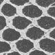 | [C1],[t],[W](http://gwydir.demon.co.uk/jo/lace/whiting/page114.htm) | [D1],[t],[W](http://gwydir.demon.co.uk/jo/lace/whiting/page134.htm)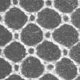 | [E1],[t],[W](http://gwydir.demon.co.uk/jo/lace/whiting/page155.htm)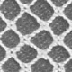 | [F1],[t],[W](http://gwydir.demon.co.uk/jo/lace/whiting/page177.htm)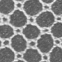 | [G1],[t],[W](http://gwydir.demon.co.uk/jo/lace/whiting/page198.htm) | [t],[W](http://gwydir.demon.co.uk/jo/lace/whiting/page219.htm) |
|  2 | [A2]2,[v],[W](http://gwydir.demon.co.uk/jo/lace/whiting/page71.htm) | [B2]2,[v],[W](http://gwydir.demon.co.uk/jo/lace/whiting/page95.htm)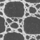 | [W](http://gwydir.demon.co.uk/jo/lace/whiting/page115.htm) | [W](http://gwydir.demon.co.uk/jo/lace/whiting/page135.htm)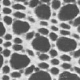 | [E2],[W](http://gwydir.demon.co.uk/jo/lace/whiting/page156.htm)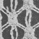 | [F2],[ts],[W](http://gwydir.demon.co.uk/jo/lace/whiting/page178.htm)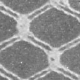 | [G2],[W](http://gwydir.demon.co.uk/jo/lace/whiting/page199.htm) | [H2],[W](http://gwydir.demon.co.uk/jo/lace/whiting/page220.htm) |
|  3 | [t],[W](http://gwydir.demon.co.uk/jo/lace/whiting/page73.htm) | [t],[W](http://gwydir.demon.co.uk/jo/lace/whiting/page96.htm)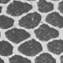 | [C3],[t],[W](http://gwydir.demon.co.uk/jo/lace/whiting/page117.htm)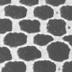 | [W](http://gwydir.demon.co.uk/jo/lace/whiting/page136.htm) | [E3],[t],[W](http://gwydir.demon.co.uk/jo/lace/whiting/page157.htm) | [t],[W](http://gwydir.demon.co.uk/jo/lace/whiting/page179.htm) | [t],[W](http://gwydir.demon.co.uk/jo/lace/whiting/page200.htm)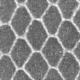 | [W](http://gwydir.demon.co.uk/jo/lace/whiting/page221.htm)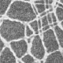 |
|  4 | -,[W](http://gwydir.demon.co.uk/jo/lace/whiting/page74.htm) | -,[W](http://gwydir.demon.co.uk/jo/lace/whiting/page97.htm)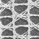 | [k],[W](http://gwydir.demon.co.uk/jo/lace/whiting/page118.htm) | [k],[W](http://gwydir.demon.co.uk/jo/lace/whiting/page137.htm) | [E4],[W](http://gwydir.demon.co.uk/jo/lace/whiting/page158.htm)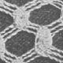 | [F4], [z],[W](http://gwydir.demon.co.uk/jo/lace/whiting/page180.htm)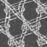 | [W](http://gwydir.demon.co.uk/jo/lace/whiting/page201.htm)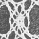 | [H4],[v],[W](http://gwydir.demon.co.uk/jo/lace/whiting/page222.htm)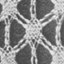 |
|  5 | [k],[W](http://gwydir.demon.co.uk/jo/lace/whiting/page75.htm)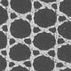 | [k],[W](http://gwydir.demon.co.uk/jo/lace/whiting/page98.htm) | [k],[W](http://gwydir.demon.co.uk/jo/lace/whiting/page119.htm)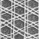 | &sim;[c],[W](http://gwydir.demon.co.uk/jo/lace/whiting/page138.htm)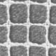 | -,[W](http://gwydir.demon.co.uk/jo/lace/whiting/page159.htm) | &sim;[c],[W](http://gwydir.demon.co.uk/jo/lace/whiting/page181.htm)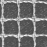 | &sim;[c],[W](http://gwydir.demon.co.uk/jo/lace/whiting/page203.htm) | &sim;[c],[W](http://gwydir.demon.co.uk/jo/lace/whiting/page224.htm)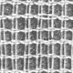 |
|  6 | [k],[W](http://gwydir.demon.co.uk/jo/lace/whiting/page76.htm)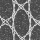 | [B6]2,[v],[W](http://gwydir.demon.co.uk/jo/lace/whiting/page99.htm)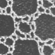 | [C6]2,[v],[W](http://gwydir.demon.co.uk/jo/lace/whiting/page120.htm) | [D6]2,[z],[W](http://gwydir.demon.co.uk/jo/lace/whiting/page139.htm)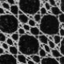 | [E6],[W](http://gwydir.demon.co.uk/jo/lace/whiting/page160.htm)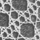 | [t],[W](http://gwydir.demon.co.uk/jo/lace/whiting/page182.htm)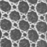 | -,[W](http://gwydir.demon.co.uk/jo/lace/whiting/page204.htm)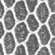 | [W](http://gwydir.demon.co.uk/jo/lace/whiting/page225.htm) |
|  7 | [W](http://gwydir.demon.co.uk/jo/lace/whiting/page77.htm)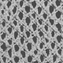 | [k],[W](http://gwydir.demon.co.uk/jo/lace/whiting/page100.htm) | [W](http://gwydir.demon.co.uk/jo/lace/whiting/page121.htm) | [W](http://gwydir.demon.co.uk/jo/lace/whiting/page140.htm) | [W](http://gwydir.demon.co.uk/jo/lace/whiting/page161.htm) | [W](http://gwydir.demon.co.uk/jo/lace/whiting/page183.htm) | [W](http://gwydir.demon.co.uk/jo/lace/whiting/page205.htm) | [k],[W](http://gwydir.demon.co.uk/jo/lace/whiting/page226.htm)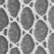 |
|  8 | [W](http://gwydir.demon.co.uk/jo/lace/whiting/page79.htm) | [W](http://gwydir.demon.co.uk/jo/lace/whiting/page101.htm) | [W](http://gwydir.demon.co.uk/jo/lace/whiting/page122.htm)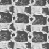 | [W](http://gwydir.demon.co.uk/jo/lace/whiting/page141.htm) | [W](http://gwydir.demon.co.uk/jo/lace/whiting/page162.htm)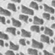 | [W](http://gwydir.demon.co.uk/jo/lace/whiting/page184.htm)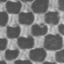 | [W](http://gwydir.demon.co.uk/jo/lace/whiting/page206.htm) | [W](http://gwydir.demon.co.uk/jo/lace/whiting/page227.htm) |
|  9 | [W](http://gwydir.demon.co.uk/jo/lace/whiting/page80.htm)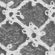 | [W](http://gwydir.demon.co.uk/jo/lace/whiting/page102.htm) | [C9]2,[v],[W](http://gwydir.demon.co.uk/jo/lace/whiting/page123.htm) | [D9],[W](http://gwydir.demon.co.uk/jo/lace/whiting/page142.htm) | [W](http://gwydir.demon.co.uk/jo/lace/whiting/page163.htm)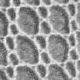 | [W](http://gwydir.demon.co.uk/jo/lace/whiting/page185.htm) | [t],[W](http://gwydir.demon.co.uk/jo/lace/whiting/page207.htm) | [H9],[t],[W](http://gwydir.demon.co.uk/jo/lace/whiting/page229.htm)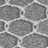 |
|  10 | [W](http://gwydir.demon.co.uk/jo/lace/whiting/page82.htm)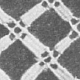 | [W](http://gwydir.demon.co.uk/jo/lace/whiting/page103.htm)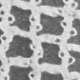 | [W](http://gwydir.demon.co.uk/jo/lace/whiting/page124.htm)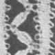 | [W](http://gwydir.demon.co.uk/jo/lace/whiting/page143.htm)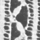 | [W](http://gwydir.demon.co.uk/jo/lace/whiting/page164.htm) | [W](http://gwydir.demon.co.uk/jo/lace/whiting/page187.htm)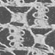 | [W](http://gwydir.demon.co.uk/jo/lace/whiting/page208.htm)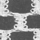 | [W](http://gwydir.demon.co.uk/jo/lace/whiting/page230.htm) |
|  11 | [t],[W](http://gwydir.demon.co.uk/jo/lace/whiting/page83.htm)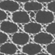 | [t],[W](http://gwydir.demon.co.uk/jo/lace/whiting/page104.htm) | -,[W](http://gwydir.demon.co.uk/jo/lace/whiting/page125.htm)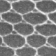 | [wk],[W](http://gwydir.demon.co.uk/jo/lace/whiting/page144.htm)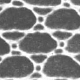 | [wk],[W](http://gwydir.demon.co.uk/jo/lace/whiting/page166.htm) | [t],[W](http://gwydir.demon.co.uk/jo/lace/whiting/page189.htm) | [k],[W](http://gwydir.demon.co.uk/jo/lace/whiting/page209.htm) | -,[W](http://gwydir.demon.co.uk/jo/lace/whiting/page231.htm)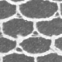 |
|  12 | [t],[W](http://gwydir.demon.co.uk/jo/lace/whiting/page84.htm)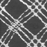 | [c],[W](http://gwydir.demon.co.uk/jo/lace/whiting/page105.htm)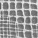 | [W](http://gwydir.demon.co.uk/jo/lace/whiting/page126.htm)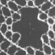 | [W](http://gwydir.demon.co.uk/jo/lace/whiting/page145.htm) | [W](http://gwydir.demon.co.uk/jo/lace/whiting/page167.htm)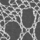 | [W](http://gwydir.demon.co.uk/jo/lace/whiting/page190.htm) | [W](http://gwydir.demon.co.uk/jo/lace/whiting/page210.htm) | [W](http://gwydir.demon.co.uk/jo/lace/whiting/page232.htm) |
|  13 | -,[W](http://gwydir.demon.co.uk/jo/lace/whiting/page85.htm) | [W](http://gwydir.demon.co.uk/jo/lace/whiting/page106.htm) | [W](http://gwydir.demon.co.uk/jo/lace/whiting/page128.htm) | [W](http://gwydir.demon.co.uk/jo/lace/whiting/page147.htm) | [W](http://gwydir.demon.co.uk/jo/lace/whiting/page169.htm) | [W](http://gwydir.demon.co.uk/jo/lace/whiting/page192.htm) | [W](http://gwydir.demon.co.uk/jo/lace/whiting/page211.htm) | [W](http://gwydir.demon.co.uk/jo/lace/whiting/page234.htm) |
|  14 | [W](http://gwydir.demon.co.uk/jo/lace/whiting/page87.htm) | [W](http://gwydir.demon.co.uk/jo/lace/whiting/page107.htm) | [W](http://gwydir.demon.co.uk/jo/lace/whiting/page129.htm) | [c],[W](http://gwydir.demon.co.uk/jo/lace/whiting/page148.htm) | [W](http://gwydir.demon.co.uk/jo/lace/whiting/page171.htm) | [W](http://gwydir.demon.co.uk/jo/lace/whiting/page193.htm) | [G14],[W](http://gwydir.demon.co.uk/jo/lace/whiting/page212.htm) | [W](http://gwydir.demon.co.uk/jo/lace/whiting/page235.htm) |
|  15 | [W](http://gwydir.demon.co.uk/jo/lace/whiting/page89.htm) | [W](http://gwydir.demon.co.uk/jo/lace/whiting/page109.htm) | [W](http://gwydir.demon.co.uk/jo/lace/whiting/page130.htm) | [W](http://gwydir.demon.co.uk/jo/lace/whiting/page149.htm) | [W](http://gwydir.demon.co.uk/jo/lace/whiting/page173.htm) | [W](http://gwydir.demon.co.uk/jo/lace/whiting/page194.htm) | [W](http://gwydir.demon.co.uk/jo/lace/whiting/page213.htm) | [W](http://gwydir.demon.co.uk/jo/lace/whiting/page237.htm) |
|  16 | [ts],[W](http://gwydir.demon.co.uk/jo/lace/whiting/page90.htm) | [W](http://gwydir.demon.co.uk/jo/lace/whiting/page110.htm) | [W](http://gwydir.demon.co.uk/jo/lace/whiting/page131.htm) | [W](http://gwydir.demon.co.uk/jo/lace/whiting/page150.htm) | [E16],[W](http://gwydir.demon.co.uk/jo/lace/whiting/page174.htm) | [F16],[W](http://gwydir.demon.co.uk/jo/lace/whiting/page195.htm) | [G16],[W](http://gwydir.demon.co.uk/jo/lace/whiting/page214.htm) | [c],[W](http://gwydir.demon.co.uk/jo/lace/whiting/page238.htm) |
|  17 | [W](http://gwydir.demon.co.uk/jo/lace/whiting/page91.htm) | [c],[W](http://gwydir.demon.co.uk/jo/lace/whiting/page111.htm) | [k],[W](http://gwydir.demon.co.uk/jo/lace/whiting/page132.htm) | [W](http://gwydir.demon.co.uk/jo/lace/whiting/page151.htm) | [c],[W](http://gwydir.demon.co.uk/jo/lace/whiting/page175.htm) | -,[W](http://gwydir.demon.co.uk/jo/lace/whiting/page196.htm) | [W](http://gwydir.demon.co.uk/jo/lace/whiting/page215.htm) | [W](http://gwydir.demon.co.uk/jo/lace/whiting/page239.htm) |
|  18 | [t],[W](http://gwydir.demon.co.uk/jo/lace/whiting/page93.htm) | [W](http://gwydir.demon.co.uk/jo/lace/whiting/page112.htm) | [W](http://gwydir.demon.co.uk/jo/lace/whiting/page133.htm) | [W](http://gwydir.demon.co.uk/jo/lace/whiting/page153.htm) | [W](http://gwydir.demon.co.uk/jo/lace/whiting/page176.htm) | [W](http://gwydir.demon.co.uk/jo/lace/whiting/page197.htm) | [W](http://gwydir.demon.co.uk/jo/lace/whiting/page217.htm) | [W](http://gwydir.demon.co.uk/jo/lace/whiting/page241.htm) |