Tesselace Index
===============

The diagrams are collected from [TesseLace.com],
resulting from Ph.D research on _Algorithmically designed lace tessellations_.
The images link to patterns like the TesseLace [slide show].
In turn these patterns link to the main [GroundForge] page
where you can choose stitches for a color coded pair diagram and thread diagram.

[TesseLace.com]: https://tesselace.com
[slide show]: https://tesselace.com/tools/inkscape-extension/
[GroundForge]: /GroundForge/

- [Common Grounds](#common-grounds)
- [Fish and Lotus variations](#fish-and-lotus-variations)
- [Virgin or Rose and bias variations](#virgin-or-rose-and-bias-variations)
- [Others](#others)

Note that the choice to put a pattern in a group may be arbitrary, duplicating too many in multiple groups would make the page too slow.

_Edit hint_: copy the link location of the image you want to move, start editing, use the browser search to find the link location.

Common Grounds
--------------

You might need to change some angles and distances to recognize a ground. See this [animation] and the reshape pages in the sidebar.

[animation]: /GroundForge/help/animation/GIFCreator-me.gif

[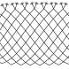](/GroundForge/sheet.html?patch=5-%20-5;checker&patch=5353%205353%205-5-%20-5-5;checker&patch=5632%2056-2%205-5-%20-535;checker&patch=53%205-%20-5%205-;bricks&patch=44%2077%2044%2077;bricks&patch=44%2044%2077%2077;bricks&patch=66%2088%2066%2011;bricks&patch=66%2066%2088%2011;checker&patch=66%2066%2099%2000;checker&patch=6;checker&patch=566-%2066-5%206-56%20-566;checker&patch=53%2053%2053%205-;bricks&patch=5663%205663;checker&patch=53%205-;bricks&patch=563%20563%20563;checker&patch=53%2053;checker&patch=5632%205632;checker&patch=5353%205353;bricks)

[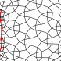](/GroundForge/sheet.html?patch=4312%206-78;bricks)

Fish and Lotus variations
-------------------------

see also [MEA-gf](https://maetempels.github.io/MAE-gf/docs/fish)

[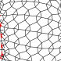](/GroundForge/sheet.html?patch=4343%206868;bricks&patch=5-K-5-K-%20-L-O-L-O%20K-5-K-5-%20-H-E-H-E;bricks)

[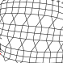](/GroundForge/sheet.html?patch=66%20-4%2021%2088;bricks&patch=66%2066%20-4%2068;bricks&patch=5-K-5-K-%20-L-O-L-O%20E-E-E-E-%20-L-L-L-L;bricks)

[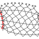](/GroundForge/sheet.html?patch=6868%20-4-4%205-5-%20-5-5;checker&patch=586-%20-4-5;checker)

[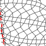](/GroundForge/sheet.html?patch=43%205-%2086%2066;bricks)

[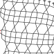](/GroundForge/sheet.html?patch=6868%201111%208888%20-4-4;checker&patch=43%2068%2066%2066;bricks&patch=466-%206686%206-46%208666;checker&patch=6888%20-114;checker&patch=L-L-L-L-%20-L-L-L-L%205---5---%20-H-E-H-E;bricks&patch=5-L-L---%20-L-L-O-L%20L-L---5-%20-E-H-E-E;bricks)

Mixed, shifted under and angle and/or with swim lanes. More under [others](#Others), even mixed with spiders.

[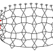](/GroundForge/sheet.html?patch=486-%20-486%205-4-%2086-5;checker&patch=6868%20---7%20AA01%20-7-7;bricks)

[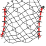](/GroundForge/sheet.html?patch=4832%2024-2%20225-%208325;checker)

[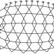](/GroundForge/sheet.html?patch=68%20-4%2021%207-;bricks)

Virgin or Rose and bias variations
----------------------------------

See also the [Droste](Droste-effect) page, a twist more or less at the first step or alternating stitches in one or two directions and you have another variation. The ID's for the stitches also will have more logic, though they won't stick to the underlying grid position.

[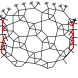](/GroundForge/sheet.html?patch=4831%20-488%20214-%2088-5;checker)

[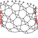](/GroundForge/sheet.html?patch=4831%20-488%206-48%2086-4;checker)

[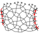](/GroundForge/sheet.html?patch=588-%20-4-5%206-58%20-214;checker)

[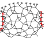](/GroundForge/sheet.html?patch=486-%20-115%20217-%2088-5;checker)

Others
------

[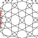](/GroundForge/sheet.html?patch=5831%20-4-7%203158%20-7-4;bricks)

[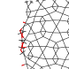](/GroundForge/sheet.html?patch=5-L-K-H-%20-L-L-O-O%205---5---%20-H-E-H-E;bricks)

[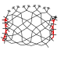](/GroundForge/sheet.html?patch=586-%20-4-5%20215-%20-7-5;checker&patch=5831%20-4-7%205-5-%20-5-5;checker)

[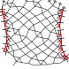](/GroundForge/sheet.html?patch=4632%2056-2%206-58%208634;checker)

[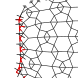](/GroundForge/sheet.html?patch=5-L---H-%20-L-O-L-O%20--5-K-5-%20-E-E-H-H;bricks)

[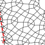](/GroundForge/sheet.html?patch=4631%2066-7%206-56%208666;bricks)

[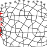](/GroundForge/sheet.html?patch=586-%201112%208-78%20-5-4;bricks)
[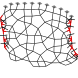](/GroundForge/sheet.html?patch=588-%20-4-5%206868%20-114;checker)

[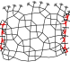](/GroundForge/sheet.html?patch=588-%201112%208-78%20-214;checker)

[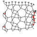](/GroundForge/sheet.html?patch=586-%20-789%202111%20-4-4;checker)
[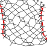](/GroundForge/sheet.html?patch=4632%205683%206-48%208634;checker)

[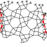](/GroundForge/sheet.html?patch=588-%208889%204-11%20-014;checker)

[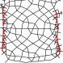](/GroundForge/sheet.html?patch=4632%205683%202111%208837;checker)

[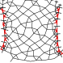](/GroundForge/sheet.html?patch=4632%205312%206-78%208634;checker)

[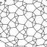](/GroundForge/sheet.html?patch=5-E-H-%20-5-5--%20L-5-O-;bricks)

[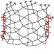](/GroundForge/sheet.html?patch=4831%20-4-7%205-21%2086-7;checker)

[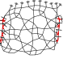](/GroundForge/sheet.html?patch=4831%20-4-7%202121%2088-7;checker)

[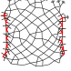](/GroundForge/sheet.html?patch=4353%205353%205-21%2086-7;checker)

[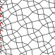](/GroundForge/sheet.html?patch=4321%205883;bricks)

[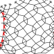](/GroundForge/sheet.html?patch=48-2%205-53;bricks)

[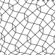](/GroundForge/sheet.html?patch=4466%207781;bricks)
[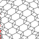](/GroundForge/sheet.html?patch=4683%203468;bricks)

[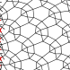](/GroundForge/sheet.html?patch=4632%203488;bricks)
[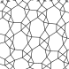](/GroundForge/sheet.html?patch=4840%205887;bricks)

[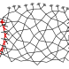](/GroundForge/sheet.html?patch=586-%20-4-5%205-21%20-5-7;bricks)

[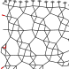](/GroundForge/sheet.html?patch=586-%20-789%202111%20-4-4;bricks)

[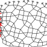](/GroundForge/sheet.html?patch=586-%201112%20788-%20-4-5;bricks)
[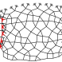](/GroundForge/sheet.html?patch=586-%201112%207-7-%20-5-5;bricks)

[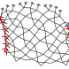](/GroundForge/sheet.html?patch=586-%20-4-5%206-58%20-5-4;bricks)

[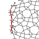](/GroundForge/sheet.html?patch=5-L-L-K-%20-L-K-5-O%20H-5-O---%20-H-E-H-E;bricks)

[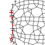](/GroundForge/sheet.html?patch=5-L-L-K-%20---H-5-O%20O-L-O-L-%20-E-E-E-E;bricks)

[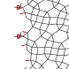](/GroundForge/sheet.html?patch=5-L-O-K-%20-L-L-L-O%20E-E-E-E-%20-5-L-L-K;bricks)

[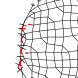](/GroundForge/sheet.html?patch=5-L-L---%20-L-L-O-L%20H-H-H-H-%20-H-H-H-H;bricks)
[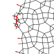](/GroundForge/sheet.html?patch=5-L-K-E-%20-L-L-O-O%20H-H-H-H-%20-5-K-H-H;bricks)
[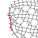](/GroundForge/sheet.html?patch=5-L-L---%20---5-O-L%20O-L-L-L-%20-E-E-E-E;bricks)

[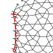](/GroundForge/sheet.html?patch=5-K-5-K-%20-L-O-L-O%205-L---H-%20-E-H-E-H;bricks)

