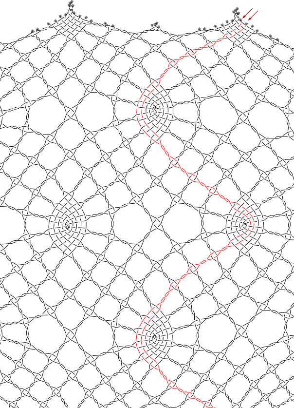
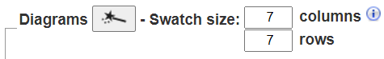
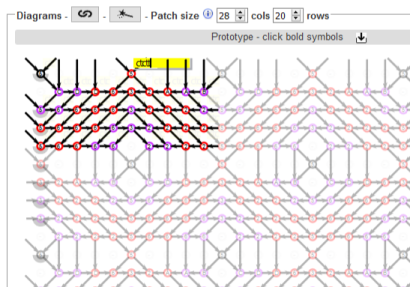
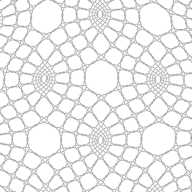

Getting Started
==========
+ [Highlight a thread](#highlight-a-thread)
+ [Resize pattern](#resize-pattern)
+ [Modify stitches](#modify-stitches)
+ [Undo changes](#undo-changes)
+ [Save and share changes](#save-and-share-changes)
+ [Create a new ground pattern](#create-a-new-ground-pattern)
+ [Add footsides](#add-footsides)
+ [Next steps](#next-steps)
   
In the following tutorial, we will explore a versatile ground from the [Whiting catalogue] and illustrate some basic features of GroundForge. 

First navigate to the [Whiting catalogue] (click on this link) and look at the grounds.  By clicking on a photo in the catalogue, you will launch the associated page in Gertrude Whiting's book *A lace guide for makers and collectors* which will give more information about the ground.  The grounds are arrange in columns labelled __A__ to __H__ and rows labelled __1__ to __18__.
 
Clicking on the [diagram] link above a photo in the catalogue will launch the GroundForge tool, initialized with the details of the selected Whiting ground.

Open the [diagram] for ground G-2 (column G, row 2) in the [Whiting catalogue].

[Whiting catalogue]: /gw-lace-to-gf/

[diagram]: /GroundForge/tiles?whiting=G2_P199&patchWidth=14&patchHeight=13&f1=ctctt&a1=ctcctc&j2=ctc&i2=ctcll&h2=ctctt&g2=ctctt&f2=ctctt&e2=ctctt&d2=ctctt&c2=ctcrrr&b2=ctc&j3=ctcll&i3=ctctt&h3=ctctt&g3=ctcttl&f3=ctc&e3=ctcttr&d3=ctctt&c3=ctctt&b3=ctcrrr&a3=ctc&j4=ctctt&i4=ctctt&h4=ctcttl&g4=ctc&f4=ctc&e4=ctc&d4=ctcttr&c4=ctctt&b4=ctctt&a4=ctcttt&j5=ctctt&i5=ctcttl&h5=ctc&g5=ctc&e5=ctc&d5=ctc&c5=ctcttr&b5=ctctt&a5=ctctt&tile=5----5----,-CDD632AAB,5666632222,5666632222,56666-2222&tileStitch=ctct&shiftColsSW=-5&shiftRowsSW=5&shiftColsSE=5&shiftRowsSE=5

## Highlight a thread
For each lace ground, GroundForge displays two generated drawings: a pair diagram (based on the International Colour Code) and a thread diagram. Help pages, accessible by clicking on the  image above each diagram, provide more information.

In the thread diagram, each thread has a small square at the start and a bobbin at the end. You may need to scroll the diagram to see them. Click on a square or bobbin to change the color of the thread from black to red. Click on the square or bobbin of a red thread  and it turns to green, next time to violet, and finally back to black. You can highlight more than one thread at a time. For more colours and options, visit [thread properties](Thread-Properties).

## Resize pattern

You can increase or decrease the size of the sample (also known as a "swatch") generated in the pair and thread diagrams. Above the pair and thread diagrams, change the number of columns and rows for the swatch. Note: If you make the swatch very large, performance may slow down considerably.  Read about [restrictions to the swatch size](Patch-Size) for more details. 

Every time you change the swatch size, you must regenerate the pair and thread diagrams by clicking on the  image found near the top left of the _Diagrams_ area.

## Modify stitches

To change the stitches, go to the pattern diagram in the _Edit pattern_ section. The pattern contains a vector drawing showing the order in which pairs of threads come together. There are multiple copies of the ground pattern in the prototype, showing how the pattern repeats. One copy is brightly coloured, the others appear faded. We will always work with the brightly coloured copy.

Where two pairs come together, there is a circle with a number or letter in its centre. Click once on any of these circles and a yellow box appears with the stitch definition. To change the stitch, type the new instructions while the yellow box is visible. Note: Do not try to click inside the yellow box to change the caret position.  Use the arrows on the keyboard instead.  

Every time you change the stitch definitions, you must regenerate the pair and thread diagrams by clicking on the  image found near the top left of the _Edit pattern_ area.

Exercise: Try to change the center of the spider from `ctcctc` to `t`. (Spoiler alert: The center of the spider is the black circle around the symbol `5`, located in the top left corner of the prototype).

In addition to the usual `c` for cross and `t` for twist, you can twist only the right pair by typing `r` or type `l` to twist only the left pair. You can also "drop" a stitch. That is, when two pairs meet, do not braid them together at all. To drop a stitch, replace the stitch instructions with `-`. Be careful when dropping stitches. It can have unexpected consequences.

Exercise: Can you create the following variation? [solution](/GroundForge/tiles?whiting=G2_P199&patchWidth=20&patchHeight=20&f1=-&a1=t&j2=ctc&i2=ctclll&h2=ctctt&g2=ctctt&f2=ctctt&e2=ctctt&d2=ctctt&c2=ctcrrr&b2=ctc&j3=ctclll&i3=ctctt&h3=ctctt&g3=ctcttl&f3=ctc&e3=ctcttr&d3=ctctt&c3=ctctt&b3=ctcrrr&a3=ctc&j4=ctctt&i4=ctctt&h4=ctcttl&g4=ctc&f4=ctc&e4=ctc&d4=ctcttr&c4=ctctt&b4=ctctt&a4=ctcttt&j5=ctctt&i5=ctcttl&h5=ctc&g5=ctc&e5=ctc&d5=ctc&c5=ctcttr&b5=ctctt&a5=ctctt&tile=5----5----,-CDD632AAB,5666632222,5666632222,56666-2222&footsideStitch=ctctt&tileStitch=ctct&headsideStitch=ctctt&shiftColsSW=-5&shiftRowsSW=5&shiftColsSE=5&shiftRowsSE=5)

## Undo changes

To return the pattern to its original values, click on the 'Reload' button (also called 'Refresh') at the top of your browser.

## Save and share changes

Once you have invested some time working on a lace ground, you will want to save your work. Click on the  image near the top left of the _Edit pattern_ area. This will change the text in the address bar at the top of your browser. The text is a link to this website and contains the lace pattern as well as the stitch choices you have made.

Save the link text into a file for later use. Copy and paste the link text into the address bar of your browser to return to your current state or share it with other lacemakers.

## Create a new ground pattern

The area labelled “Edit pattern” is used to create a new pattern. First, we map the pattern onto a grid. Symbols, comprising numbers or letters, are used to draw lines on the grid. This creates a vector diagram showing the order in which pairs of threads come together. From this description, the software generates a pair diagram and a thread diagram. A more [detailed tutorial](Advanced) fully explains the many construction options available.

## Add footsides

In addition to modelling a lace ground, GroundForge can also model a footside for it. Left and right footsides are defined separately and depend on the number of columns in the patch. For example, here is [footside for Whiting G-2](/GroundForge/tiles?whiting=G2_P199&patchWidth=11&patchHeight=22&r1=ctcrr&q1=ctc&j1=ctctt&e1=ctcctc&c1=ctc&b1=ctcll&s2=ctctt&r2=ctc&q2=ctcll&p2=ctc&n2=ctc&m2=ctclll&l2=ctctt&k2=ctctt&j2=ctctt&i2=ctctt&h2=ctctt&g2=ctcrrr&f2=ctc&d2=ctc&c2=ctcrr&b2=ctc&a2=ctctt&r3=ctcrr&q3=ctc&p3=ctcrr&n3=ctclll&m3=ctctt&l3=ctctt&k3=ctcttl&j3=ctc&i3=ctcttr&h3=ctctt&g3=ctctt&f3=ctcrrr&e3=ctc&d3=ctcll&c3=ctc&b3=ctcll&s4=ctctt&r4=ctc&q4=ctcll&p4=ctctt&n4=ctctt&m4=ctctt&l4=ctcttl&k4=ctc&j4=ctc&i4=ctc&h4=ctcttr&g4=ctctt&f4=ctctt&e4=ctcttt&d4=ctctt&c4=ctcrr&b4=ctc&a4=ctctt&r5=ctcrr&q5=ctc&p5=ctctt&n5=ctctt&m5=ctcttl&l5=ctc&k5=ctc&i5=ctc&h5=ctc&g5=ctcttr&f5=ctctt&e5=ctctt&d5=ctctt&c5=ctc&b5=ctcll&s6=ctctt&r6=ctc&q6=ctcll&c6=ctcrr&b6=ctc&a6=ctctt&s7=ctctt&r7=ctcrr&q7=ctc&p7=ctctt&d7=ctctt&c7=ctc&b7=ctcll&a7=ctctt&r8=ctc&q8=ctcll&p8=ctcll&d8=ctcrr&c8=ctcrr&b8=ctc&s9=ctctt&r9=ctcrr&q9=ctc&p9=rr&d9=ll&c9=ctc&b9=ctcll&a9=ctctt&r10=ctc&q10=ctcll&p10=ctcrr&d10=ctcll&c10=ctcrr&b10=ctc&footside=X14-,4886,-111,B883,X111,488-,1115,X786,1114,X786&tile=5----5----,-CDD632AAB,5666632222,5666632222,56666-2222&headside=-78X,2117,888-,311C,888X,-117,5888,214X,7888,214X&footsideStitch=ctc&tileStitch=ctctt&headsideStitch=ctctt&shiftColsSW=-5&shiftRowsSW=5&shiftColsSE=5&shiftRowsSE=5).
There is a separate tutorial on how to [create footsides](Advanced#foot-sides).

## Next steps

* Experiment with four snowflake variations in [Binche Kompakt: ground number 31](Binche).
* [Create a pattern](Advanced)
* Learn about [the Droste effect](Droste-effect)
