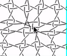

Sometimes the animation leaves some clutter in pair or thread diagrams.
Dragging stitches can resume the unfolding process.
 
Sometimes a [pattern] definition causes clutter.
Dragging stitches can reveal what happens in a problematic area.

[pattern]: /GroundForge/tiles.html?patchWidth=12&patchHeight=12&c1=ctct&b1=ctct&c2=ctct&a2=ctct&tile=XM8,FX1&footsideStitch=ctctt&tileStitch=ctct&headsideStitch=ctctt&shiftColsSW=0&shiftRowsSW=2&shiftColsSE=3&shiftRowsSE=2

   

The draggable modus may cause nervous/rotating diagrams when trying to change thread colors.
The modus applies to thread diagrams as wel as pair diagrams.
