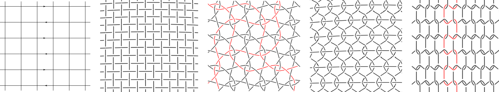
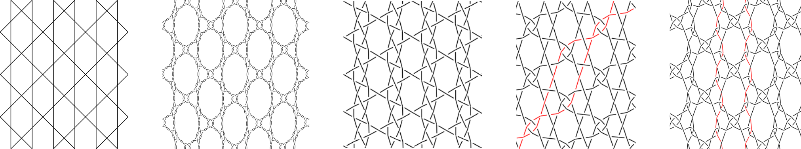



What is GroundForge?
--------------------

GroundForge is a tool that complements existing lace ground [catalogues](#pattern-catalogues) by making it possible to play with their designs. 
* It generates an interactive thread diagram in which you can highlight the path of a thread; a useful feature when working with multiple thread colours or thicknesses in a design.  
* You can specify the combinations of stitches to make when two pairs meet.  This is very useful for communicating and documenting a new lace ground.
* Experiment with lace grounds without the need to wind bobbins or prepare a pricking. The final test is always to make a hand-worked sample&mdash;only in a physical sample can the interactions between pins and threads under tension be completely observed&mdash;however, GroundForge can help you narrow the number of samples you need to test by hand.

You can experiment and play around with the hundreds of patterns provided here, or you can create your own.  Even when reinventing the wheel, your own discoveries can bring great joy.

Tutorials
---------
* [Getting started](help)
* [Variations on a Binche ground](help/Binche)
* [Create a prototype](help/Advanced)
* [The Droste effect](help/Droste-effect)

Pattern Catalogues
-----------------
* [TesseLace algorithmically generated grounds](/tesselace-to-gf)
* [Gertrude Whiting's sampler](/gw-lace-to-gf)
* [Flanders variations](https://maetempels.github.io/MAE-gf/docs/flanders)
* [MAE-gf](https://maetempels.github.io/MAE-gf/) (More Attractive Examples - *g*round*f*orge)
  * includes variations on [Paris](https://maetempels.github.io/MAE-gf/docs/paris), [bias](https://maetempels.github.io/MAE-gf/docs/bias), [spiders](https://maetempels.github.io/MAE-gf/docs/spiders), [snowflakes](https://maetempels.github.io/MAE-gf/docs/snowflakes), [triangular](https://maetempels.github.io/MAE-gf/docs/tria), [lotus](https://maetempels.github.io/MAE-gf/docs/lotus) and [3-pair joins](https://maetempels.github.io/MAE-gf/docs/misca#3-paired-join).

Community Contributions
-----------------------
* [3x4 TesseLace patterns](/tesselace-to-gf/docs/fouche_3x4.md) interpreted by Pierre Fouch&#233;