Snow Mixer
==========

You can find some hints below the diagrams.

<fieldset style="height:145px; overflow: auto; resize: both"><legend>Select a recipe</legend>
<a data-title="123-a" href="javascript:GF_snow_mixer.recipe('crc,crclctc,ctcrc,rcl,c,c','right')">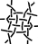</a> &nbsp;
<a data-title="123-b" href="javascript:GF_snow_mixer.recipe('rcl,ctc,crcllc,crrclcr,ctc,cl','left')">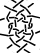</a> &nbsp;
 &nbsp;
 &nbsp;
<a data-title="321-a" href="javascript:GF_snow_mixer.recipe('tc,rclcrc,clcrcl,ct','left')">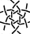</a> &nbsp;
 &nbsp;
 &nbsp;
 &nbsp;
<a data-title="126453-a" href="javascript:GF_snow_mixer.recipe('-,c,ctctc,ctctc,ctctc,c','left')">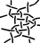</a> &nbsp;
 &nbsp;
<a data-title="154326-a" href="javascript:GF_snow_mixer.recipe('t,rctc,ctctcl,ctct','left')">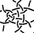</a> &nbsp;
 &nbsp;
 &nbsp;
 &nbsp;
<a data-title="321546-a" href="javascript:GF_snow_mixer.recipe('-,cl,ctcl,crcrcr,rcr,c','left')">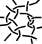</a> &nbsp;
 &nbsp;
 &nbsp;
<a data-title="354612-a" href="javascript:GF_snow_mixer.recipe('ctct,ct,ct,ct,cl,ctc','right')">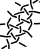</a> &nbsp;
 &nbsp;
 &nbsp;
<a data-title="456123-a" href="javascript:GF_snow_mixer.recipe('r,lrc,ctcr,lct','right')">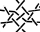</a> &nbsp;
 &nbsp;
<a data-title="462513-a" href="javascript:GF_snow_mixer.recipe('rc,clcrc,clctc,rcl','left')">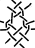</a> &nbsp;
 &nbsp;
<a data-title="563412-c" href="javascript:GF_snow_mixer.recipe('-,c,ctctc,clcr,rctc,c','right')">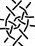</a> &nbsp;
<a data-title="623451-a" href="javascript:GF_snow_mixer.recipe('r,c,crc,ctc,lcrcl,ctc,crc,cl','left')">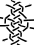</a> &nbsp;
 &nbsp;
 &nbsp;
</fieldset>

The same set of four colors serves different independent purposes.
* The colors of the hexagons in _apply recipe_ match groups of stitches in the thread diagram.
* The pair diagram has a [color-code] that can express unorthodox stitches.

To study the anatomy of the recipes:
* Hover over stitches for tooltips,
the tooltips in the thread diagram will show stitch IDs
that start with the same value as the corresponding stitch in the pair diagram.
* Click a stitch in the pair diagram to remove the color from the corresponding stitch in the thread diagram.
Apply the last recipe again to restore the colors.

Some recipes put more stitches in the recipe box than others.
They may clutter the perimeters of the diagrams.
You can move the content for a better view.

The go-to buttons lead to pages where you can [highlight] threads 
for three-pair respectively six-pair connections and [replace stitches].
You can save all three pages as a [PDF] document.
After tweak footside, you can return here via the droste page (follow _threads as pairs_).

A [tutorial] gives a general introduction, elaborates choosing stitches and tweaking [footsides] and [recipes].
 
[color-code]: /GroundForge-help/color-rules
[tutorial]: /GroundForge-help/snow-mix
[highlight]: /GroundForge-help/clips/color
[replace stitches]: /GroundForge-help/clips/flip
[PDF]: /GroundForge-help/clips/print-as-pdf
[footsides]: /GroundForge-help/snow-mix#footsides
[recipes]: /GroundForge-help/snow-mix#recipes-for-the-mixer

