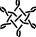
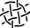

Mix three/six-pair connections
==============================

On the left a sample of lace by Babette.
She invented a double hexagonal ring pair around a snowflake.
The intersections of the double ring pairs are in fact compact snowflakes.
This inspired to explore a mix of snowflakes in general. 

The pair diagram of a six pair snowflake can be interpreted
as a thread diagram of a three pair connection. 
Each three pair connection can be composed with a group of two pair stitches.
The form below starts with the last step to provide building blocks for a combination of four snowflakes. 

On the right the first repeat of the [default](?) template:
four groups of stitches with three pairs.
The groups in this example reconstruct a double hexagonal ring pair with an arbitrary snowflake.
The colors of the groups match the hexagons below and the thread diagram.
The pair diagram has a [color code] that caters for unorthodox stitches.

Click one of the hexagons to replace the groups in the diagrams.
An odd number of stitches (minimal three) needs a [workaround].
We support up to 10 stitches.

[MAE-gf]: /MAE-gf/docs/snow-stitches/#examples
[color code]: /GroundForge-help/color-rules
[workaround]: https://github.com/d-bl/GroundForge/blob/master/docs/_includes/snow/README.md#odd-number-of-stitches
[saved PDF]: /GroundForge-help/clips/print-as-pdf



Click an image below to assign its recipe to the form:<!-- true: start left -->  
 "family 123") &nbsp;
 "family 321") &nbsp;
 "family 321") &nbsp;
 "family 456123") &nbsp;
 "family 321")
 "family 321") &nbsp;
 "family 321") &nbsp;

A catalog with recipes can barely scratch the surface of the possibilities.
We have a few more [here](/MAE-gf/docs/snow-stitches/#examples)
and [here](/MAE-gf/docs/misca#3-paired-join).
and instructions to [create](/MAE-gf/docs/snow-stitches/#pair-diagrams-interpreted-as-thread-diagrams-with-blobs)
your own recipes from pair diagrams you find in literature.
Clicking a stitch in the pair diagram will remove the color from the corresponding stitch in the thread diagram.
This can help to trouble shoot a recipe.

When satisfied with the result, you can follow the link to the _pairs from threads_ page
to assign stitches for the actual snowflakes.
Even without that last step it can be fun to play with configurations of snowflakes.

Hint: print this page as PDF to collect your own recipes. 
Reopen in the browser to copy-paste the text field.

