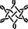
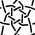
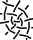
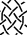
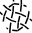
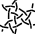
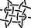
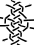

Mix four snowflakes
===================

[color code]: /GroundForge-help/color-rules
[saved PDF]: /GroundForge-help/clips/print-as-pdf



<fieldset><legend>Select a recipe</legend>
 &nbsp;
 &nbsp;
 &nbsp;
 &nbsp;
 &nbsp;
 &nbsp;
 &nbsp;
 &nbsp;
</fieldset>

The colors of the hexagons match the thread diagram.
The pair diagram has a [color code] that can express unorthodox stitches.

A <a href="/GroundForge-help/snow-mix" target="_blank">tutorial</a>
explains how to change recipes, create new recipes and more subjects.
