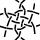
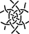



<fieldset style="background: #FFF; max-width:90%; max-height:145px; overflow: auto"><legend>Select a recipe</legend>
 &nbsp;
 &nbsp;
 &nbsp;
 &nbsp;
 &nbsp;
 &nbsp;
 &nbsp;
 &nbsp;
 &nbsp;
 &nbsp;
 &nbsp;
 &nbsp;
 &nbsp;
 &nbsp;
 &nbsp;
 &nbsp;
 &nbsp;
 &nbsp;
<a href="/GroundForge-help/snow-mix#recipes-for-the-mixer">more...</a>
</fieldset>
 

The same set of four colors serves two independent purposes.
The colors of the hexagons match groups of stitches in the thread diagram.
The pair diagram has a [color-code] that can express unorthodox stitches.

Click a stitch in the pair diagram to remove the color from the corresponding stitch in the thread diagram.
The go-to buttons lead to pages where you can [highlight] threads 
for three-pair respectively six-pair connections and [replace stitches].
You can save all three pages as a [PDF] document.
The [tutorial] elaborates choosing stitches and has some bonus subjects like
foot sides and modify or create recipes.

[color-code]: /GroundForge-help/color-rules
[tutorial]: /GroundForge-help/snow-mix
[highlight]: /GroundForge-help/clips/color
[replace stitches]: /GroundForge-help/clips/flip
[PDF]: /GroundForge-help/clips/print-as-pdf

