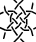
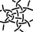
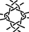
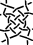
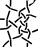



<fieldset style="background: #FFF; max-width:95%; height:145px; overflow: auto; resize: both"><legend>Select a recipe</legend>
 &nbsp;
 &nbsp;
 &nbsp;
 &nbsp;
 &nbsp;
 &nbsp;
 &nbsp;
 &nbsp;
 &nbsp;
 &nbsp;
 &nbsp;
 &nbsp;
 &nbsp;
 &nbsp;
 &nbsp;
 &nbsp;
 &nbsp;
 &nbsp;
 &nbsp;
 &nbsp;
 &nbsp;
 &nbsp;
 &nbsp;
 &nbsp;
 &nbsp;
 &nbsp;
 &nbsp;
 &nbsp;
<a href="/GroundForge-help/snow-mix#recipes-for-the-mixer">more...</a>
</fieldset>
 

The same set of four colors serves two independent purposes.
The colors of the hexagons match groups of stitches in the thread diagram.
The pair diagram has a [color-code] that can express unorthodox stitches.

Some recipes put more stitches in the recipe box than others.
They may clutter the perimeters of the pair diagram.
Resize the panel (drag the bottom right corner) or move the content around for a better view.
To study the anatomy of the recipes:
Hover over a stitch in the pair diagram for a tooltip, 
click to remove the color from the corresponding stitch in the thread diagram.

The go-to buttons lead to pages where you can [highlight] threads 
for three-pair respectively six-pair connections and [replace stitches].
You can save all three pages as a [PDF] document.
A [tutorial] gives a general introduction, elaborates choosing stitches, footsides and recipes.

[color-code]: /GroundForge-help/color-rules
[tutorial]: /GroundForge-help/snow-mix
[highlight]: /GroundForge-help/clips/color
[replace stitches]: /GroundForge-help/clips/flip
[PDF]: /GroundForge-help/clips/print-as-pdf

