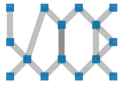
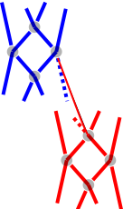
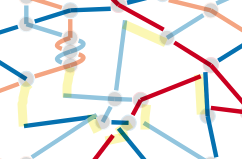
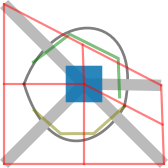

A technical birds eye overview
===============================

The file `svgPairsToThreads.js` defines a JavaScript object called `GF_svgP2T`.
This object provides a set of functions for processing and generating bobbin lace diagrams.
Color coded pair diagrams provide instructions for a bobbin lace maker.
Thread diagrams visualise how the threads flow through the lace.
Given a pair diagram, the script generates the corresponding thread diagram.

Uploaded SVG diagrams are supposed to be created by the symmetry page of GroundForge.
This page lets you add, drop and move stitches in a template diagram. 
This template is then combined in various reflected compositions. 
These reflections are indicated with bdpq versions of the template.

Page structure
--------------

The proof of concept page has little static content: 
* A standard GroundForge header
* a button and its label to upload files.
* fields to change the color of threads.

The dynamic content is rendered by JavaScript:
* A modified version of the template found in the upload. This is a color-coded pair diagram.
  The style attributes are replaced to allow static and interactive styling with CSS.
  Also, some classes are added to simplify the conversion to a thread diagram.
* The color code and text label from the legend in the upload become captions for little thread diagrams.
* A larger version of the thread diagram and smaller set of bdpq versions.
  These mirrored version are intended to build swatches.
  Currently, the d and p versions have the wrong over/under effect.
  The b (top-left) and q (bottom-right) versions are correct.

Uploads
-------

Uploads are sanitized for safety reasons. This excludes `<use>` elements, because of href attributes.
In practise this means we don't get the swatches from the symmetry page.
We will get the dots next to the swatches, if present in the uploaded file.
The titles of these dots provide tooltips with the swatch parameters.
Neither the swatches nor the dots are currently used in the script.

Classes
-------

The classes on the SVG elements have different functions:
* Chances for custom presentation by CSS rules and interaction in pages displaying the diagrams.
* Structural information used during construction of the diagrams and for further processing.

We have multiple groups of classes:

| pattern                              | diagram type   | element type | note                                                                  |
|--------------------------------------|----------------|--------------|-----------------------------------------------------------------------|
| starts/ends_left/right_at_\<node-id> | both           | edges        | left/right component only on thread diagrams                          |
| white_start/end                      | threads        | edges        | for the over/under effect                                             |
| thread_\<nr>                         | threads        | edges        | for styling purposes                                                  |
| cross/twist                          | threads        | nodes        |                                                                       |
| first_kiss_\<nr>                     | threads        | nodes        | the group node of a set of cross/twist nodes                          |
| kiss_odd/even                        | both           | edges        | for styling purposes                                                  |
| kiss_\<nr>                           | both           | edges        | for processing purposes                                               |
| , ,                                  | enhanced pairs | nodes        | two per node except on left/right perimeter                           |
| from_\<node_id>                      | enhanced pairs | nodes        | to determine a valid working order and to connect stitches            |
| to_\<node_id>                        | enhanced pairs | nodes        | like from_ used to calculate (dx,dy) for the edges around a pair node |
| link                                 | pairs          | edges        | legacy (in other contexts nodes might be paths)                       |

Colors on odd/even kissing paths in the thread diagrams 
helped to debug the direction of bends for repeated actions.
_Hint_: The developer tools of the mayor browsers have a style editor. 
Uncomment the `.kiss_` rules at the bottom of `styles.css` to override the thread colors.

High-level Call Flow
--------------------

* `init()` is the main entry point and sets up the application.
  * On file upload or initial load of a demo file:
    * `readSVGFile()`
    * `processUploadedSvg()`
      * `coyModifiedTemplateToDoc()`
      * `addCaptionedLegendElementsToDoc()` iterates over elements of an uploaded `#bdqpLegend` element.
      * `addThreadDiagramToDoc()` iterates over stitch elements of an uploaded `#template` element
* `newStitch()` and `addThreadClasses()` are called by functions that draw stitches:
  * `newLegendStitch()`
  * `addThreadDiagramToDoc()`

Customize the init function for integration in another page.
You might want just one or two of the ...ToDoc functions, each adding different components to a web page.
Or even bypass addCaptionedLegendElementsToDoc to pass your own color code symbols into newLegendStitch.
Once not only the template but also a swatch of the symmetry page can be processed,
you might want to react on a click on a dot next to one of the swatches.

Function newStitch
------------------

Core function: parse a stitch notation string (e.g., "ctc", "ctlr") and create an SVG thread diagram.

The following images show steps leading to a thread diagram from `ctc`.

A `t` makes two pairs of nodes at the same height kiss one another.
This explains why the following two stitches have the same color code,
will be also identical in real lace, yet are drawn differently.

Function addThreadDiagramToDoc
------------------------------

Core function: iterate over stitch elements in a pair diagram to create a thread diagram

Iterate in a valid working order:  
* First the stitches without a from_ class.
* Then the stitches with both from_ classes matching stitches that are already in the diagram.

To connect stitches we use the from_ classes again. 
Usually we have two from_ nodes per new stitch. 
To find the fringes of the involved stitches we select edges without an ends_at_ class for the source stitches
and without a starts_at_ class for the target stitches. 
Once the fringes are selected, the ones with the same kiss_ class are connected into a single new edge.
Along the perimeter we have just one from_ class.
The example below shows another case with a single from class.
The difference is the number off kiss_ classes on the target stitches.
With a single kiss_ class in the pair diagram, we should not connect all fringes of the target stitch but the two inner fringes only.

The position of stitches in the thread diagram is defined by the position of stitches in the pair diagram.
Currently, the stitches all get the same size and orientation.
This is okay for a torchon net, we can even drop stitches.
When finalizing the diagram the gaps will be connected.

When adding and/or moving stitches we run into problems.
The following image is an overlay of the demo diagrams: the thread diagram (before connecting the stitches),
the pair diagram and green shapes with corners at the mid-points of edges around the nodes of the pair diagram.

The green shapes are drawn a little smaller to avoid confusion.
The shapes along the perimeter apply to a swatch with only b tiles without indents.
When widening the green squares in the drawing above by 50%,
we get bounding boxes for the currently generated thread stitches.
That works well for a plain Torchon ground.
Other tiling will need different shapes along the perimeter.

One stitch appears outside its green shape: 
it has a pair going up and means trouble when washing the real lace.

The twist are defined on edges between stitches.
From repeating the template we learn something from the third stitch in the top row:
In the thread diagrams, the twists should also be drawn independently, not as part of either stitch.

Inner function combineStraightPaths
-----------------------------------

Core function: combine the dashed lines into the thin line.

Note that the function is called one by one for each pair of edges to combine.

| illustrating the core function | screenshot without compensation for a rotation of -30 degrees |
|:-------------------------------|--------------------------------------------------------------:|
|          |                                              |

The colors and widths in the left diagram above serve the explanation.
The blue lines (and their dots) are in the source group.
The red lines (and their dots) are in the target group.
Each group has a translation determining position of the stitch as a whole in the thread diagram.

When adjusting the coordinates of the dashed red line into the coordinates of the thin red line,
we can't simply copy-paste the x-y values of the start of the blue dashed line.
We have to compensate with the deltas between both translations.

The group elements won't have scaling
The function newStitch gets container size parameters.
The stitches are generated to fit the container.

The group elements may have a rotation.
The yellow markings on the screenshot show which compensations are required.
For now, we scale and rotate two stitches with hardcoded values in the demo template.

Shaping stitches
----------------

A potential but more complex solution than the rotation described above,
is to shape the stitches via the initial kissing paths.
Perhaps as shown in blue below. 

The sketch below has green lines traversing along starting points of kissing paths
and brownish green traversing along end points of kissing paths.
These lines start and end with segments perpendicular to adjacent edges in the pair diagram.
The length of these segments depend on the length of the edges 
as well as the angle with neighboring edges.

The inner function `wip` (work in progress) calculates (dx,dy) values
of the edges around a node in a pair diagram.
These can be visualized by uncommenting the style rules for the `.frame` class.
The top and bottom nodes are currently in random order, though top before bottom.

The image below is an attempt to figure out 
general construction rules to approach the greenish lines.
The stitch width a pair going up looks even more complicated.
If somehow he can establish a rule for the black curve,
it seems we have to divide it into 5 sections to get the start/end pint of the kissing paths.
The length of these sections depend on the agnles between the pairs.

