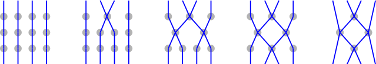
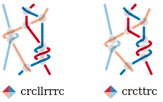
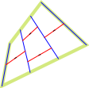

A technical birds eye overview
===============================

The file `svgPairsToThreads.js` defines a JavaScript object called `GF_svgP2T`.
This object provides a set of functions for processing and generating bobbin lace diagrams.
Color coded pair diagrams provide instructions for a bobbin lace maker.
Thread diagrams visualise how the threads flow through the lace.
Given a pair diagram, the script generates the corresponding thread diagram.

Uploaded SVG diagrams are supposed to be created by the symmetry page of GroundForge.
This page lets you add, drop and move stitches in a template diagram. 
This template is then combined in various reflected compositions. 
Reflections are indicated with bdpq versions of the template.

High-level Call Flow
--------------------

* `init()` is the main entry point and sets up the application.
  * On file upload or initial load of a demo file:
    * `readSVGFile()`
    * `processUploadedSvg()`
      * `coyModifiedTemplateToDoc()`
      * `addCaptionedLegendElementsToDoc()` iterates over elements of an uploaded `#bdqpLegend` element.
      * `addThreadDiagramToDoc()` iterates over stitch elements of an uploaded `#template` element
* `newStitch()` and `addThreadClasses()` are called by functions that draw stitches:
  * `newLegendStitch()`
  * `addThreadDiagramToDoc()`

Customize the init function for integration in another page.
You might want just one or two of the ...ToDoc functions, each adding different components to a web page.
Or even bypass addCaptionedLegendElementsToDoc to pass your own color code symbols into newLegendStitch.
Once not only the template but also a swatch of the symmetry page can be processed, 
you might want to react on a click on a dot next to one of the swatches.

Uploads
-------

Uploads are sanitized. This excludes `<use>` elements, because of href attributes.
In practise this means we don´t get the swatches from the symmetry page.
We will get the dots next to the swatches.
The titles of these dots provide tooltips with the swatch parameters.
Neither the swatches nor the dots are currently used in the script.

Page structure
--------------

The page has little static content: a button and its label to upload files.
The dynamic content is rendered by JavaScript:
* A modified version of the template found in the upload. This is a color-coded pair diagram.
  The style attributes are replaced to allow static and interactive styling with CSS.
  Also, some classes are added to simplify the conversion to a thread diagram.
* The color code and text label from the legend in the upload become captions for little thread diagrams.
* A larger version of the thread diagram and smaller set of bdpq versions.
  These mirrored version are intended to build swatches.
  Currently, the d and p versions have the wrong over/under effect.
  The b (top-left) and q (bottom-right) versions are correct.

Function newStitch
------------------

Core function: parse a stitch notation string (e.g., "ctc", "ctlr") and create an SVG thread diagram.

The following images show steps leading to a thread diagram from `ctc`.

A `t` makes two pairs of nodes at the same height kiss one another.
This explains why the following two stitches have the same color code, 
will be also identical in real lace, yet are drawn differently.

Classes
-------

Various classes on the SVG elements have different functions:
* Chances for custom presentation by CSS rules and interaction in pages displaying the diagrams.
* Structural information used during construction of the diagrams and for further processing.

We have multiple groups of classes for edges:

| pattern                              | diagram type   | element type | note                                            |
|--------------------------------------|----------------|--------------|-------------------------------------------------|
| starts/ends_left/right_at_\<node-id> | both           | edges        | left/right component only on thread diagrams    |
| white_start/end                      | threads        | edges        | for the over/under effect                       |
| thread_\<nr>                         | threads        | edges        | for the thread number                           |
| cross/twist                          | threads        | nodes        |                                                 |
| first_kiss_\<nr>                     | threads        | nodes        | the group node of a set of cross/twist nodes    |
| kiss_\<nr>                           | both           | edges        |                                                 |
| , ,                                  | enhanced pairs | nodes        | two per node except on left/right perimeter     |
| from_\<node_id>                      | enhanced pairs | nodes        |                                                 |
| link                                 | pairs          | edges        | legacy (in other contexts nodes might be paths) |

This kissing path number (and corresponding color) 
helped to debug the direction of bends for repeated actions.
_Hint_: The developer tools of the mayor browsers have a style editor. 
Uncomment the `.kiss_` rules at the bottom of `styles.css` to override the thread colors.

Composing the thread diagram
----------------------------

The position of stitches in the thread diagram is defined by the position of stitches in the pair diagram.
Currently, the stitches all get the same size and orientation.
This is okay for a torchon net, when just dropping stitches from a torchon net,
we get no more problems than gaps in threads.

When adding and/or moving stitches we run into more problems.
The following image is an overlay of the demo diagrams: the thread diagram (before connecting the stitches),
the pair diagram and green shapes with corners at the mid-points of edges around the nodes of the pair diagram.

The green shapes are drawn a little smaller to avoid confusion.
The shapes along the perimeter apply to a swatch with only b tiles without indents.
Other titling will need different shapes along the perimeter.

One stitch appears outside its green shape: it means trouble when washing the real lace.

From repeating the template we learn something from the third stitch in the top row:
The twist are defined on edges between stitches. 
In the thread diagrams, the twists should also be drawn independently, not as part of either stitch.

### Reshaping stitches

When widening the green squares in the drawing above by 50%, 
we get the bounding boxes for the currently generated thread stitches.
That works well for a plain Torchon ground.
As an alternative to some matrix transformation to distort the stitches after creation, 
we could start the kissing paths as shown in blue below. 
The arrows on the red lines indicate how to make th threads kiss for a ctc stitch.

However, the green shapes discussed so far, are no basis for bounding shapes of stitches.
Instead, it seems we should initialize the kissing threads bending along with the kissing pairs.
Like sketched below for one stitch. Not sure how that will look like.

The sketch below has bright green lines traversing along starting points of kissing paths
and brownish green traversing along end points of kissing paths.
These lines start and end with segments perpendicular to adjacent edges in the pair diagram.
The length of these segments depend on the length of the edges 
as well as the angle with neighboring edges.
The three segments might need more or less the same length.
This may be a conflicting requirements.

