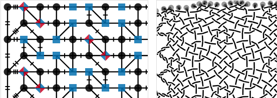

So far, about a [template] intended for fun with snowflakes.

Introduction
------------

We saw someone using a double ring pair around snowflakes.
It is a variation of ground B4.1 in [Viele Gute Gründe] by Ulrike Volker-Löhr,
The corners of te ring pairs are in fact compact snowflakes.
Curiosity led to a method to generate all kinds of variations with GroundForge.

 
We can interpret pair diagrams of snowflakes as thread diagrams.
In the figure on the right we see blobs highlighting four stitches in such a thread diagram.
The caption enumerates these stitches in the order they are worked.
The R means we start working with the two pairs on the right.
More examples (and explanations) on [MAE-gf](/MAE-gf/docs/snow-stitches/#examples).

We can assign the stitches from the blobs to a template to get diagrams as in the screenshot below.
This is example is a [reconstruction] of a ground with a double ring pair.
See also the [color coding](/GroundForge-help/color-rules).

  

The star in the center of the hexagonal ring is a snowflake 
which can become one of B3.47-B3.51 and more.

For now, you have to assign sixteen stitches one by one to this [template]:
one for each corner of the squares shown on the right.

Under construction
------------------

The hexagons below match the squares above.
Note that one of the black arrows has another direction.



The form is not yet active. A click on a hexagon should assign the stitches in the text field and show the changes in the template.
Subsequently, follow the links to the _pairs from threads_ page to assign stitches for the actual snowflakes.
Even without that last step it can be fun to play with configurations of snowflakes.

Another challenge is to support a variety of blob counts and starting sides.
For that purpose we should be able to combine any of the following elements into a valid template.

[Viele Gute Gründe]: https://www.librarything.com/work/2331526/book/11899122
[reconstruction]: https://d-bl.github.io/GroundForge/stitches?patchWidth=11&patchHeight=10&footside=b,-,b,-&tile=3217,1783,3248,1731,&headside=7,8,-,c&shiftColsSW=0&shiftRowsSW=4&shiftColsSE=4&shiftRowsSE=2&m1=llctt&e1=ctc&d1=rc&c1=tc&b1=lcrclc&a1=rrctt&m2=llctt&e2=ctc&d2=cr&c2=crclcr&b2=ct&e3=lc&d3=ctc&c3=cr&b3=ctc&a3=rrctt&m4=llctt&e4=cl&d4=ctc&c4=ctc&b4=lc&droste2=
[template]: https://d-bl.github.io/GroundForge/stitches.html?patchWidth=11&patchHeight=10&footside=b,-,b,-&tile=3217,1783,3248,1731,&headside=7,8,-,c&shiftColsSW=0&shiftRowsSW=4&shiftColsSE=4&shiftRowsSE=2&m1=llctt&e1=ctc&d1=ctc&c1=ctc&b1=ctc&a1=rrctt&m2=llctt&e2=ctc&d2=ctc&c2=ctc&b2=ctc&e3=ctc&d3=ctc&c3=ctc&b3=ctc&a3=rrctt&m4=llctt&e4=ctc&d4=ctc&c4=ctc&b4=ctc

