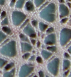



&nbsp;

Quick demo
==========

Result of the form above with the default values.
These thread diagrams are used as pair diagrams for the actual snowflakes.
More explanations on [MAE-gf](/MAE-gf/docs/snow-stitches/).

TO DO
=====

The page is still under construction.

* Allow snowflakes to start with different pairs. Currently, all should start on the right or all on the left. For this reason _ne/sw_ does not complete the symmetry.
* The pair diagrams on the _pairs from thread_ page need a better user interface: the same interactive color code as the [stitches](../stitches) page.

The page is inspired by a ground first seen in a design by Kumiko Nakazaki.

