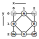

Current formats
===============

* **Tiles page**:
  [rose](https://d-bl.github.io/GroundForge/tiles?patchWidth=9&patchHeight=10&c1=ct&b1=ctct&a1=ct&c2=ct&a2=ct&b3=ctct&tile=831,4-7,-5-&tileStitch=ct&shiftColsSW=-2&shiftRowsSW=2&shiftColsSE=2&shiftRowsSE=2)
  ground.
* **Sheet page** (with a [dance](https://d-bl.github.io/GroundForge-help/Reshape-Patterns) leader): 
  [rose](https://d-bl.github.io/GroundForge/sheet.html?patch=5831%20-4-7;bricks&patch=-437%2034-7;bricks&patch=4830%20--77;bricks)
  ground.
* **Inkscape plugin template**:  
  Documented at the bottom of https://tesselace.com/tools/inkscape-extension/  
  rose: https://d-bl.github.io/tesselace-to-gf/tl/3_4_8/rose.txt 
* **Draft** with a proof of concept on the pricking page:  
  An irregularly shaped and (more or less randomly) rotated [rose](https://jo-pol.github.io/GroundForge/pricking?topo=lo,b4,ri,a1,1;lo,d4,li,a1,1;lo,b3,ri,a3,2;lo,d3,li,a3,2;lo,a1,li,b1,4;ro,b4,ri,b1,2;lo,b1,li,b2,2;lo,c1,ri,b2,0.5;lo,b2,li,b3,2;lo,c3,ri,b3,2;lo,a3,li,b4,1;ro,b3,ri,b4,2;ro,b1,li,c1,2;lo,d1,ri,c1,2;ro,b2,li,c3,0.5;lo,d2,ri,c3,0.5;ro,a1,ri,d1,4;ro,d4,li,d1,2;ro,c1,li,d2,0.5;ro,d1,ri,d2,2;ro,c3,li,d3,2;ro,d2,ri,d3,2;ro,a3,ri,d4,1;ro,d3,li,d4,2)
  ground.
  Similarities between id-s and a chessboard or spreadsheet is a coincidence.
  
Conversions
-----------

* **tiles -> inkscape template**:  
  Download button on the caption of the "patern definition" panel. 
  It does not yet support overlapping tile layouts.
  The templates have too much freedom for the other way around.
* **sheet -> tiles**:  
  Built in links. The other way around would be possible but is not yet implemented.

Thoughts on a new format
========================

Let's start with an example

    right-source;left-source;stitch
    SE[1,+1,+0] ;SW[1,-1,+0];N [1,0],ctct ,#FF0000
    SE[1,+0,+1] ;N [1,-1,+1];W [0,1],ct   ,#00FF00
    N [1,+1,+1] ;SW[1,+0,+1];E [2,1],ct   ,#00FF00
    W [1,+1,+1] ;E [1,-1,+1];S [1,2],ctct ,#FF0000
    S [1,-1,+0] ;E [1,+0,+1];SE[2,2],ct   ,#00FF00
    W [1,+0,+1] ;S [1,-1,+0];SW[0,2],ct   ,#00FF00
    
    Legend per column
    ...-source: id[strength, dx, dy]
    stitch:     id[x,y], instructions (ctlrp), color

Any similarity between id-s and a wind rose is a coincidence.

* Header line mandatory. Order of columns may vary.
* Strengths, deltas and coordinates are optional.
* Decimals are allowed for deltas and coordinates.
* Coordinates or deltas allow a quick re-render.
* Strengths help to limit modifications for starch/wire-free patterns. Default 1.

Calculation of a spring layout requires either deltas or coordinates or additional columns
for left/right-target. Coordinates for pins, default centroid?
For thread/droste diagrams one c(ross) or t(wist) for one stitch should be sufficient when
no threads as pairs are desired. But what to do with pins?

Stitches with more than two pairs require more columns.
Perhaps numbered source/target columns in a clockwise order.
Together with more flexible stitch symbols than a colored dot, we might need a json format.
A possible library for that purpose: https://github.com/circe/circe#readme

For color names, See https://www.w3schools.com/colors/colors_names.asp  
Need research whether Inkscape and other editors support the same set of names
for the same hex-values. Default depends on the instructions which in turn defaults to ctc.
Alternatives for a plain color for a standard circle:

    <circle r="8" style="fill:rgb(225,0,0);opacity:0.65" />
    <rectangle rx="8" ry="0" style="fill:rgb(225,0,0);opacity:0.65" />
    <ellipse rx="4" ry="8" style="fill:yellow;stroke:purple;stroke-width:2" />
    <polygon points="200,10 250,190 160,210" style="fill:lime;stroke:purple;stroke-width:1" />
    <path d="m 12.6,14.7 -2.1,-3.7 4.2,0 z" style="fill:rgb(0,225,0)" />

In case of a polygon or closed path the (rotation?) center must be 
at the top left corner of the page.
These shapes require other delimiters above, for example tabs to separate columns.
This freedom of representing stiches requires a separate table 
mapping stitch instructions to representations. 
Reversing this mapping provides a legend.
This approach reduces the stitch field to two components.
The path in the examples above is a triangel.
Inkscape can create nice [shapes](https://inkscape.org/doc/tutorials/shapes/tutorial-shapes.html),
Save a page with just one shape, open in a browser, 
right click somewhere, view page source,
copy-paste and omit the properties not shown above.
Note that too many details of a shape can get lost,
The shape should also be a big enough target to click, 
yet leave enough space between stitches for other clicks.

Comment/metadata? Such as a link to the tiles page, copyright (default cc-0?), author.

Conversions
-----------
The Inkscape plugin template format does not use id-s, 
but coordinates for all three columns and a simple tile size.

Map cheat sheet symbols to deltas: dibl.Matrix.toRelativeSources
Expand to simple matrices: dibl.proto.PairParams.toSimple3x2
(commit a192295d, branch jo-pol/without-distortion,
so far only bricks, how to determine the simple size for an overlapping tile?)